# Lab1实验报告
计61 柳瑞阳 2016011396

## 练习一：

#### 操作系统镜像文件ucore.img是如何一步一步生成的？

答：运行命令行指令 **make V=**，观察输出可见编译过程如下：  

* 运行编译器对操作系统内核代码进行编译生成重定向执行文件（ **.o** 文件）。需要编译的文件包括：
	* kern/init 文件下的 init.c；
	* kern/libs 文件下的 readline.c，stdio.c；
	* kern/debug 文件下的 kmonitor.c，panic.c；
	* kern/driver 文件下的 clock.c，console.c，intr.c，picirq.c；
	* kern/trap 文件下的 trap.c，trapentry.S，vectors.S；
	* kern/mm 文件下的 pmm.c；
	* libs/ 文件下的 printfmt.c，string.c

　　代码举例如下：

		+ cc kern/debug/panic.c
		i386-elf-gcc -Ikern/debug/ -fno-builtin -Wall -ggdb -m32 -gstabs -nostdinc  -fno-stack-protector -Ilibs/ -Ikern/debug/ -Ikern/driver/ -Ikern/trap/ -Ikern/mm/ -c kern/debug/panic.c -o obj/kern/debug/panic.o

　　其中使用参数意义如下：

　　　　-nostdinc：使编译器不再系统缺省的目录里查找头文件，一般和-I一起使用，明确限定头文件的位置。    
　　　　-fno-builtin：不使用C语言的内建函数而使用自己定义的，例如printf。  
　　　　-Wall：编译时显示所有的警告，由于检查程序错误。  
　　　　-ggdb：此选项将尽可能的生成gdb可以使用的调试信息。  
　　　　-m32：交叉编译选项，生成32位（x86）代码。  
　　　　-gstabs：此选项以stabs格式生成调试信息，但是不包括gdb调试信息。  
　　　　-fno-stack-protector：不使用栈完整性确认（金丝雀）机制，在某些默认打开stack protector的编译器上必须使用，这是因为该机制会调用\_\_stack\_chk\_fail标准库函数，而在编译操作系统内核时我们不能使用标准库。

* 运行链接器链接重定向文件，将上述生成的 .o 文件链接为 ELF 格式可执行文件 /bin/kernel：

		+ ld bin/kernel
		i386-elf-ld -m elf_i386 -nostdlib -T tools/kernel.ld -o bin/kernel  obj/kern/init/init.o obj/kern/libs/readline.o obj/kern/libs/stdio.o obj/kern/debug/kdebug.o obj/kern/debug/kmonitor.o obj/kern/debug/panic.o obj/kern/driver/clock.o obj/kern/driver/console.o obj/kern/driver/intr.o obj/kern/driver/picirq.o obj/kern/trap/trap.o obj/kern/trap/trapentry.o obj/kern/trap/vectors.o obj/kern/mm/pmm.o  obj/libs/printfmt.o obj/libs/string.o

　　其中使用参数意义如下：  

　　　　-m elf\_i386：交叉编译生成i386平台的代码。  
　　　　-nostdlib：不链接C标准库，防止C标准库使用自带的init函数代替入口函数。  
　　　　-T tools/kernel.ld：使用自编的链接脚本进行代码段、数据段空间的分配，并把ELF可执行文件的入口点设置为函数kern\_init。  

* 运行编译器对 Bootloader 代码进行编译生成重定向执行文件（ **.o** 文件）。需要编译的文件包括：
	* boot 文件下的 bootasm.S；
	* boot 文件下的 bootmain.c；

　　代码举例如下：

		+ cc boot/bootasm.S
		i386-elf-gcc -Iboot/ -fno-builtin -Wall -ggdb -m32 -gstabs -nostdinc  -fno-stack-protector -Ilibs/ -Os -nostdinc -c boot/bootasm.S -o obj/boot/bootasm.o

　　其中使用参数意义同上。  

* 运行编译器和链接器对硬盘主引导扇区进行编译和链接，生成 bin/sign。  

　　代码举例如下：

		+ cc tools/sign.c
		gcc -Itools/ -g -Wall -O2 -c tools/sign.c -o obj/sign/tools/sign.o
		gcc -g -Wall -O2 obj/sign/tools/sign.o -o bin/sign

　　其中使用参数意义如下：  

　　　　-g 保留代码的文字信息，便于调试。  
　　　　-O2：优化优先级选项。  
　　　　-Wall：编译时显示所有的警告，由于检查程序错误。  

* 运行链接器链接Bootloader，生成 bin/bootblock。  

　　代码举例如下：

	+ ld bin/bootblock
	i386-elf-ld -m elf_i386 -nostdlib -N -e start -Ttext 0x7C00 obj/boot/bootasm.o obj/boot/bootmain.o -o obj/bootblock.o

　　其中使用参数意义如下：  
 
　　　　-N：将代码区和数据区设置为可读可写，不对数据区进行页对齐，不链接标准库。  
　　　　-e start：设置入口函数为start。  
　　　　-Ttext 0x7C00：设定代码段的虚拟内存地址为0x7C00，即主引导扇区被读取到内存的地址。这个地址实际是BIOS自动拷贝到的，这里再次进行设定应该是程序中直接寻址需要。  

* 运行 OBJDUMP 和 OBJCOPY 实用工具，导出 Bootloader 的代码段。

　　输出结果举例如下：

	'obj/bootblock.out' size: 500 bytes

* 使用 sign 程序，处理 Bootloader 代码，生成 512 字节的 MBR 扇区镜像。

　　输出结果举例如下：

	build 512 bytes boot sector: 'bin/bootblock' success!

* 运行dd程序，创建ucore.img硬盘镜像。  

　　输出结果举例如下：

	dd if=/dev/zero of=bin/ucore.img count=10000
	10000+0 records in
	10000+0 records out
	5120000 bytes transferred in 0.064835 secs (78969896 bytes/sec)
	dd if=bin/bootblock of=bin/ucore.img conv=notrunc
	1+0 records in
	1+0 records out
	512 bytes transferred in 0.000028 secs (18354561 bytes/sec)
	dd if=bin/kernel of=bin/ucore.img seek=1 conv=notrunc
	154+1 records in
	154+1 records out

　　其中使用参数意义如下：  
 
　　　　if：输入文件。  
　　　　of：输出文件。  
　　　　count：拷贝block的个数。  
　　　　seek：数据拷贝起始block寻址。  
　　　　conv=notrunc：当dd到一个比源文件大的目标文件时，不缩小目标文件。  

　　至此 ucore.img 文件生成完成。

---

#### 一个被系统认为是符合规范的硬盘主引导扇区的特征是什么？

答：通过阅读 **ucore\_os\_lab/labcodes/lab1/tools/sign.c** 的代码可发现，符合规范的硬盘主引导扇区的特征包括 3 个方面：  

* st.st\_size（文件内容） 不能超过 510 字节，即启动代码和硬盘分区表加起来不能超过 510 字节。   
* 主引导扇区大小为 512 字节。   
* 结束标志字，即最后两个字节为 0x55 和 0xAA。

---

   

## 练习二：

#### 准备工作：模仿学堂在线视频进行操作
* 步骤一：在 lab1/Makefile 中新增代码：  

		lab1-mon: $(UCOREIMG)
			$(V)$(TERMINAL) -e "$(QEMU) -S -s -d in_asm -D $(BINDIR)/q.log -monitor stdio -hda $< -serial null"
			$(V)sleep 2
			$(V)$(TERMINAL) -e "gdb -q -x tools/lab1init"
		
	其中修改的第一条指令含义为，新启动一个 gnome 终端并运行 debug 状态的 qemu，并将打印的汇编代码输出到 q.log 文件中。第三条指令含义为初始化 gdb 调试指令。  

* 步骤二：在 lab1/tools/ 中新增文件 lab1init，其内容如下：  

		file bin/kernel
		target remote :1234
		set architecture i8086
		b *0x7c00
		continue
		x /2i $pc  

　　含义为：首先加载 kernel，然后使得 qemu 和 gdb 之间使用网络端口 1234 进行通讯，刚开始 BIOS 进入 8086 的 16 位实模式方式。在地址为 0x7c00（Bootloader第一条指令）处设置断点，然后使得程序运行，然后显示出 PC 寄存器（EIP 指令指针寄存器）处开始的两条指令。

* 步骤三：运行指令 make lab1-mon，观察输出结果；并输入指令 x /10i $pc，观察输出结果。并检验与 lab1/boot/bootasm.S 中代码一致。

	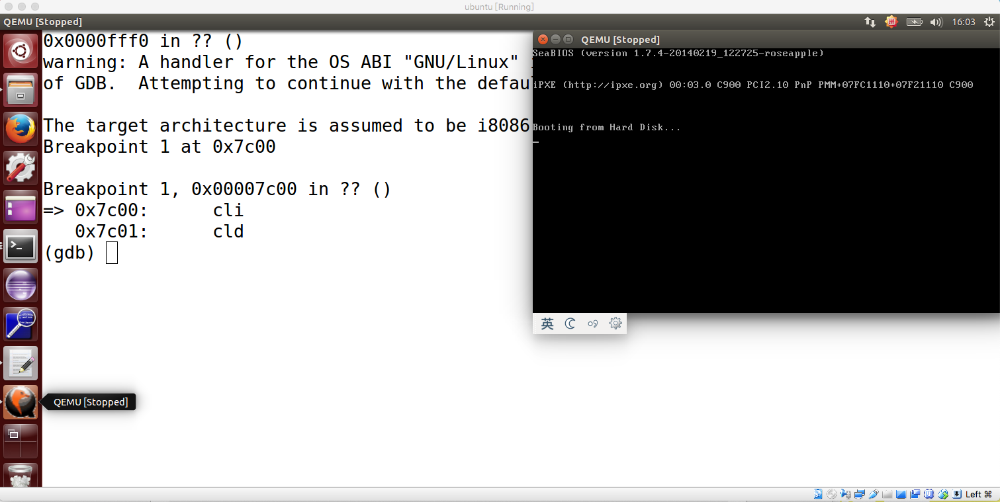
	

---

#### 1. 从CPU加电后的第一条指令开始，单步跟踪BIOS的运行。
* 步骤一：在 lab1/Makefile 中新增代码：  

		lab1-liuruiyang-debug: $(UCOREIMG)
		$(V)$(TERMINAL) -e "$(QEMU) -S -s -d in_asm -D $(BINDIR)/q.log -monitor stdio -hda $< -serial null"
		$(V)sleep 2
		$(V)$(TERMINAL) -e "gdb -q -x tools/lab1liuruiyangdebug" 

* 步骤二：在 lab1/tools/ 中新增文件 lab1liuruiyangdebug，其内容如下：  

		file bin/kernel
		target remote :1234
		set architecture i8086

* 步骤三：运行指令 make lab1-liuruiyang-debug，进行实验。可见在 gdb 调试中，访问 \$PC 寄存器时，其值为 0xfff0，说明其并未考虑 CS 寄存器的偏移，因为 gdb 调试设置模拟的CPU架构为 i8086，其为 16 位模式，无法找到正确的地址；而在 qemu 调试中，访问 \$PC 寄存器，发现其按照 CS:IP 计算启动地址，地址为 0xfffffff0，可见此时 CPU 初始时处于 32 位实模式，第一条运行的指令为：  

		(qemu) x $pc
		0xfffffff0:  ljmp   $0xf000,$0xe05b

  在 gdb 调试中输入 nexti（单步一条机器指令，不进入函数），实现长跳转，随后依旧在 qemu 调试中观察，此时 CPU 进入16位实模式，此时指令如下所示：

		(qemu) x /10i $pc
		0x000fe05b:  cmpl   $0x0,%cs:0x6c48
		0x000fe062:  jne    0xfd2e1
		0x000fe066:  xor    %dx,%dx
		0x000fe068:  mov    %dx,%ss
		0x000fe06a:  mov    $0x7000,%esp
		0x000fe070:  mov    $0xf3691,%edx
		0x000fe076:  jmp    0xfd165
		0x000fe079:  push   %ebp
		0x000fe07b:  push   %edi
		0x000fe07d:  push   %esi

	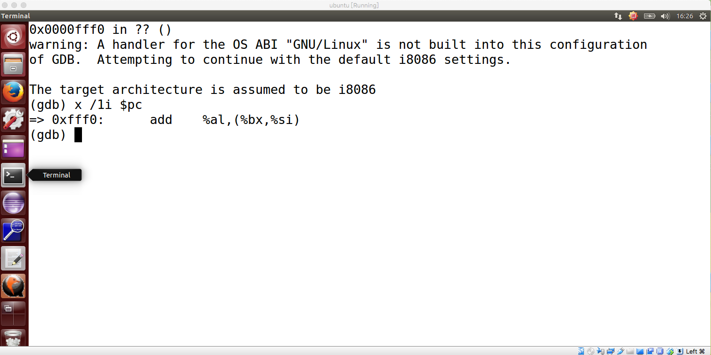
	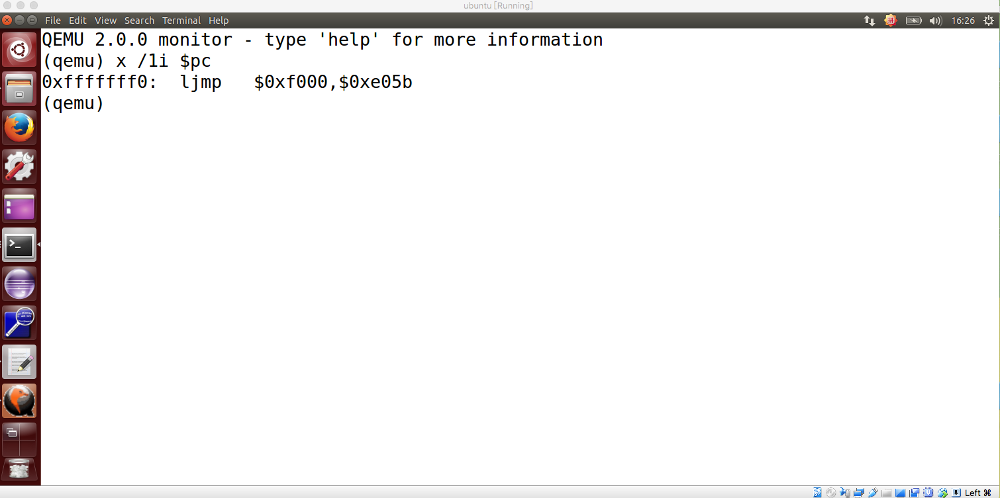
	

#### 2. 在初始化位置0x7c00设置实地址断点,测试断点正常。
* 步骤四：在 gdb 调试中，输入指令 **b \*0x7c00**，再执行 **continue**，最后输入指令 **x /10i $pc**，其和之前的准备练习中观察的结果相同，说明测试断点正常。

	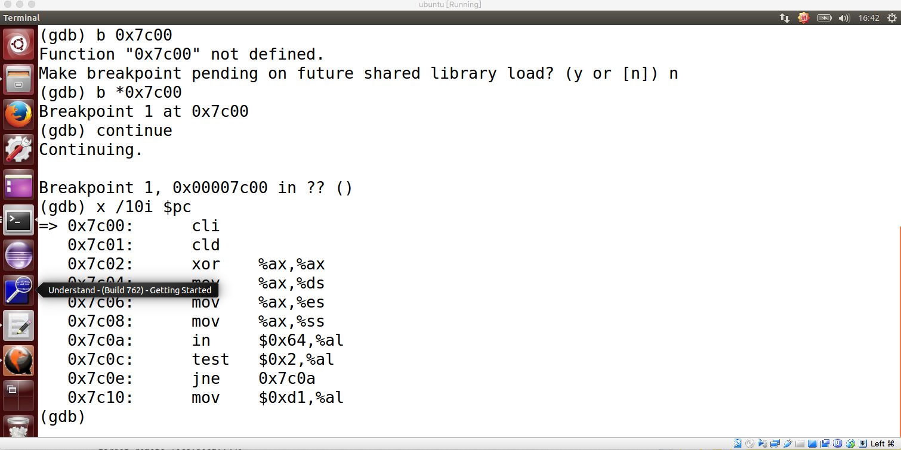

#### 3. 从0x7c00开始跟踪代码运行,将单步跟踪反汇编得到的代码与bootasm.S和 bootblock.asm进行比较。
* 步骤五：设置宏指令 showstep，使得 pc += 1，并展示当前 pc 寄存器所指的指令。宏指令设置如下：

		define showstep
		nexti
		x/i $pc
		end  

　　经过观察输出，可以发现代码与 lab1/boot/bootasm.S 中代码一致基本相同。虽然有部分指令经过了编译器的优化，但是整体执行的逻辑和顺序依旧保持不变。

	

#### 4. 自己在内核或Bootloader中寻找代码位置，进行断点测试
* 步骤六：在 kern/debug/kdebug.c 中我选择函数 **print\_kerninfo** 作为断点，在 gdb 调试中使用命令 **break print\_kerninfo** 和 **continue**，发现 PC 停止在 **0x10084c** 处。随后进行断点测试，测试结果如下图：  

	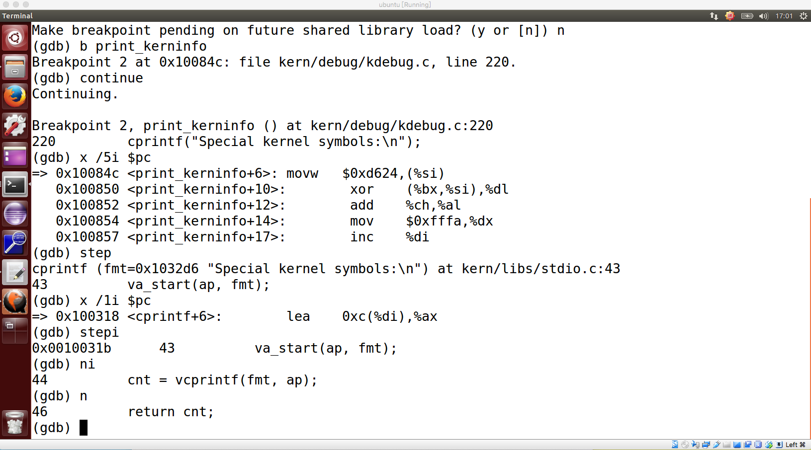

---

   

## 练习三：
#### 分析bootloader进入保护模式的过程

* 分析 boot/bootasm.S 的代码解释如下：
	* 第 15 ～ 23 行代码首先设置中断为禁用，随后设置段寄存器 DS，ES，SS 为0.

			.code16                    # Assemble for 16-bit mode
			    cli                    # Disable interrupts
			    cld                    # String operations increment
			
			    # Set up the important data segment registers (DS, ES, SS).
			    xorw %ax, %ax          # Segment number zero
			    movw %ax, %ds          # -> Data Segment
			    movw %ax, %es          # -> Extra Segment
			    movw %ax, %ss          # -> Stack Segment
			    
	* 第 25 ～ 43 行代码使能 A20 地址线，先等待 8042 的输入缓存为空，然后将数据写入 8042 的 P2 端口，即向 P2 发送命令。再等待输入缓存空，将 P2 的 A20 位置设置为 1。

			    # Enable A20:
			    #  For backwards compatibility with the earliest PCs, physical
			    #  address line 20 is tied low, so that addresses higher than
			    #  1MB wrap around to zero by default. This code undoes this.
			seta20.1:
			    inb $0x64, %al         # Wait for not busy(8042 input buffer empty)
			    testb $0x2, %al
			    jnz seta20.1
			
			    movb $0xd1, %al        # 0xd1 -> port 0x64
			    outb %al, $0x64        # 0xd1 means: write data to 8042's P2 port
			
			seta20.2:
			    inb $0x64, %al         # Wait for not busy(8042 input buffer empty)
			    testb $0x2, %al
			    jnz seta20.2
			
			    movb $0xdf, %al        # 0xdf -> port 0x60
			    outb %al, $0x60        # 0xdf = 11011111, means set P2's A20 bit(the 1 bit) to 1

	* 第 49 行：是把 gdtdesc 这个标识符的值送入全局映射描述符表寄存器 GDTR 中。这条指令的功能就是把关于 GDT 表的一些重要信息存放到 CPU 的 GDTR 寄存器中，其中包括 GDT 表的内存起始地址，以及 GDT 表的长度。这个寄存器由 48 位组成，其中低 16 位表示该表长度，高 32 位表该表在内存中的起始地址。所以 gdtdesc 是一个标识符，标识着一个内存地址。从这个内存地址开始之后的 6 个字节中存放着 GDT 表的长度和起始地址。

			    # Switch from real to protected mode, using a bootstrap GDT
			    # and segment translation that makes virtual addresses
			    # identical to physical addresses, so that the
			    # effective memory map does not change during the switch.
			    lgdt gdtdesc
	
	* 第 50 ～ 56 行：将 CR0 寄存器的 PE 位置为使能，跳转到 32 位地址，完成到保护模式的转换。
				
				movl %cr0, %eax
				orl $CR0_PE_ON, %eax
				movl %eax, %cr0
			
				# Jump to next instruction, but in 32-bit code segment.
				# Switches processor into 32-bit mode.
				ljmp $PROT_MODE_CSEG, $protcseg
				
	* 第 61 ～ 行：设置保护模式数据段寄存器，设置堆栈指针，堆栈区域从 0 ～ 0x7c00，然后调用bootmain函数。

				.code32                # Assemble for 32-bit mode
				protcseg:
				    # Set up the protected-mode data segment registers
				    movw $PROT_MODE_DSEG, %ax     # Our data segment selector
				    movw %ax, %ds      # -> DS: Data Segment
				    movw %ax, %es      # -> ES: Extra Segment
				    movw %ax, %fs      # -> FS
				    movw %ax, %gs      # -> GS
				    movw %ax, %ss      # -> SS: Stack Segment
				
				    # Set up the stack pointer and call into C. The stack region is from 0--start(0x7c00)
				    movl $0x0, %ebp
				    movl $start, %esp
				    call bootmain
				
				    # If bootmain returns (it shouldn't), loop.
				spin:
				    jmp spin
 	
			    
#### 为何开启A20，以及如何开启A20？   

　　在 i8086 时代，CPU 的数据总线是 16bit，地址总线是 20bit，寄存器是 16bit，因此 CPU 只能访问 1MB 以内的空间。因为数据总线和寄存器只有 16bit，如果需要获取 20bit 的数据, 我们需要做一些额外的操作，比如移位。实际上，CPU 是通过对 segment (每个 segment 大小恒定为 64K ) 进行移位后和 offset 一起组成了一个 20bit 的地址，这个地址就是实模式下访问内存的地址：
		
		address = segment << 4 | offset

　　理论上，20bit 的地址可以访问 1MB 的内存空间( 0x00000 - ( 2^20 - 1 = 0xFFFFF ))。但在实模式下, 这 20bit 的地址理论上能访问从 0x00000 - ( 0xFFFF0 + 0xFFFF = 0x10FFEF ) 的内存空间。也就是说，理论上我们可以访问超过 1MB 的内存空间，但越过 0xFFFFF 后，地址又会回到 0x00000。  
　　上面这个特征在 i8086 中是没有任何问题的，因为它最多只能访问1MB的内存空间，但到了i80286 / i80386 后，CPU 有了更宽的地址总线，数据总线和寄存器后，这就会出现一个问题：在实模式下, 我们可以访问超过 1MB 的空间，但我们只希望访问 1MB 以内的内存空间，以实现向后兼容。为了解决这个问题，CPU中添加了一个可控制 A20 地址线的模块，通过这个模块，我们在实模式下将第 20bit 的地址线限制为 0，这样CPU就不能访问超过 1MB 的空间了。进入保护模式后，我们再通过这个模块解除对 A20 地址线的限制，这样我们就能访问超过 1MB 的内存空间了。  
　　默认情况下，A20 地址线是关闭的( 20bit 以上的地址线限制为 0)，因此在进入保护模式(需要访问超过 1MB 的内存空间)前，我们需要开启 A20 地址线( 20bit 以上的地址线可为 0 或者 1 )。  
　　根据上述第 25 - 43 行代码即可实现 A20 的开启。

 	

#### 如何初始化GDT表？  

　　根据 boot/bootasm.S 和 boot/asm.h 代码所示，这里所有 GDT 表项(除了空段)初始化为全段，此时段偏移量 EIP 等于物理地址。这里 gdt 分别代表三个段，null seg，code seg，data seg。由于 xv6 其实并没有使用分段机制，也就是说数据和代码都是写在一起的，所以数据段和代码段的起始地址都是 0x0，大小都是 0xffffffff = 4GB。然后在 gdtdesc 处就要存放这个 GDT 表的信息了，其中 0x17 是这个表的大小 -1 = 0x17 = 23，紧接着就是这个表的起始地址 gdt。

		# Bootstrap GDT
		.p2align 2             # force 4 byte alignment
		gdt:
		    SEG_NULLASM        # null seg
		    SEG_ASM(STA_X|STA_R, 0x0, 0xffffffff)     # code seg for bootloader and kernel
		    SEG_ASM(STA_W, 0x0, 0xffffffff)           # data seg for bootloader and kernel
		
		gdtdesc:
		    .word 0x17         # sizeof(gdt) - 1
		    .long gdt          # address gdt
		
		...
		
		/* Normal segment */
		#define SEG_NULLASM
		    .word 0, 0;
		    .byte 0, 0, 0, 0
		
		#define SEG_ASM(type,base,lim) 
			.word (((lim) >> 12) & 0xffff), ((base) & 0xffff);  
			.byte (((base) >> 16) & 0xff), (0x90 | (type)),(0xC0 | (((lim) >> 28) & 0xf)), (((base) >> 24) & 0xff)
　　
  

#### 如何使能和进入保护模式？  

　　使能是将 CR0 寄存器的 bit 0 位（PE）设置为 CR0\_PE\_ON（0x1），即 CR0 中的数字为 1。在开启 A20 和初始化 GDT 后，根据 PROT\_MODE\_CSEG（kernel 的代码段选择子），采用 ljmp 长跳转指令进行跳转，实现保护模式的进入。
　　
#### 备注：x86实模式和保护模式的 CS:IP 寻址方式概述

　　CS 寄存器分为可见的选择子 selector 区域（16位）和不可见的基址 base address 区域（32位）。 实际上，不可见区域如果不存在，整个体系也能正常工作，不可见区域仅仅是一个缓存。

　　在 16 位实模式下，线性地址可寻址空间为 1M，寻址方式为 base address + eip，其中 base address 在一般情况下等于 selector << 4，但是在刚刚开机上电的时候这种关系不成立，此时 base address = 0xFFFF0000，但是 selector = 0xF000，再加上 eip = 0x0000FFF0，最终形成了 0xFFFFFFF0 的最初地址。而之后进行了跳转指令之后，base address 缓存得到更新，重新计算为 0x000F0000，之后的寻址便从 0x000FXXXX 开始了。

　　在32位保护模式下，线性地址可寻址空间为 4G，寻址方式为 base address + eip，其中 base address 总是等于 **selector 中的 index 域指向的 GDT 表项的偏移基址**。
　　
##### 段选择子

　　在实模式下, 逻辑地址由段选择子和段选择子偏移量组成. 其中, 段选择子16bit, 段选择子偏移量是32bit. 下面是段选择子的示意图:

	

* 在段选择子中，其中的 INDEX[15:3] 是 GDT 的索引。
* TI[2:2] 用于选择表格的类型，1 是 LDT，0 是 GDT。
* RPL[1:0] 用于选择请求者的特权级，00 最高，11 最低。

##### GDT的访问

	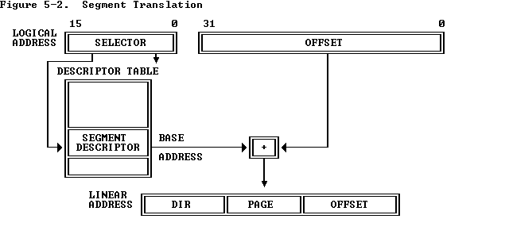

* 根据 CPU 给的逻辑地址分离出段选择子。
* 利用段选择子查找到对应的段描述符。
* 将段描述符里的 Base Address 和 EIP 相加而得到线性地址。

---

   

## 练习四：

#### bootloader如何读取硬盘扇区的？

	static void
	readseg(uintptr_t va, uint32_t count, uint32_t offset) {
	    uintptr_t end_va = va + count;
	
	    // round down to sector boundary
	    va -= offset % SECTSIZE;
	
	    // translate from bytes to sectors; kernel starts at sector 1
	    uint32_t secno = (offset / SECTSIZE) + 1;
	
	    // If this is too slow, we could read lots of sectors at a time.
	    // We'd write more to memory than asked, but it doesn't matter --
	    // we load in increasing order.
	    for (; va < end_va; va += SECTSIZE, secno ++) {
	        readsect((void *)va, secno);
	    }
	}

　　在执行完 bootasm.S 后，此时系统从实模式进入了保护模式，然后执行 bootasm.c，开始加载 OS。bootasm.c 完成的任务是引导来自第一个 IDE 硬盘的 ELF 内核映像，在保护模式的内核态读取和拷贝内核的 ELF 文件。所以必须要对硬盘进行访问。第一个 IDE 硬盘的 I/O 地址为 **0x1F0 ~ 0x1F7**。详见 bootasm.c 的 readsect 函数，其执行步骤如下：  

* 循环访问端口 0x1F7，检查磁盘是否处于空闲状态，一直等待磁盘准备好为止。
* 向端口 0x1F2 写入要读取的扇区个数，本实验为读取 1 个扇区。
* 向端口 0x1F3 ～ 0x1F6 写入要读区的扇区编号信息。
* 向端口 0x1F7 写入 0x20 指令，代表读取扇区。
* 循环访问端口 0x1F7，检查磁盘是否处于空闲状态，一直等待磁盘读取完成为止。
* 通过 insl 指令读取一个扇区的内容并保存到指定的虚拟内存中去。（insl，这个函数包含3个输入参数，port代表端口号，addr代表这个扇区存放在主存中的起始地址，cnt则代表读取的次数）

 

#### bootloader是如何加载ELF格式的OS？

	// read 1st page off disk
	readseg((uint32_t) ELFHDR, SECTSIZE*8, 0);

　　bootmain 函数首先调用 **readseg((uintptr\_t)ELFHDR, SECTSIZE * 8, 0);** 这里调用了函数 readseg（ readseg(uintptr\_t va, uint32\_t count, uint32\_t offset) ），其功能是把距离内核起始地址 offset 个偏移量存储单元作为起始，将它和它之后的 count 字节的数据读出送入以 va 为起始地址的内存虚拟地址处。所以这条指令是把内核的第一个页 ( 4MB = 4096 = SECTSIZE * 8 = 512 * 8 ) 的内容读取的内存地址 ELFHDR ( 0x10000 ) 处。其实完成这些后相当于把操作系统映像文件的 ELF 头部读取出来放入内存中。  
　　读取完这个内核的 ELF 头部信息后，需要对这个 ELF 头部信息进行验证，并且也需要通过它获取一些重要信息。

	// is this a valid ELF?
    if (ELFHDR->e_magic != ELF_MAGIC) {
        goto bad;
    }

　　ELF 头部信息 ELFHDR 的 e\_magic 字段是整个头部信息的开端。并且如果这个文件是格式是 ELF 格式的话，文件的 ELFHDR->e\_magic 域应该等于 ELF\_MAGIC 的，所以这条语句就是判断这个输入文件是否是合法的 ELF 可执行文件。

	// load each program segment (ignores ph flags)
	ph = (struct proghdr *)((uintptr_t)ELFHDR + ELFHDR->e_phoff);

　　ELFHDR 中一定包含 Program Header Table。这个表格存放着程序中所有段的信息。通过这个表我们才能找到要执行的代码段，数据段等等信息。为了获得这个表，采取这条指令。首先 ELFHDR 是表头起址，而 e\_phoff 字段代表 Program Header Table 距离表头的偏移量。所以 ph 可以被指定为Program Header Table 的表头。

	eph = ph + ELFHDR->e_phnum;

　　由于 e\_phnum 中存放的是 Program Header Table 表中表项的个数，即段的个数。用表头加表项的个数，所以这步操作是把 eph 指向该表末尾。

	for (; ph < eph; ph ++) {
	    readseg(ph->p_va & 0xFFFFFF, ph->p_memsz, ph->p_offset);
	}

　　这个 for 循环就是在把操作系统内核的各个段从外存读入内存中。ph->p\_va 指的是这个段在内存中的虚拟地址。ph-> p\_offset 字段指的是这一段的开头相对于这个 ELF 文件的开头的偏移量。ph->p\_filesz 字段指的是这个段在 ELF 文件中的大小。ph->p\_memsz 则指的是这个段被实际装入内存后的大小。通常来说 ph->p\_memsz 一定大于等于 ph->p\_filesz，因为段在文件中时许多未定义的变量并没有分配空间给它们。

	// call the entry point from the ELF header
	// note: does not return
	((void (*)(void))(ELFHDR->e_entry & 0xFFFFFF))();

　　ELFHDR->e_entry 字段指向的是这个文件的执行入口地址。相当于开始运行这个文件，即内核文件。   
　　自此就把控制权从 bootloader 转交给了操作系统的内核。  

（参考 https://https://www.cnblogs.com/fatsheep9146）

---

   

## 练习五：

#### 任务要求

　　在 lab1 中完成 kdebug.c 中函数 print\_stackframe 的实现，可以通过函数 print\_stackframe 来跟踪函数调用堆栈中记录的返回地址。

#### 函数栈基本知识

　　首先认识函数栈的基本知识：  

* ebp 基址指针寄存器。 
* esp 堆栈指针寄存器(指向栈顶) 。 
* ebp 寄存器中存储着栈中的一个地址（原 ebp 入栈后的栈顶），以地址为基准，向上（栈底方向）能获取返回地址、参数值，向下（栈顶方向）能获取函数局部变量值，而该地址处又存储着上一层函数调用时的 ebp 值。  

　　举一个实际的例子查看 %ebp 与 %esp 两个寄存器如何构建出完整的函数栈，最后的 leave 等同于 **movl %ebp, %esp** 和 **popl %ebp** 两条指令

	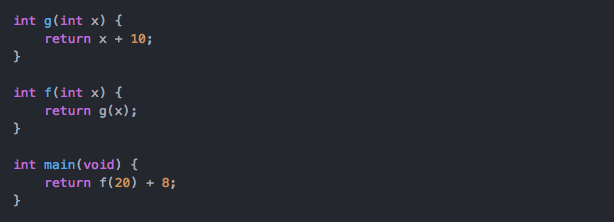
	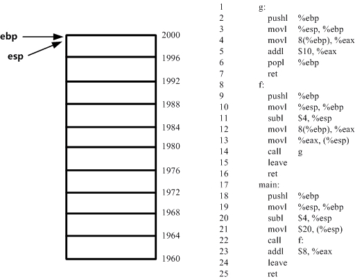

（参考借鉴 https://www.jianshu.com/p/969e1bdcb471 ）  
　　
#### 输出分析　

　　阅读实验样例输出可发现每两行的含义为：  

* ebp：栈帧基指针寄存器中的值
* eip：存储 CPU 要读取指令的地址，CPU 通过 eip 寄存器读取即将要执行的指令
* args：调用该函数时传入的参数值
* kernel/XXX/XXX.c:line：PC 所在位置对应的源程序代码位置和行数，即该帧进行函数调用时候的程序位置。

	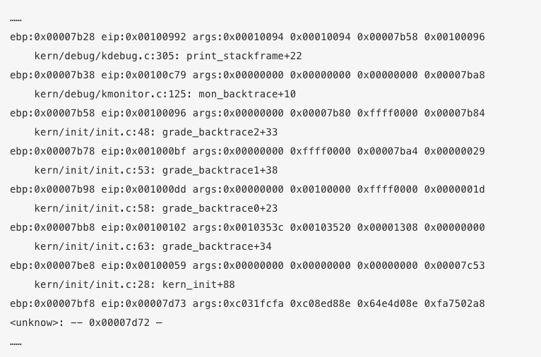

#### 代码实现

　　代码实现思路同前述讲解，首先读取 ebp 和 eip 的值，然后通过 for 循环追踪函数调用栈。首先输出 ebp 和 eip 的值，随后获取函数栈中参数列表的地址，再通过一个新的 for 循环，以此输出参数。调用 print_debuginfo 函数输出当前的调用的函数名称和所在行数信息，即第二行信息。最后更新 ebp 和 eip 即可。

	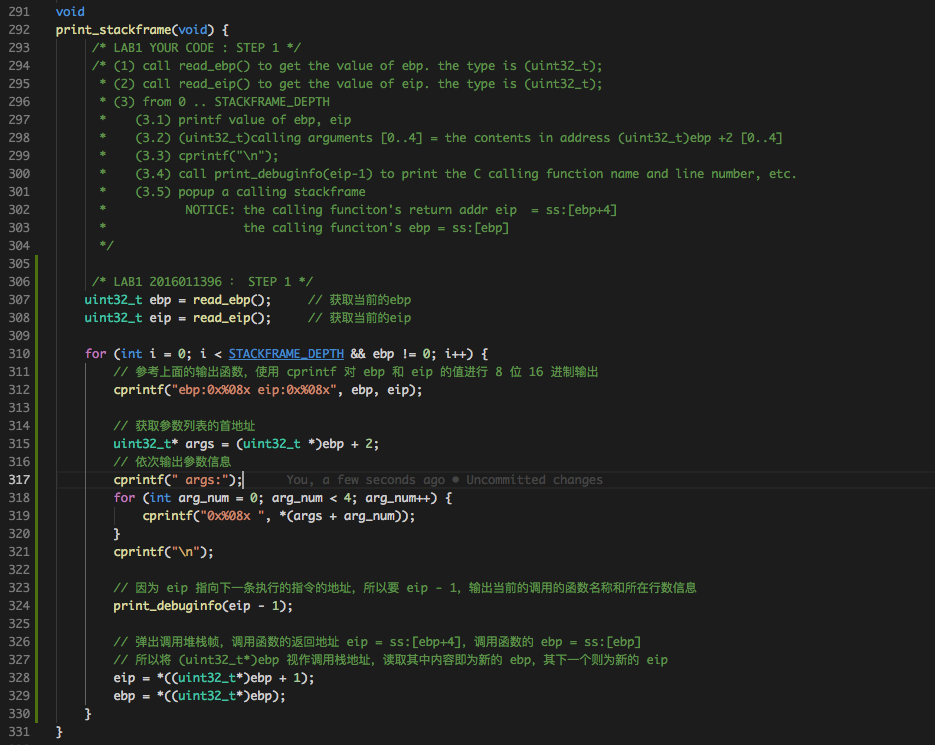

　　在实验的第一次我未添加 **ebp != 0** 的判断条件，导致输出结果如下图，与实验要求不符合。当对比 lab1_result 后发现添加其即可实现实验要求。可见部分地址参数和实验展示结果有所不同，是因为我在 MAC 下进行的编译链接，但是通过函数调用代码的名称和行数可见，练习五实现成功。
　　

	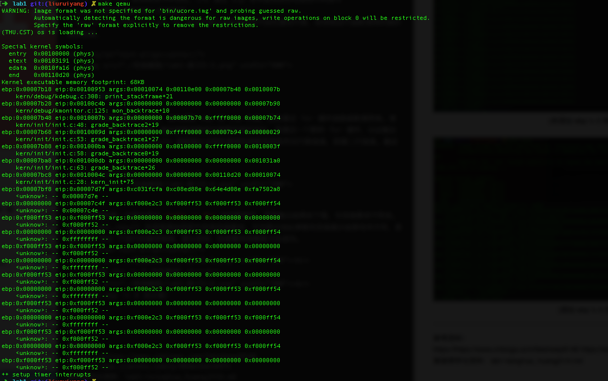 
	(未添加 ebp != 0 导致错误）  
	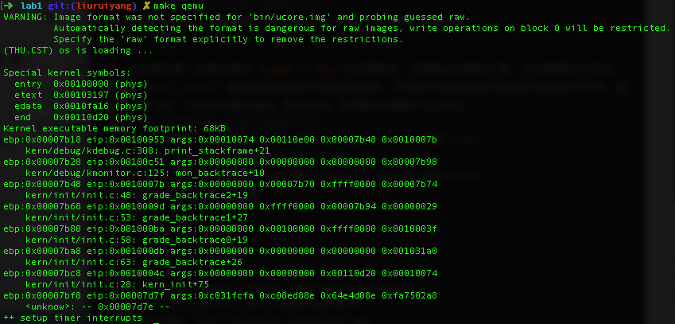 
	(添加 ebp != 0 后正确)

---

   

## 练习六：

#### 中断描述符表（也可简称为保护模式下的中断向量表）中一个表项占多少字节？其中哪几位代表中断处理代码的入口？

　　中断描述符表的一个表项占 8 个字节，其中 2 ~ 3 字节是段选择子，0 ~ 1 字节和 6 ~ 7 字节拼成位移，即高 16 位和低 16 为拼成 offset，通过段选择子经过 GDT 的进一步查询得到段基址，再加上段内偏移量就可以得到中断处理代码的入口地址。中断门描述符如下所示：

	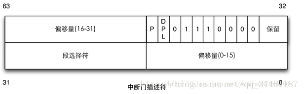 
	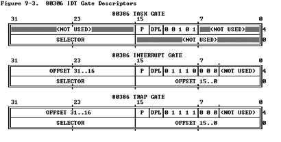 

　　补充：IDT 可以位于内存的任意位置，CPU 通过 IDT 寄存器（IDTR）的内容来寻址 IDT 的起始地址。指令 LIDT(load IDT) 和 SIDT(Store IDT) 用来操作 IDTR。当 CPU 收到中断时，会查找对应的中断描述符表IDT，确定对应的中断服务例程，需要经过 GDT 的进一步查询之后才能知道真正入口的线性地址。中断处理过程如下所示：

	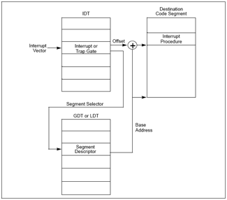 

 

#### 请编程完善kern/trap/trap.c中对中断向量表进行初始化的函数idt\_init。在idt\_init函数中，依次对所有中断入口进行初始化。使用mmu.h中的SETGATE宏，填充idt数组内容。每个中断的入口由tools/vectors.c生成，使用trap.c中声明的vectors数组即可。

* **第一步：查看 kern/mm/mmu.h 宏定义**  

　　由宏 SETGATE 可见，其目标是生成一个 8 字节（64bit）的普通中断/陷阱门描述符，其中 gate 来源于 Struct gatedesc，其具体含义同上图中断门描述符所示。其中 sel 为段选择子，off 为偏移 offset，dpl 为访问权限。

	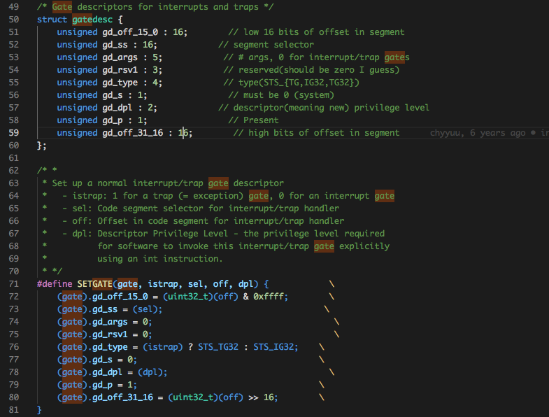 

* **第二步：查看 kern/trap/vectors.S 以及 tools/vector.c 的中断号定义及实现**

　　通过 kern/trap/vectors.S 代码可见，保护模式下一共有 256 个不同的中断号，vectorX 中定义的仅仅是先将中断类型对应编号压栈操作和简单的跳转语句，并未做处理。真正进行中断处理的是这条跳转语句跳转到的 kern/trap/trapentry.S 中的 \_\_alltraps，在这个函数中首先保存一系列寄存器的值，然后将 GD\_KDATA 加载到 %ds 和 %es 中以设置内核的数据段，将 %esp 的值（指向 trapframe 的指针）压栈并作为 trap() 的参数，接着调用 kern/trap/trap.c 中的 trap(trapframe *tf) 函数，这时才开始正式进行 C 语言级别的异常处理。

* **第三步：完成 kern/trap/trap.c 的函数 idt_init 代码实现**

　　参考 mooc 教学视频和代码提示，完成对 IDT 初始化的代码实现。首先引用 \_\_vectors[]，其每一项对应为代码段的偏移量，然后对于每一项 IDT 表项调用宏 SETGATE 进行初始化，这里学习 mooc 视频，对于标号为 T\_SWITCH\_TOK 的中断，其代表用户态向核心态的转变且权限为用户态权限，和对于系统调用中断( T\_SYSCALL )，其使用陷阱门描述符且权限为用户态权限以外，其它中断均使用特权级( DPL )为 ０ 的中断门描述符，权限为内核态权限，所以在初始化时进行判断。其中 KERNEL\_CS：在执行 ISR 的时候 CS 段需要为内核态；DPL\_USER：本中断可以在用户态进行调用。最后调用 lidt(load IDT) 指令，将 idt\_pd 的地址作为参数实现中断描述符表的加载工作。

 
	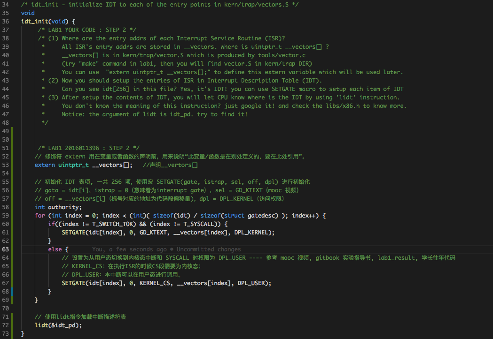 

 

#### 请编程完善trap.c中的中断处理函数trap，在对时钟中断进行处理的部分填写trap函数中处理时钟中断的部分，使操作系统每遇到100次时钟中断后，调用print_ticks子程序，向屏幕上打印一行文字”100 ticks”。

　　在执行终端服务例程前，需要通过压栈传递参数，形成 trapFrame。而调用 \_\_alltraps 函数前，vector.S 已经向栈中压入两个参数，在 \_\_alltraps 函数执行过程中进一步完成 trapFrame 的准备工作。最后调用 trap(trapframe \*tf) 函数。在 trap(trapframe \*tf) 函数中调用了 trap_dispatch(struct trapframe \*tf) 函数，对应找到时钟中断响应代码。  
　　根据代码提示，首先针对全局变量 ticks 进行加一处理，每次时钟中断都会对其加一，直到 ticks 的值等于 100，此时调用 print\_ticks() 函数进行输出，并重新将 ticks 置为 0。

 
	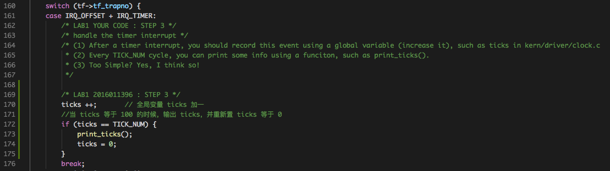 

#### 实验效果截图

 
	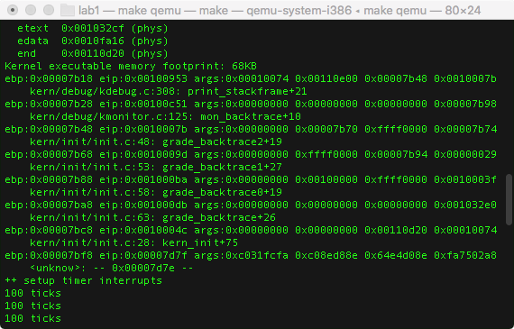 

　　至此，练习 1 ～ 6 全部完成。  

---

   

## 实验总结
#### 实验lab1中重要的知识点

* 练习1：主引导扇区的特征
* 练习2：gdb 调试的操作和方法；Bootloader 的启动过程
* 练习3：Bootloader 的启动过程；GDT 表的结构和加载；A20 地址线的使能方式；实模式到保护模式的转变
* 练习4：Bootloader 读取硬盘扇区；ELF 文件的格式和加载流程
* 练习5：函数调用栈的格式以及栈运行原理
* 练习6：中断符号表相关知识，中断处理例程运行流程

#### 在实验中没有对应上的知识点

　　我认为实验一比较完整的再现了操作系统的启动流程，从 BIOS 到 Bootloader，再到 OS 的加载，以及段描述符表和中断描述符表的初始化，整个知识点囊括比较全面。暂时不清楚的知识点是代码中直接给出了某阶段寄存器如何赋值进行初始化或者记录某状态信息，其中多用宏参数进行复制或作为参数，如 GD\_KTEXT 等，而这些具体的细节比较难以理解，而且需要大量的背景知识，所以如果深入看，我们只是通过 lab1 粗略地了解了系统启动的大概，或者说是框架的简单实现。但是细节上还是有很多的欠缺和知识。

#### 与参考答案的实现区别

* 练习5：基本代码思路和实现相同
* 练习6：我参考黄家辉学长实现的资料以及自己的理解，对于权限为用户态的中断描述符初始化，我包含了 T\_SWITCH\_TOK 和 T\_SYSCALL，而答案仅实现了 T\_SYSCALL；并且其参数 sel (段选择子) 我借鉴黄家辉学长的描述使用 KERNEL\_CS，而答案使用 GD\_KTEXT，我尚且对于这两个宏参数的含义不是很明确，所以不清楚如何使用。

---

   

## 扩展实验
#### 扩展proj4,增加syscall功能，即增加一用户态函数（可执行一特定系统调用：获得时钟计数值），当内核初始完毕后，可从内核态返回到用户态的函数，而用户态的函数又通过系统调用得到内核态的服务（通过网络查询所需信息，可找老师咨询。如果完成，且有兴趣做代替考试的实验，可找老师商量）。需写出详细的设计和分析报告。

* **分析总结**

　　通过学习 lab1\_result 以及网上搜索资源。分析如下：   
　　CS 为代码段寄存器，一般用于存放代码；DS 为数据段寄存器，一般用于存放数据。而用户态和核心态使用的栈是不同的，即存放数据和代码的栈不同。所以可以依据 CS 和 DS 寄存器的值来判定当前系统处于用户态还是核心态。为了实现用户态和核心态模式的转变，首先需要修改 CS 和 DS 寄存器的值。而他们都在 struct trapframe 中的成员变量 tf\_ds 以及 tf\_cs实现存储。由练习六分析可知：在中断处理例程处理前，原程序运行时的所有段寄存器均被压入栈中，处理完毕之后再弹出。所以我们可以在中断处理例程中修改这些寄存器的值。总共修改的信息包括：CS，DS，ES，SS，ESP，e-flags。  
　　具体实现依然需要再继续学习思索，对于其中很多原理还不是特别清楚，尚无法做到对 lab1_result 中相应实现的每行语句的目的都完全理解，希望与其他同学多做交流后能够理解其中含义。

   

### 实验参考资料：  

* lab1\_result  
* https://www.cnblogs.com/fatsheep9146  
* https://blog.csdn.net/qq\_31481187/article/details/63251420
* https://www.jianshu.com/p/969e1bdcb471  
* 黄家辉学长资料：lab1-tsinghua\_huangjh14.md