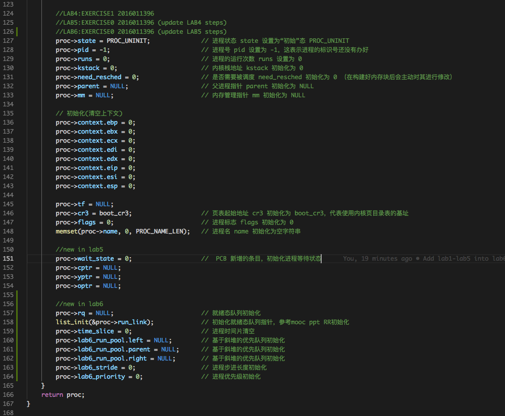
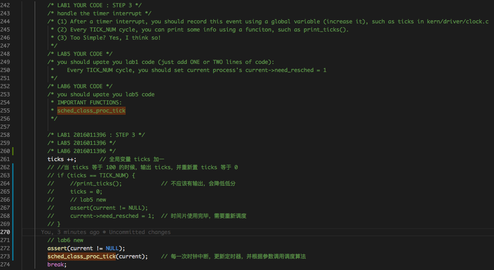
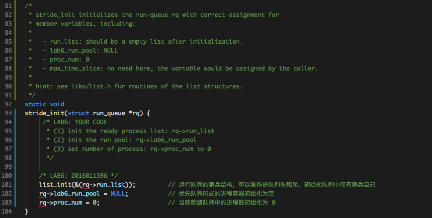
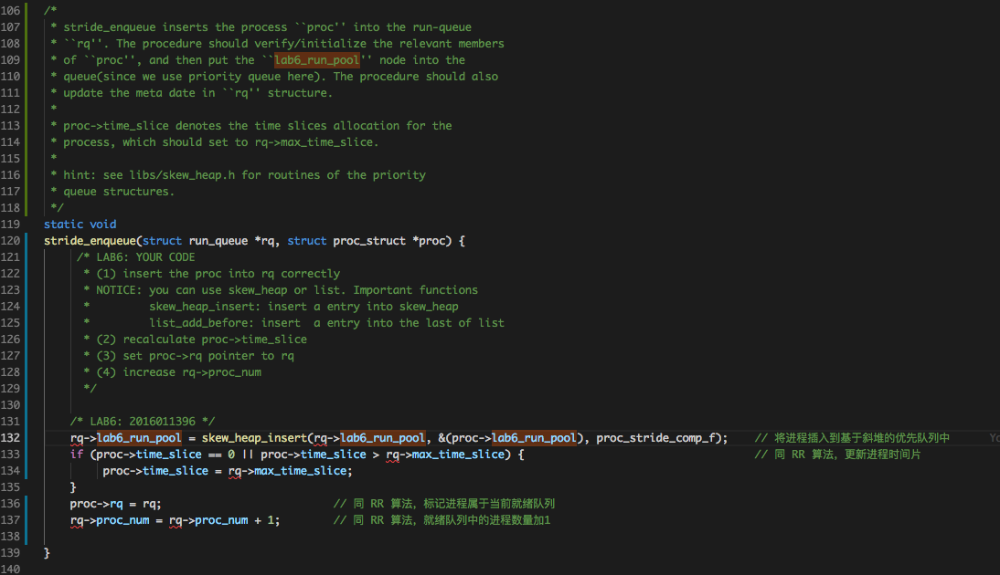
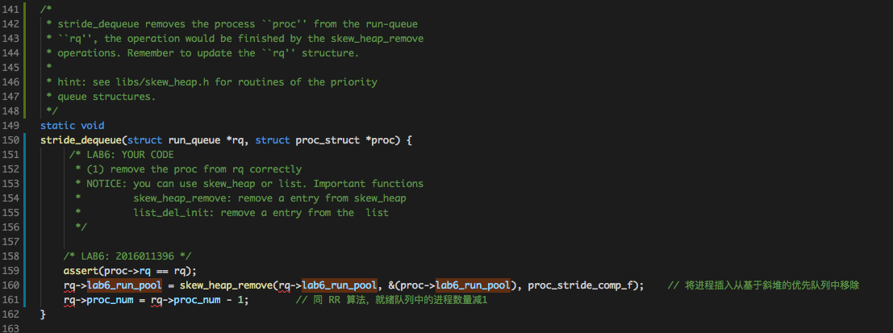
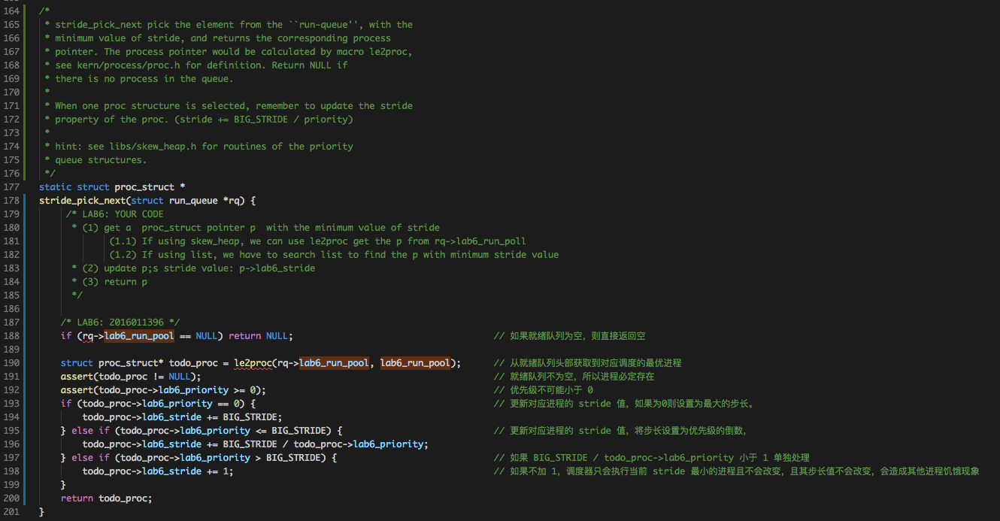
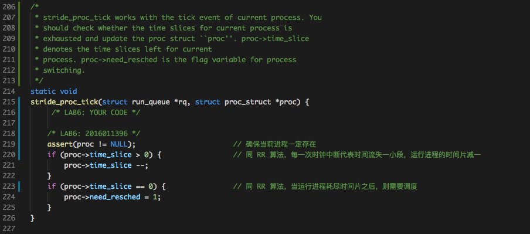
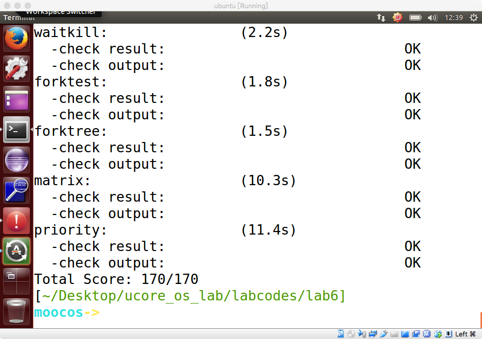
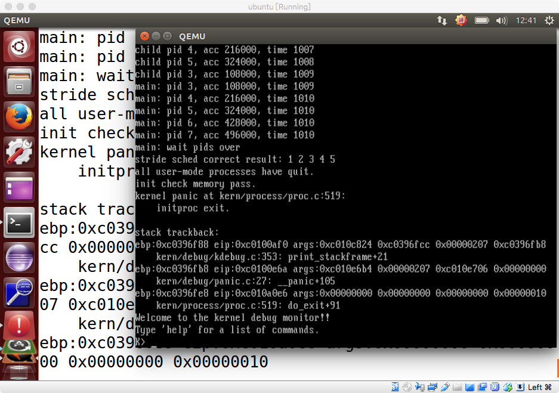

# Lab6 实验报告
计61 柳瑞阳 2016011396

## 练习零：填写已有实验

　　借用 Meld 工具，依赖 lab5, 把 lab1-lab5 的代码填入本实验中代码中有 “LAB1” 、“LAB2” 、 “LAB3”、“LAB4” 和 “LAB5” 的注释相应部分。总共修改的文件有七个，分别是以下文件：  

* **default_pmm.c**
* **pmm.c**
* **trap.c**
* **kdebugs.c**
* **vmm.c**
* **swap_fifo.c**
* **proc.c**

　　注意：为了能够正确执行 lab6 的测试应用程序，可能需对已完成的实验 1/2/3/4/5 的代码进行进一步改进。在搜索栏中搜关键词 **LAB6 YOUR CODE**，发现一共两处地方需要修改：  
　　首先针对 kern/process/proc.c 中的 alloc\_proc 函数，观察 struct proc\_struct 新增成员变量如下:  

    struct run_queue *rq;                       // running queue contains Process
    list_entry_t run_link;                      // the entry linked in run queue
    int time_slice;                             // time slice for occupying the CPU
    skew_heap_entry_t lab6_run_pool;            // FOR LAB6 ONLY: the entry in the run pool
    uint32_t lab6_stride;                       // FOR LAB6 ONLY: the current stride of the process 
    uint32_t lab6_priority;                     // FOR LAB6 ONLY: the priority of process, set by lab6_set_priority(uint32_t)

　　在此需要对新增添的成员变量进行初始化。具体函数如下：

	 

　　最后是针对 kern/trap/trap.c 中的 trap\_dispatch 函数，需要在每一个 TICK_NUM 计数循环中调用函数 sched\_class\_proc\_tick，即每一次产生时钟中断，调用我们自己实现的 proc\_tick 函数，实现进程时间片的更新，以及时间片是否耗尽需要交出CPU执行权并调度进程的判断。当然此时需要确保当前进程存在。 

	void
	sched_class_proc_tick(struct proc_struct *proc) {
	    if (proc != idleproc) {
	        sched_class->proc_tick(rq, proc);
	    }
	    else {
	        proc->need_resched = 1;
	    }
	}

　　具体实现函数如下：

	 

　　至此，练习零完成，代码准备工作实现完毕。

---

   

## 练习一：使用 Round Robin 调度算法

### 练习内容：

　　完成练习 0 后，建议大家比较一下（可用 kdiff3 等文件比较软件）个人完成的 lab5 和练习 0 完成后的刚修改的 lab6 之间的区别，分析了解 lab6 采用 RR 调度算法后的执行过程。执行 make grade，大部分测试用例应该通过。但执行 priority.c 应该过不去。请在实验报告中完成：

* 请理解并分析 sched\_class 中各个函数指针的用法，并结合 Round Robin 调度算法描 ucore 的调度执行过程
* 请在实验报告中简要说明如何设计实现”多级反馈队列调度算法“，给出概要设计，鼓励给出详细设计

### 算法原理：

　　Round Robin 时间片轮转调度算法思想是：同先入先服务(FIFS)维护一个就绪队列(双向链表)，将依次进入就绪队列的进程按次序排在链表尾部，链表头为先进入的进程。让所有就绪队列中的进程按次序分时使用CPU资源。当前进程的时间片用完之后，调度器将当前进程放置到就绪队列的尾部，再从就绪队列头部取出进程进行调度。  
　　通过代码分析，可以观察到时间片轮转算法实现了一个就绪队列的双向链表，维护了一个管理就绪队列的数据结构 run\_queue，其中的成员变量 max\_time\_slice 记录了就绪进程队列中最大的执行时间片。同时在进程控制块中增加了一个成员变量 time\_slice 表示对应进程当前可以运行的时间片长度。当一个进程进入就绪队列时，其可以运行的时间片长度不能大于队列默认的最大时间片长度，若大于，则修改为 max\_time\_slice。当一个进程运行时，每一次时钟中断到来意味着一小段时间的流失，此时就会使得运行进程的 time\_slice 减去 1。当减为 0 时，说明当前运行进程耗尽时间片，应该交出 CPU 执行权，自己重新回到就绪队列中去，并重置 time\_slice 为所处就绪队列中的 max\_time\_slice。此时调度器从就绪队列中直接选取队列头的进程作为下一个执行的进程。如果就绪队列为空，则会切换到内核线程 idle 进行执行，其功能是不断询问就绪队列中是否有进程，如果有则立即交出 CPU 给就绪队列中的进程执行。

### Round Robin 算法的 ucore 实现分析：

　　接下来结合 Round Robin 调度算法描 ucore 的调度执行过程。RR 算法的具体实现在 kern/schedule/default\_sched.c 中。

* **RR\_init**：此函数完成了对就绪状态进程队列的初始化。将就绪队列双向链表置空，并且记录队列中进程数量为 0。 

		static void
		RR_init(struct run_queue *rq) {
		    list_init(&(rq->run_list));
		    rq->proc_num = 0;
		}

* **RR\_enqueue**：此函数完成了进程进入就绪队列的功能。首先声明进程的进程控制块指针存在，将其添加到就绪队列的末尾，并且如果进程控制块的时间片为 0 或者其可用时间片大于当前队列的最大时间片，则需要把它重置为当前队列的 max\_time\_slice。最后标记上进程处于当前就绪队列，当前就绪队列中的进程数量加一。

		static void
		RR_enqueue(struct run_queue *rq, struct proc_struct *proc) {
		    assert(list_empty(&(proc->run_link)));
		    list_add_before(&(rq->run_list), &(proc->run_link));
		    if (proc->time_slice == 0 || proc->time_slice > rq->max_time_slice) {
		        proc->time_slice = rq->max_time_slice;
		    }
		    proc->rq = rq;
		    rq->proc_num ++;
		}

* **RR\_dequeue**：此函数完成了进程出队列的功能。此时需要确保当前进程处于该就绪队列中，并且进程控制块存在，只需用将其进程控制块从队列中弹出，并且将队列中的进程数减一即可。

		static void
		RR_dequeue(struct run_queue *rq, struct proc_struct *proc) {
		    assert(!list_empty(&(proc->run_link)) && proc->rq == rq);
		    list_del_init(&(proc->run_link));
		    rq->proc_num --;
		}

* **RR\_pick\_next**：此函数完成了从就绪队列中选取最合适的进程交给 CPU 执行的功能。基于本算法，最合适的进程即在就绪队列头部，所以只需保证就绪队列不为空的情况下返回处于就绪队列头部的进程即可。若就绪队列为空，则返回 NULL。

		static struct proc_struct *
		RR_pick_next(struct run_queue *rq) {
		    list_entry_t *le = list_next(&(rq->run_list));
		    if (le != &(rq->run_list)) {
		        return le2proc(le, run_link);
		    }
		    return NULL;
		}

* **RR\_proc\_tick**：此函数实现了基于时钟中断时运行进程的时间片减一的功能。如果时间片减为 0，说明该进程已经将自己的时间片耗尽，此时需要交出 CPU 执行权，重新进行调度。这样在下一次中断执行 trap 函数时，会执行 schedule 函数，然后把当前执行进程放回就绪队列末尾，而从就绪队列头取出等待时间最久的那个就绪进程执行。

		static void
		RR_proc_tick(struct run_queue *rq, struct proc_struct *proc) {
		    if (proc->time_slice > 0) {
		        proc->time_slice --;
		    }
		    if (proc->time_slice == 0) {
		        proc->need_resched = 1;
		    }
		}

* **default\_sched\_class**：定义一个 c 语言类的实现，提供 RR 调度算法的函数接口

		struct sched_class default_sched_class = {
		    .name = "RR_scheduler",
		    .init = RR_init,
		    .enqueue = RR_enqueue,
		    .dequeue = RR_dequeue,
		    .pick_next = RR_pick_next,
		    .proc_tick = RR_proc_tick,
		}; 

### sched\_class 各个函数指针的用法

　　通过代码观察，发现调度器类中的主要功能函数五个，他们的功能分别如下：

* init：初始化调度器的相关参数，对应上述 RR\_init
* enqueue：进程进入就绪队列函数，对应于上述 RR\_enqueue
* dequeue：进程移出就绪队列函数，对应于上述 RR\_dequeue
* pick\_next：根据调度策略选择下一个应该被换出的进程，对应于上述 RR\_pick\_next
* proc\_tick：每次时钟中断之后更新进程的相关信息，更新是否需要调度信息函数，对应于上述 RR\_proc\_tick

		struct sched_class {
		    // the name of sched_class
		    const char *name;
		    // Init the run queue
		    void (*init)(struct run_queue *rq);
		    // put the proc into runqueue, and this function must be called with rq_lock
		    void (*enqueue)(struct run_queue *rq, struct proc_struct *proc);
		    // get the proc out runqueue, and this function must be called with rq_lock
		    void (*dequeue)(struct run_queue *rq, struct proc_struct *proc);
		    // choose the next runnable task
		    struct proc_struct *(*pick_next)(struct run_queue *rq);
		    // dealer of the time-tick
		    void (*proc_tick)(struct run_queue *rq, struct proc_struct *proc);
		    /* for SMP support in the future
		     *  load_balance
		     *     void (*load_balance)(struct rq* rq);
		     *  get some proc from this rq, used in load_balance,
		     *  return value is the num of gotten proc
		     *  int (*get_proc)(struct rq* rq, struct proc* procs_moved[]);
		     */
		};

　　根据课堂讲授，在 do\_exit, do\_wait, init\_main, cpu\_idle, lock 中调用 schedule 函数时由于要执行进程切换到等待状态(睡眠状态)操作或进程退出操作，此时需要进程内存资源的回收，并且放弃对 CPU 的使用权。而这些都是属于主动放弃 CPU 使用权，不涉及本次实验的调度算法。  
　　在 trap 函数中会去做当前⼀些进程跟调度相关的一些资源的一些调整，例如时间片的调整从⽽可以影响到后续的调度的选择并进一步产⽣调度。此调度点涉及本次实验的调度算法。在调用 schedule 函数进行进程调度时，首先屏蔽中断，将本进程的 need\_resched 设置为 0。再调用 enqueue 函数将当前进程加入就绪队列 run\_queue 中，接着使用 pick\_next 函数选择出就绪队列头部的第一个进程，调用 dequeue 函数将其从就绪队列中移除。如果没有挑选出来，即就绪队列为空，则会执行内核线程 idle。最后调用 proc\_run 执行新的进程。

	void
	schedule(void) {
	    bool intr_flag;
	    struct proc_struct *next;
	    local_intr_save(intr_flag);
	    {
	        current->need_resched = 0;
	        if (current->state == PROC_RUNNABLE) {
	            sched_class_enqueue(current);
	        }
	        if ((next = sched_class_pick_next()) != NULL) {
	            sched_class_dequeue(next);
	        }
	        if (next == NULL) {
	            next = idleproc;
	        }
	        next->runs ++;
	        if (next != current) {
	            proc_run(next);
	        }
	    }
	    local_intr_restore(intr_flag);
	}

### 多级反馈队列调度算法设计

　　想要实现多级反馈队列调度算法，需要新增加一个就绪队列调度器类，其作用在进程需要 enqueue 到一个就绪队列时根据进程的属性信息，将其添加到合适的就绪队列中去。同时在进程切换时，按照一定的规则从多个就绪队列中选择合适的队列，再从队列中选择合适的进程进行调度。队列间的调度也可用时间片轮转算法实现，即分给不同的队列不同的时间片需求，队列再在给定的时间片下对于自己队列中的进程进行调度。当一个队列的时间片试用完毕，则在下一次调度时选择下一个队列即可。不同队列内部可以使用自己的调度算法，互不影响。

---

   

## 练习二：实现 Stride Scheduling 调度算法

### 练习内容：

　　首先需要换掉 RR 调度器的实现，即用 default\_sched\_stride_c 覆盖default\_sched.c。然后根据此文件和后续文档对 Stride 度器的相关描述，完成 Stride 调度算法的实现。执行：make grade。如果所显示的应用程序检测都输出 ok，则基本正确。如果只是 priority.c 过不去，可执行 make run-priority 命令来单独调试它。大致执行结果可看附录。

### 准备工作：

　　考察 round-robin 调度器，在假设所有进程都充分使用了其拥有的 CPU 时间资源的情况下，所有进程得到的 CPU 时间应该是相等的。但是有时候我们希望调度器能够更智能地为每个进程分配合理的 CPU 资源。假设我们为不同的进程分配不同的优先级，则我们有可能希望每个进程得到的时间资源与他们的优先级成正比关系。Stride 调度是基于这种想法的一个较为典型和简单的算法。该算法的基本思想可以考虑如下：

1. 为每个 runnable 的进程设置一个当前状态 stride，表示该进程当前的调度权。另外定义其对应的 pass 值，表示对应进程在调度后，stride 需要进行的累加值。
2. 每次需要调度时，从当前 runnable 态的进程中选择 stride 最小的进程调度。
3. 对于获得调度的进程 P，将对应的 stride 加上其对应的步长 pass（只与进程的优先权有关系）。
4. 在一段固定的时间之后，回到步骤 2，重新调度当前 stride 最小的进程。可以证明，如果令  P.pass = BigStride / P.priority 其中 P.priority 表示进程的优先权（大于 1），而 BigStride 表示一个预先定义的大常数，则该调度方案为每个进程分配的时间将与其优先级成正比。

　　在 ucore 中，目前 Stride 是采用无符号的32位整数表示。由于溢出的出现，进程间 stride 的理论比较和实际比较结果出现了偏差。我们首先在理论上分析这个问题：令 PASS\_MAX 为当前所有进程里最大的步进值。则我们可以证明如下结论：对每次 Stride 调度器的调度步骤中，有其最大的步进值 STRIDE\_MAX 和最小的步进值 STRIDE\_MIN 之差：STRIDE\_MAX – STRIDE\_MIN <= PASS\_MAX，在加上之前对优先级有 Priority > 1 限制，我们有 STRIDE\_MAX – STRIDE\_MIN <= BIG\_STRIDE, 于是我们只要将 BigStride 取在某个范围之内，即可保证对于任意两个 Stride 之差都会在机器整数表示的范围之内。所以为了不出现溢出，**BIG\_STRIDE = 0x7FFFFFFF**，这样的话就不会溢出了。

　　另外，将该调度器应用到 ucore 的调度器框架中来，则需要将调度器接口实现如下：

* init:
	* 初始化调度器类的信息（如果有的话）
	* 初始化当前的运行队列为一个空的容器结构。（比如和RR调度算法一样，初始化为一个有序列表）
* enqueue:
	* 初始化刚进入运行队列的进程 proc 的 stride 属性。
	* 将 proc 插入放入运行队列中去（注意：这里并不要求放置在队列头部）
* dequeue:
	* 从运行队列中删除相应的元素。
* pick\_next: 
	* 扫描整个运行队列，返回其中stride值最小的对应进程。
	* 更新对应进程的 stride 值，即 pass = BIG\_STRIDE / P->priority; P->stride += pass。
* proc\_tick: 
	* 检测当前进程是否已用完分配的时间片。如果时间片用完，应该正确设置进程结构的相关标记来引起进程切换。
	* 一个 process 最多可以连续运行 rq.max\_time\_slice个时间片。

### 实现流程：

　　在此我完成基于斜堆的优先队列的 stride 调度算法。其各个接口的伪代码描述如下：

* init(rq):
	- Initialize rq->run\_list
	- Set rq->lab6\_run\_pool to NULL
	- Set rq->proc\_num to 0
* enqueue(rq, proc)
	- Initialize proc->time\_slice
	- Insert proc->lab6_run\_pool into rq->lab6\_run\_pool
	- rq->proc\_num ++
* dequeue(rq, proc)
	- Remove proc->lab6\_run\_pool from rq->lab6\_run\_pool
	- rq->proc\_num --
* pick_next(rq)
	- If rq->lab6\_run\_pool == NULL, return NULL
	- Find the proc corresponding to the pointer rq->lab6\_run\_pool
	- proc->lab6\_stride += BIG\_STRIDE / proc->lab6\_priority
	- Return proc
* proc\_tick(rq, proc):
	- If proc->time\_slice > 0, proc->time\_slice --
	- If proc->time\_slice == 0, set the flag proc->need\_resched

　　下面对于每一个函数的具体实现依次进行讲解：  
　　针对 stride\_init 函数，需要初始化的成员变量有 rq->run\_list、rq->lab6\_run\_pool 以及 rq->proc\_num。初始化就绪队列，然后设置当前就绪队列内进程数目为 0。实现代码如下：

	 

　　针对 stride\_enqueue 函数，整体思路同 RR 算法，只是需要将插入就绪队列链表的步骤更改为插入基于斜堆的优先队列实现的就绪队列即可，并且判定如果进程控制块的时间片为 0 或者其可用时间片大于当前队列的最大时间片，则需要把它重置为当前队列的 max\_time\_slice。最后标记上进程处于当前就绪队列，当前就绪队列中的进程数量加一。实现代码如下：

	 

　　针对 stride\_dequeue 函数，整体思路同 RR 算法，首先验证被选择的进程处于当前就绪队列中，将其从优先队列中移除，并将就绪队列中的进程数减一。实现代码如下：

	 

　　针对 stride\_pick\_next 函数，实现思路同代码注释，如果就绪队列为空，则直接返回 NULL。否则选择最小 stride 的进程，并更新其步进值 stride。优先级越低，步进值越大。如果优先级别为 0，步进值增加 BIG\_STRIDE。否则步进值增加 BIG\_STRIDE / todo\_proc->lab6\_priority。但是此处需要注意如果优先级太大，导致增加为 0，则会一直执行当前程序，并且其步进值不会改变。所以对于优先级太大的程序需要单独考虑。实现代码如下：

	 

　　针对 stride\_proc\_tick 函数，整体思路同 RR 算法，实现了基于时钟中断时运行进程的时间片减一的功能。如果时间片减为 0，说明该进程已经将自己的时间片耗尽，此时需要交出 CPU 执行权，重新进行调度。这样在下一次中断执行 trap 函数时，会执行 schedule 函数，然后把当前执行进程放回就绪队列末尾，而从就绪队列头取出等待时间最久的那个就绪进程执行。实现代码如下：

	 

　　至此，lab6 基本完成。

---

   

## 实验总结

　　通过 lab6，我对于调度算法有了更多的认识，对于整个调度过程有了具体的了解。结合之前的实验，基本掌握了系统从启动到内存建立，一直到用户程序执行和切换的整个过程。对于系统的认识达到了一个新的阶段。

#### 实验效果截图

　　至此，lab6 练习 1-2 完成，最终 make grade 得分为 170/170，qemu 运行结果如下，同时执行 make run-priority 运行结果如下：  

	 
	 
	 

#### 实验 lab6 中重要的知识点

* 练习0：时间片轮转算法时钟中断处理，就绪队列结构，进程控制块和就绪队列对进程控制的实现
* 练习1：RR 时间片轮转算法，多级反馈队列调度算法
* 练习2：Stride 调度算法

#### 在实验中没有对应上的知识点

　　我认为 lab6 没有涉及到的知识点有：优先级反置，多处理机调度，实时调度，短进程优先调度，先入服务调度，最高响应比优先算法，公平共享调度算法。

#### 与参考答案的实现区别

* 练习0：与参考答案基本相同
* 练习1：无参考答案
* 练习2：与参考答案基本思路相同，但是增添了 stride\_pick\_next 函数中对于优先级过高容易引起饥饿问题的解决。

   

### 实验参考资料：  

* 实验指导书
* lab6\_result  
* https://blog.csdn.net/ni9htmar3/article/details/73430336  
* https://blog.csdn.net/qq_19876131/article/details/51707003
* 黄家辉学长资料：lab6-tsinghua\_huangjh14.md