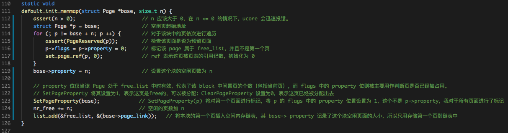
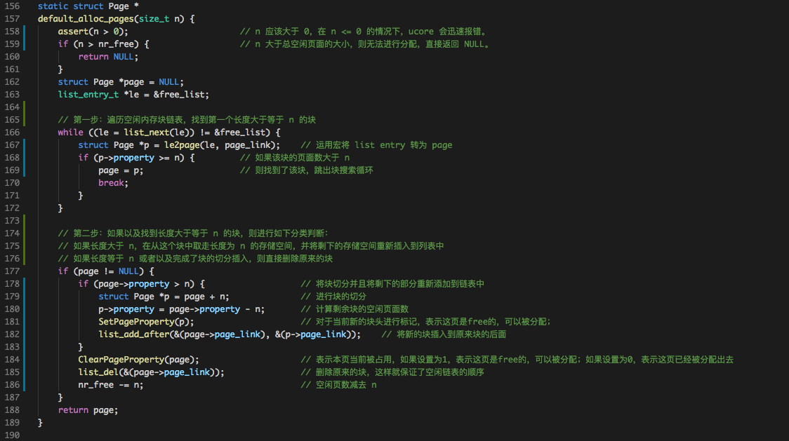
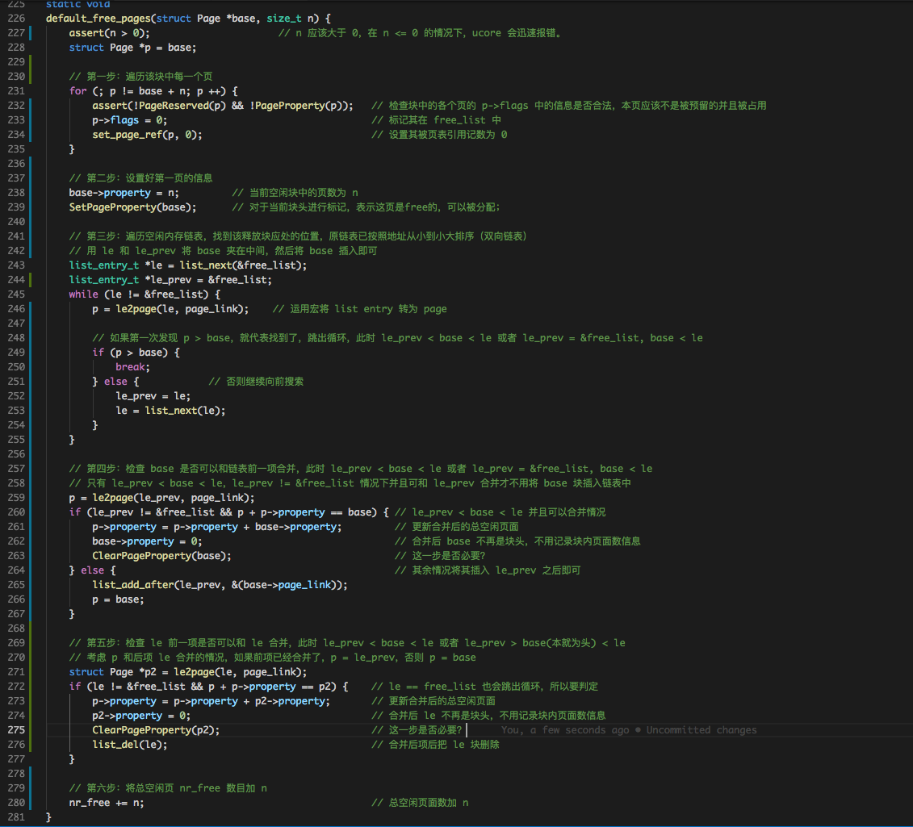
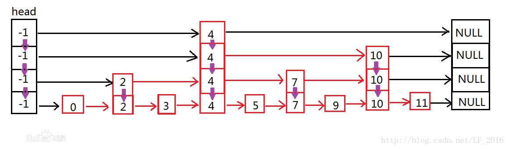
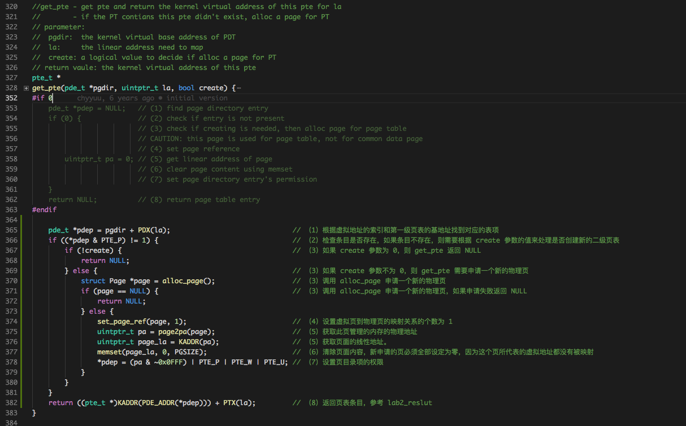
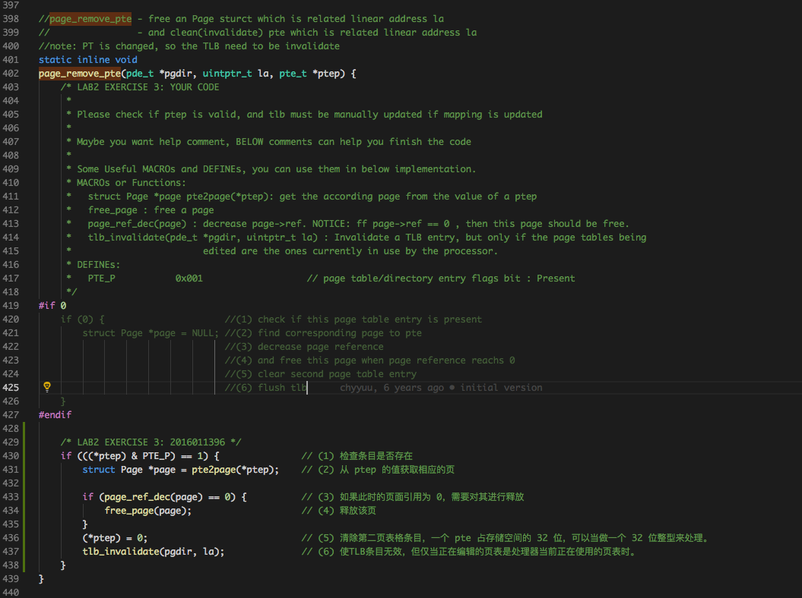
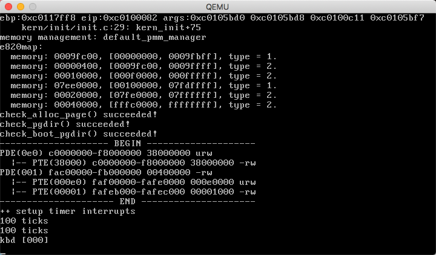

# Lab2实验报告
计61 柳瑞阳 2016011396

## 练习零

　　依赖 lab1, 把 lab1 的代码填入本实验中代码中有 “LAB1” 的注释相应部分。对应 lab1 的练习 5 和练习 6 部分的代码。

---

   

## 练习一

### 练习内容：

　　在实现 **first fit** 内存分配算法的回收函数时，要考虑地址连续的空闲块之间的合并操作。提示:在建立空闲页块链表时，需要按照空闲页块起始地址来排序，形成一个有序的链表。可能会修改 default\_pmm.c 中的 default\_init，default\_init\_memmap，default\_alloc\_pages，default\_free\_pages等相关函数。请仔细查看和理解 default\_pmm.c 中的注释。

### First-Fit:

　　最先匹配算法（First Fit）：空闲分区列表按照地址排序，该算法从空闲分区的链首开始查找，直至找到一个能满足其大小要求的空闲分区为止。然后再按照需求的大小，从该分区中划出一块内存分配给请求者，余下的空闲分区仍留在空闲分区链中。  
　　特点：简单，该算法倾向于使用内存中低地址部分的空闲区，在高地址部分的空闲区很少被利用，从而保留了高地址部分的大空闲区。  
　　缺点：低地址部分不断被划分，留下许多难以利用、很小的空闲区，而每次查找又都从低地址部分开始，会增加查找的开销。同时分配大块时查询时间较长，实现速度较慢。

### 实现思路：

　　在 first fit 算法实现中，主要需要完成四个相关函数：**default\_pmm.c** 中的 **default\_init**，**default\_init\_memmap**，**default\_alloc\_pages**，**default\_free\_pages** 

* **default\_init(void)**

　　default\_init 函数是实现连续内存空闲双向链表的块初始化。free_area_t 数据结构，包含了一个list\_entry 结构的双向链表指针 free\_list 和记录当前空闲页的个数的无符号整型变量 nr\_free。在本函数中将链表头的前向和后向分别指向自己，表示链表为空，同时给 nr\_free 赋初值 0，表示当前空闲页的个数为 0。在实现中我未对此函数进行修改。

		#define free_list (free_area.free_list)
		#define nr_free (free_area.nr_free)
		
		static void
		default_init(void) {
	    	list_init(&free_list);
	    	nr_free = 0;
		}
		
		/* *
		 * list_init - initialize a new entry
		 * @elm:        new entry to be initialized
		 * */
		static inline void
		list_init(list_entry_t *elm) {
		    elm->prev = elm->next = elm;
		}

* **default\_init\_memmap(struct Page \*base, size\_t n)**

　　default\_init\_memmap 函数将起始地址为 base 的 n 个连续页加入到内存中，该函数将根据每个物理页帧的情况来建立空闲页链表，且空闲页块应该是根据地址高低形成一个有序链表。  
　　实现细节是：首先声明空闲页个数 n 应该不小于0。然后基于块地址 base(第一个页)，开始对于每一个页依次遍历，先检查每个遍历到的页是不是预留页面，然后对其 p->flags 设置为0，标记其在 free\_list 中，然后设置其 property 为 0，表示其不是空闲块的第一个页，随后初始化该页被页表引用的次数为0。当 n 个页面被遍历处理完后，设置第一个页面的 property 为 n，即该空闲块有 n 个空闲页面，然后对其 flags 中的 property 位置设置为 1，表明其已经被占用。最后将空闲页总数 nr\_free 加 n，再将第一个页面 base 添加到 free\_list 中即可。在实现中我未对此函数进行修改。
		

	

* **default\_alloc\_pages(size\_t n)**

　　default\_alloc\_pages 实现从空闲链表中申请 n 个空闲页，如果成功，返回第一个页表的地址。在实现中我基于原有的实现，对此函数进行了一定的修改。  
　　我的实现细节是：首先处理简单的情况，要求 n 不能小于 0，然后如果 n 大于总共的空闲页面，这时候一定不可能找到适合的空闲块，所以直接返回空 NULL。然后分两步进行。  
　　第一步：然后如果 n 符合要求，我首先遍历整个空闲内存块链表 free\_list，因为 free\_list 是双向链表，所以判停条件是回到自身。对于找到其中第一个空闲页面数大于 n 的内存块，记录其第一页起始位置，跳出循环。如果没有找到了这样的块，直接返回 NULL。  
　　第二步：如果找到了这样的内存块，则需要进行判断。如果本内存块空间大于需求，则对其进行划分，将划分后新的内存块添加到空闲列表中被找到的内存块的后面，否则不做处理。然后将原由被找到的内存块从 free_list 中删除，这样就能保证切分后剩余的内存块在链表中有正确的位置。同时将待分配块第一页的 flags 中的 property 标记清除，表示从 free\_list 中释放，然后空闲内存总的页面数 nr\_free 减去 n。最后将该块的起始地址(第一页)返回。

	

* **default\_free\_pages(struct Page \*base, size\_t n)**

　　default\_free\_pages 实现将释放的页重新加入到页链表中，并需要考虑空闲块合并的问题。在实现中我基于原有的实现，对此函数进行了一定的修改。  
　　我的实现细节是：首先处理简单的情况，要求 n 不能小于 0。然后分五步进行。  
　　第一步：遍历该块中每一个页，对每一个页的合法性进行检查，然后将其 flags 设置为 0，表示在 free\_list 中，并将被页表引用记数初始化为 0。  
　　第二步：设置好第一页(base)的信息，包括当前空闲块中的页数为 n，以及对于当前块头进行标记，表示这页是free的，可以被分配。  
　　第三步：遍历空闲内存链表，找到该释放块应处的位置。我使用的方法是遍历该空闲内存列表，第一次发现页地址大于 base 则停下，若当前位置为 le，则有两种可能 le\_prev < base < le 且 le\_prev != &free\_list 或者 base < le 且 le\_prev = &free\_list。  
　　第四步：检查 base 是否可以和链表前一项合并。只有 le\_prev < base < le，le\_prev != &free\_list 情况下并且可和 le\_prev 合并才不用将 base 块插入链表中，否则需要将 base 插入到链表中 le\_prev 之后，le 之前。若可合并，则需要更新合并块信息。  
　　第五步：第五步：检查 le 前一项是否可以和 le 合并。若第四步实现了合并，则检查 le\_prev 和 le，否则检查 base 和 le 是否可合并。若可合并，则需要更新合并块信息，并将 le 对应的块删除。  
　　第六步：将总空闲页 nr\_free 数目加 n。

	

　　注：在自我实现后我查看了 lab2\_result 和网上的参考代码，其中对于合并后需要删除的块的起始地址 p，都调用了函数 **ClearPageProperty(p)**。而没有添加 **p->property = 0;**。我认为，为了实现的统一，即在初始化时，在 free\_list 空闲块内部的页面中，p->property 初始化为0，代表不是块头，而是块内部的页，所以本空闲块中空闲页的数量不做记录，仅有块头会对其做记录。而 SetPageProperty(base) 以及 ClearPageProperty(base) 是作用于空闲块的起始页，表示本页开始的块可以分配或已被占用，在分配时对于其块内部页的 flags 中的 property 并不做检查和其他要求，所以在这里调用 ClearPageProperty(p) 这个函数我没有理解到其目的和必要性。但是当我删除其进行测试时，qemu 并不能运行成功，所以我想应该是只有可分配的块头才会将 flags 中的 property 设置为 1，表示可分配，而其他页面不管在不在 free_list 中，其位都将会是 0。这样在执行到 **assert(!PageReserved(p) && !PageProperty(p));** 语句时就不会报错。

### 进一步改进的空间

　　分析 first-fit 算法的实现，无论是分配内存块还是释放内存块，在查找的时候都需要 O(n) 的复杂度。因为我们使用了双向链表来构建空闲内存链表，所以天然需要这样的线性时间。  
　　其实可以采用 **（双向）跳表** 的数据结构, 跳表不仅能提高搜索性能，同时也可以提高插入和删除操作的性能。其平均时间复杂度为 O(log n)。  

	 

　　也可以分析具体应用场景，当中等大小的分配较多时，可以修改为 worst-fit 算法；当大部分分配尺寸较小时，可以修改为 best-fit 算法。或者实现三种算法的接口，存储前几次连续分配内存大小信息，预测下一次分配动态采取分配策略，也是一种可行的方法。

---

   

## 练习二

### 练习内容：

　　通过设置页表和对应的页表项，可建立虚拟内存地址和物理内存地址的对应关系。其中的get\_pte函数是设置页表项环节中的一个重要步骤。此函数找到一个虚地址对应的二级页表项的内核虚地址，如果此二级页表项不存在，则分配一个包含此项的二级页表。本练习需要补全 get\_pte 函数 in kern/mm/pmm.c，实现其功能。

### 准备工作

　　ucore 的内存管理经常需要查找页表：给定一个虚拟地址，找出这个虚拟地址在二级页表中对应的项。通过更改此项的值可以方便地将虚拟地址映射到另外的页上。可完成此功能的这个函数是get\_pte函数。首先观察 **pte\_t \*get\_pte(pde\_t \*pgdir, uintptr\_t la, bool create)** 函数，pde\_t 全称为 page directory entry，也就是一级页表的表项（注意：pgdir实际不是表项，而是一级页表本身。）pte\_t 全称为 page table entry，表示二级页表的表项。uintptr\_t表示为线性地址，由于段式管理只做直接映射，所以它也是逻辑地址。有可能根本就没有对应的二级页表的情况，所以二级页表不必要一开始就分配，而是等到需要的时候再添加对应的二级页表。如果在查找二级页表项时，发现对应的二级页表不存在，则需要根据 create 参数的值来处理是否创建新的二级页表。如果 create 参数为 0，则 get\_pte 返回 NULL；如果 create 参数不为 0，则 get\_pte 需要申请一个新的物理页（通过 alloc\_page 来实现，可在 mm/pmm.h 中找到它的定义），再在一级页表中添加页目录项指向表示二级页表的新物理页。注意，新申请的页必须全部设定为零，因为这个页所代表的虚拟地址都没有被映射。  
　　当建立从一级页表到二级页表的映射时，需要注意设置控制位。这里应该设置同时设置上 PTE\_U、 PTE\_W 和 PTE\_P。如果原来就有二级页表，或者新建立了页表，则只需返回对应项的地址即可。虚拟地址只有映射上了物理页才可以正常的读写。在完成映射物理页的过程中，除了要像上面那样在页表的对应表项上填上相应的物理地址外，还要设置正确的控制位。只有当一级二级页表的项都设置了用户写权限后，用户才能对对应的物理地址进行读写。 所以我们可以在一级页表先给用户写权限，再在二级页表上面根据需要限制用户的权限，对物理页进行保护。由于一个物理页可能被映射到不同的虚拟地址上去（譬如一块内存在不同进程间共享），当这个页需要在一个地址上解除映射时，操作系统不能直接把这个页回收，而是要先看看它还有没有映射到别的虚拟地址上。通过查找管理该物理页的 Page 数据结构的成员变量 ref （用来表示虚拟页到物理页的映射关系的个数）来实现的，如果 ref 为 0 了，表示没有虚拟页到物理页的映射关系了，就可以把这个物理页给回收了，从而这个物理页是 free 的了，可以再被分配。 page\_insert 函数将物理页映射在了页表上。可参看 page\_insert 函数的实现来了解 ucore 内核是如何维护这个变量的。当不需要再访问这块虚拟地址时，可以把这块物理页回收并在将来用在其他地方。取消映射由 page\_remove 来做，这其实是 page\_insert 的逆操作。

### 实现思路

　　我参考程序中给出的实现步骤，具体将实现分为八步实现：  
　　第一步：根据虚拟地址的索引和第一级页表的基地址找到对应的表项。  
　　第二步：检查条目是否存在，如果条目不存在，则需要根据 create 参数的值来处理是否创建新的二级页表，否则直接执行第八步。  
　　第三步：检查 create 参数，如果 create 参数为 0，则 get\_pte 返回 NULL，否则需要调用  alloc\_page 申请一个新的物理页。如果申请失败，同样返回 NULL。    
　　第四步：设置虚拟页到物理页的映射关系的个数为 1，因为是新申请的物理页面，所以一定只有一个虚拟地址与之对应。  
　　第五步：首先获取此页管理的内存的物理地址，再根据物理地址获取页面的线性地址。  
　　第六步：清除页面内容，新申请的页必须全部设定为零，因为这个页所代表的虚拟地址都没有被映射。  
　　第七步：设置页目录项的权限（实现参考lab2\_results）。  
　　第八步：返回页表条目（实现参考lab2\_reslut）。

	   

### 请描述页目录项（Page Directory Entry）和页表项（Page Table Entry）中每个组成部分的含义以及对ucore而言的潜在用处。

　　最顶层的分页结构是页目录。它本质上是一个页目录条目数组。一个 pde 占存储空间的 32 位，可以当做一个 32 位整型来处理。其组成如下：

* Page Table 4KB Aligned Address（31 downto 12）：4KB 对齐的页表起始地址，对应 4 兆字节的页表的物理地址
* Avail (11 downto 9)：可供软件使用，对应填写 ucore 中的 PTE_AVAIL
* G (8)：暂时被忽略没有使用
* S（7）：'Page Size'，存储该特定条目的页面大小。如果该位置位，则页面大小为4 MiB。否则，他们是4 KiB。对应填写 ucore 中的 PTE_PS
* 0（6）：这一位一定是 0，对应填写 ucore 中的 PTE_MBZ
* A（5）：'Accessed'，用于发现页面是否已被读取或写入。如果有，则设置该位，否则不设置。对应填写 ucore 中的 PTE_A
* D（4）：'Cache Disable'位，如果设置该位，则不会缓存页面。否则，它会。对应填写 ucore 中的。对应填写 ucore 中的 PTE_PCD
* W（3）：通过的能力。如果该位置1，则启用直写式高速缓存。如果不是，则启用回写。对应填写 ucore 中的 PTE_PWT
* U（2）：'User / Supervisor'位，根据权限级别控制对页面的访问。如果该位置位，则所有人都可以访问该页面; 但是，如果未设置该位，则只有主管可以访问它。对应填写 ucore 中的 PTE_U
* R（1）：'Read / Write'权限标志，如果该位置1，则页面是可读/写的。否则，当未设置时，页面是只读的。对应填写 ucore 中的 PTE_W
* P（0）：'Present'，如果该位置位，则该页面实际上处于物理内存中。对应填写 ucore 中的 PTE_P

	  

　　在每个页面表中，实际上也有1024个条目。这些称为页表条目，与页面目录条目非常相似。同 pde 一样，一个 pte 占存储空间的 32 位，可以当做一个 32 位整型来处理。其组成如下：

* Physical Page Address（31 downto 12）：4KB 对齐的物理地址，地址是 4KB 的物理内存块
* Avail（11 downto 9）：可供软件使用，对应填写 ucore 中的 PTE_AVAIL
* G（8）：Global标志
* 0（7）：如果支持PAT，则应指示存储器类型。否则，它必须为0。对应填写 ucore 中的 PTE_MBZ
* D（6）：Dirty标志，如果已设置，表示已写入页面。CPU不会更新此标志，一旦设置将不会自行设置。
* A（5）：'Accessed'，用于发现页面是否已被读取或写入。如果有，则设置该位，否则不设置。对应填写 ucore 中的 PTE_A
* C（4）：Cached 是前一个表中的 'D' 位，对应填写 ucore 中的 PTE_PCD
* W（3）：通过的能力。如果该位置1，则启用直写式高速缓存。如果不是，则启用回写。对应填写 ucore 中的 PTE_PWT
* U（2）：'User / Supervisor'位，根据权限级别控制对页面的访问。如果该位置位，则所有人都可以访问该页面; 但是，如果未设置该位，则只有主管可以访问它。对应填写 ucore 中的 PTE_U
* R（1）：'Read / Write'权限标志，如果该位置1，则页面是可读/写的。否则，当未设置时，页面是只读的。对应填写 ucore 中的 PTE_W
* P（0）：'Present'，如果该位置位，则该页面实际上处于物理内存中。对应填写 ucore 中的 PTE_P

	  

### 如果ucore执行过程中访问内存，出现了页访问异常，请问硬件要做哪些事情？

　　当进程正在寻求访问未映射到任何物理内存的虚拟内存区域时，当在只读页面上尝试写入时，当使用保留位访问 PTE 或 PDE 时，会导致页面错误异常或权限不足时。  
　　在触发页面错误异常之前，CPU 会在堆栈上推送错误代码。必须由异常处理程序分析错误代码，以确定如何处理异常。异常代码的最低 3 位是唯一使用的位，保留位 3-31。这些标志的组合指定页面错误的详细信息并指出要采取的操作： 

		位0（P）是Present标志。
		位1（R / W）是读/写标志。
		位2（U / S）是用户/超级用户标志。
		
		US RW  P - Description
		0  0  0 - Supervisory process tried to read a non-present page entry
		0  0  1 - Supervisory process tried to read a page and caused a protection fault
		0  1  0 - Supervisory process tried to write to a non-present page entry
		0  1  1 - Supervisory process tried to write a page and caused a protection fault
		1  0  0 - User process tried to read a non-present page entry
		1  0  1 - User process tried to read a page and caused a protection fault
		1  1  0 - User process tried to write to a non-present page entry
		1  1  1 - User process tried to write a page and caused a protection fault

　　当 CPU 触发页面不存在的异常时，CR2 寄存器将填充导致异常的线性地址。高 10 位指定页目录条目（PDE），中 10 位指定页表条目（PTE）。首先检查 PDE 并查看它是否存在位，如果没有设置页表并将 PDE 指向页表的基地址，则设置当前位和 iretd。如果存在 PDE，则清除 PTE 的当前位。您需要将一些物理内存映射到页表，设置当前位然后 iretd 继续处理。

---

   

## 练习三

### 练习内容：

　　当释放一个包含某虚地址的物理内存页时，需要让对应此物理内存页的管理数据结构 Page 做相关的清除处理，使得此物理内存页成为空闲；另外还需把表示虚地址与物理地址对应关系的二级页表项清除。请仔细查看和理解 page\_remove\_pte 函数中的注释。为此，需要补全在 kern/mm/pmm.c 中的 page\_remove\_pte 函数。

### 准备工作：

　　page\_remove\_pte 函数完成释放一个与线性地址相关的页面结构，并且清除与线性地址相关的失效的 pte。**page\_remove\_pte(pde\_t \*pgdir, uintptr\_t la, pte\_t \*ptep)** 含有三个参数，分别是页目表项 pgdir，对应的线性地址 la，以及需要清除的第二页表条目 ptep。pgdir 实际不是表项，而是一级页表本身。通过 ptep 可以获取对应页面，判断此页被引用的次数，如果删除之前仅仅被引用一次，则这个页也可以被释放。同时需要清空 ptep，因为一个 pte 占存储空间的 32 位，可以当做一个 32 位整型来处理，清空的含义即将其设置为 0。然后可以通过 pgdir 和 la，实现删除对应 TLB 条目的功能。

### 实现细节

　　我参考程序中给出的实现步骤，具体将实现分为六步实现：  
　　第一步：检查确认第二页表条目是否存在，如果存在才进行移除操作。  
　　第二步：通过第二页表条目获取对应的物理页面。  
　　第三步：将物理页面的引用次数减一。    
　　第四步：如果物理页面引用次数变为 0，说明没有任何程序使用其页面，可以将之释放。  
　　第五步：清除第二页表条目，即将之初始化为 0。  
　　第六步：清除 TLB 中相关条目。  

	  

### 数据结构Page的全局变量（其实是一个数组）的每一项与页表中的页目录项和页表项有无对应关系？如果有，其对应关系是啥？

　　他们之间有关系。Page 数组主要用于管理物理的连续内存，数组中每一个 page 对应物理内存中的一个页。页目录表存放于物理内存的页中，其每一项指向的页表也存储在物理内存的页中；页表中每一项存储的是页的物理内存地址，通过这个地址能够找到与之对应的 Page 结构。具体如下图：
　　

	  

### 如果希望虚拟地址与物理地址相等，则需要如何修改lab2，完成此事？

　　在 lab2 中，地址映射的建立分为四个阶段完成，针对不同的阶段需要修改不同的代码以使得虚拟地址和物理地址相等。  
　　第一阶段：bootloader 阶段，即从 bootloader 的 start 函数（在 boot/bootasm.S 中）到执行ucore kernel 的 kern\_entry 函数之前，其虚拟地址，线性地址以及物理地址之间的映射关系与 lab1 的一样，**virt addr = linear addr = phy addr**，无需修改；  
　　第二阶段：从kern\_entry 函数开始，到执行 enable\_page 函数（在 kern/mm/pmm.c 中）之前再次更新了段映射，还没有启动页映射机制。由于 gcc 编译出的虚拟起始地址从 0xC0100000 开始，ucore 被bootloader 放置在从物理地址 0x100000 处开始的物理内存中。所以当 kern\_entry 函数完成新的段映射关系后，且 ucore 在没有建立好页映射机制前，CPU 按照 ucore 中的虚拟地址执行，能够被分段机制映射到正确的物理地址上，确保 ucore 运行正确。这时的虚拟地址，线性地址以及物理地址之间的映射关系为： **virt addr - 0xC0000000 = linear addr = phy addr**。需要修改的地方为 ucore 的链接脚本，将 ucore 起始的虚拟地址由 0xC0100000 改为 0x00100000。   
　　第三阶段：从 enable\_page 函数开始，到执行 gdt\_init 函数（在 kern/mm/pmm.c 中）之前，启动了页映射机制，但没有第三次更新段映射。这时的虚拟地址，线性地址以及物理地址之间的映射关系比较微妙 **virt addr - 0xC0000000 = linear addr  = phy addr + 0xC0000000 # 线性地址在0~4MB之外的三者映射关系**; **virt addr - 0xC0000000 = linear addr  = phy addr # 线性地址在0~4MB之内的三者映射关系**。这个时候页机制和段机制对于 0xC0000000 的偏移是叠加的。仅需要将 boot\_map\_segment 函数调用的 KERNBASE 参数改为 0，并取消 VPT 的递归自映射。这种情况下也没有必要专门建立 0-4M 物理地址映射，因为即使偏移叠加物理地址和虚拟地址还是相等的。  
　　第四阶段：从 gdt\_init 函数开始，第三次更新了段映射，形成了新的段页式映射机制，并且取消了临时映射关系，即执行语句 “boot\_pgdir[0] = 0;” 把 boot\_pgdir[0] 的第一个页目录表项（0~4MB）清零来取消临时的页映射关系。此阶段由于完全启用了页机制，且页机制的相关参数已经在之前设置完毕，所以无需修改，虚拟地址自会与物理地址相等。

　　**具体实现如下：**

* 更改链接脚本tools/kernel.ld，将虚拟地址改为0x100000：

		SECTIONS {
		  /* Load the kernel at this address: "." means the current address */
		  . = 0x0100000;
  
* 把 mm/memlayout.h, kernel基地址改回0：

		/* All physical memory mapped at this address */
		#define KERNBASE            0x00000000

* 注释 mm/pmm.c 中0~4M区域内存页映射的代码

		//disable the map of virtual_addr 0~4M
		// boot_pgdir[0] = 0;

（本问题参考 https://www.jianshu.com/p/216dc51294b9 以及 黄家辉学长资料进行实现，但是修改后并没有成功运行 qemu，尚不清楚问题出现在哪里）

---

   

## 实验总结

　　通过 lab2，我对于操作系统中的物理内存管理有了更近一步的认识。不仅对于连续物理内存管理中的内存分配算法，还有非连续物理内存管理中的段页式管理实现都有了进一步的了解。

#### 实验效果截图

　　至此，lab2 练习 1-3 完成，qemu 运行结果如下：

	  

#### 实验lab2中重要的知识点

* 练习1：连续内存地址分配策略（First-Fit算法）
* 练习2：段页式存储管理，PDE 和 PTE 的组成，虚拟内存到物理内存的转换
* 练习3：段页式存储管理，二级页表以及物理页面的释放

#### 在实验中没有对应上的知识点

　　我认为实验二对于内存分配算法，段页式存储管理有所涉及，但是内容不全。内存分配算法只是设计到了 first-fit，对于 best-fit 和 worse-fit 还没有涉及。同时对于内存释放，没有进行碎片整理，块的重定位。段页式管理之体现了页表项查询和删除，并未涉及到段表。同时对于反置页表也没有涉及。

#### 与参考答案的实现区别

* 练习1：我修改了 default\_alloc\_pages 和 default\_free\_pages 函数，其中前者基本代码思路和实现相同，后者实现思路有较大不同。我的实现是先确定块的位置，然后判断和前一个块合并，在判断和后一个块合并。参考答案的实现是在第一轮遍历空闲内存链表时就判断块能不能向前或者向后合并，如果可以合并则实现合并。在第一轮遍历中即可完成最多三块的合并，如果实现了合并则将合并后的块进行删除，此时 base 指向合并后的块的起始地址。在第二轮遍历中确定 base 正确的位置，并实现插入。与我的实现思路刚好相反。
* 练习2：我根据代码注释编写实现，实现逻辑与参考答案大致相同。
* 练习3：我根据代码注释编写实现，实现逻辑与参考答案大致相同。

---

   

### 实验参考资料：  

* lab2\_result  
* https://www.jianshu.com/p/216dc51294b9   
* https://blog.csdn.net/yanhangy/article/details/79319333
* 黄家辉学长资料：lab1-tsinghua\_huangjh14.md
* https://wiki.osdev.org/Paging