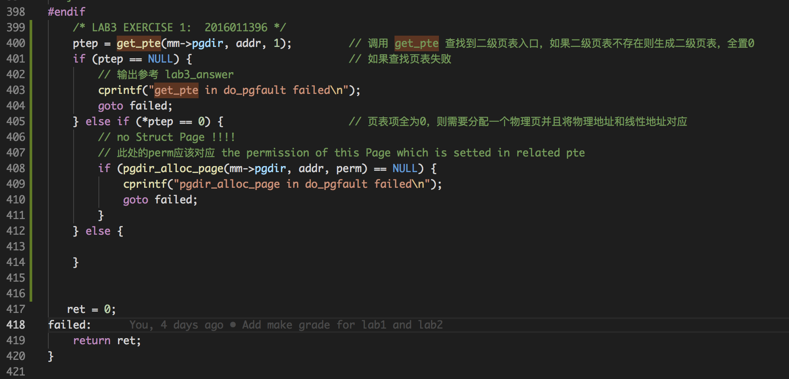
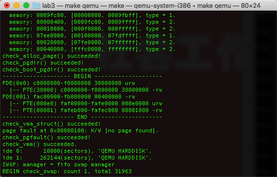
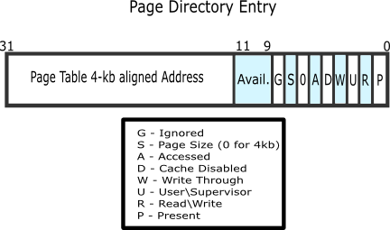
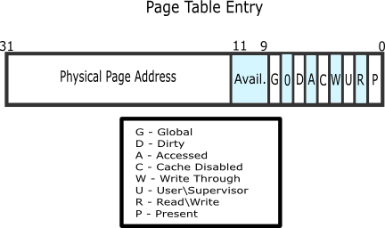
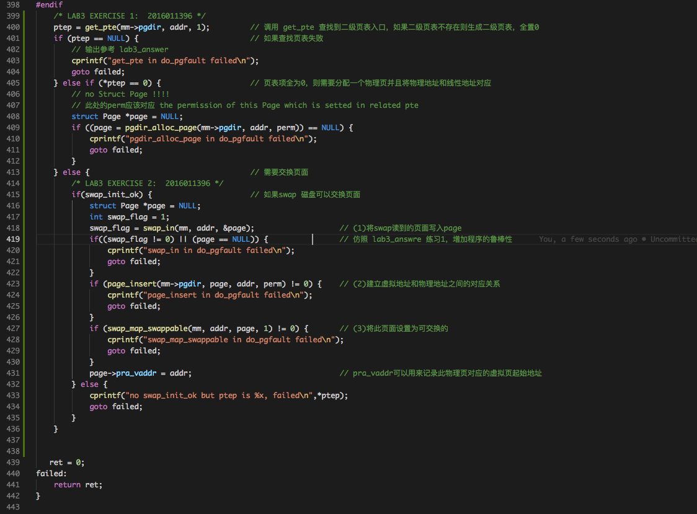
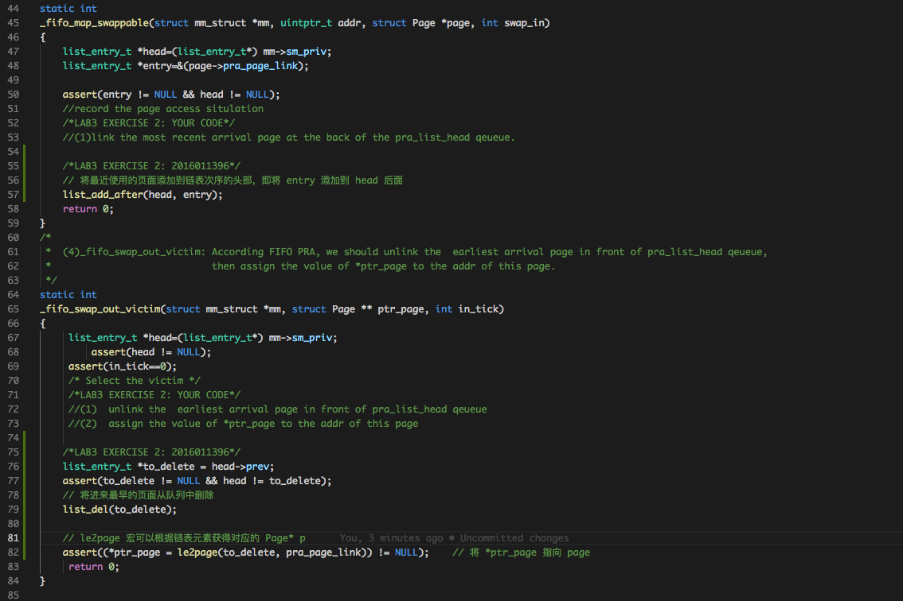
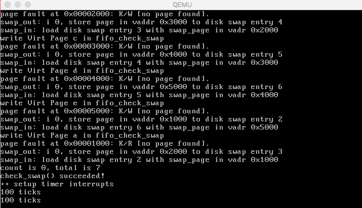
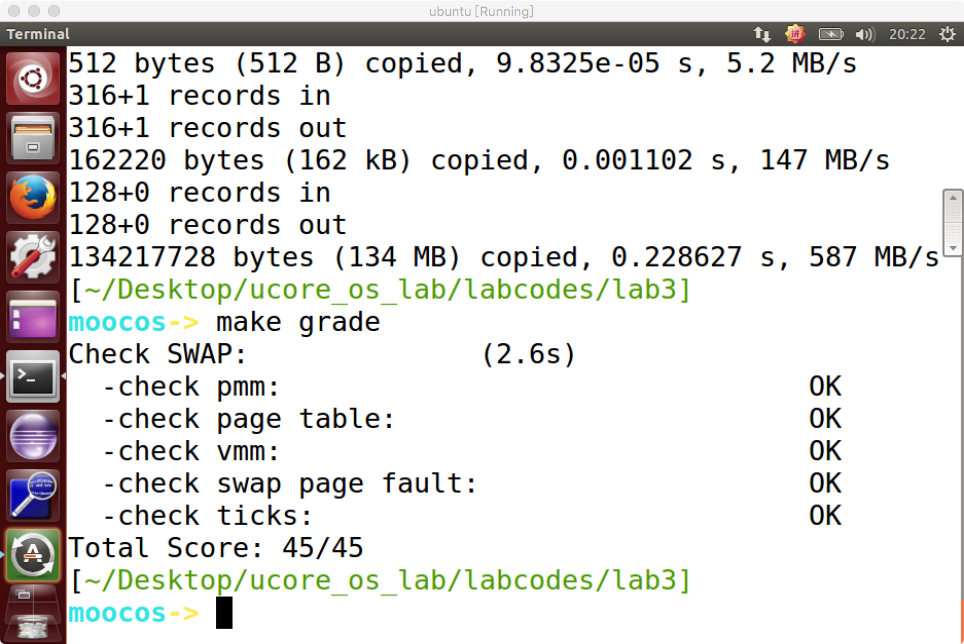

# Lab3实验报告
计61 柳瑞阳 2016011396

## 练习零：填写已有实验

　　借用 Meld 工具，依赖 lab2, 把 lab1-lab2 的代码填入本实验中代码中有 “LAB1” 和 “LAB2” 的注释相应部分。总共修改的文件有四个，分别是以下文件：  

* **default_pmm.c**
* **pmm.c**
* **trap.c**
* **kdebugs.c**

---

   

## 练习一：给未被映射的地址映射上物理页

### 练习内容：

　　完成 do\_pgfault（mm/vmm.c）函数，给未被映射的地址映射上物理页。设置访问权限的时候需要参考页面所在 VMA 的权限，同时需要注意映射物理页时需要操作内存控制 结构所指定的页表，而不是内核的页表。注意：在LAB3 EXERCISE 1 处填写代码。如果通过 check\_pgfault 函数的测试后，会有 “check\_pgfault() succeeded!” 的输出，表示练习 1 基本正确。

### 准备工作:

　　首先分析 ucore 的启动初始化函数 init 的代码，可以看到在调用完成虚拟内存初始化的 vmm\_init 函数之前，需要首先调用 pmm\_init 函数完成物理内存的管理，这是在 lab2 已经完成的内容。接着是执行中断和异常相关的初始化工作，即调用 pic\_init 函数和 idt\_init 函数等，这些工作是 lab1 的中断异常初始化相关工作。  
　　在调用完 idt\_init 函数之后，调用 vmm\_init 函数，初始化虚拟内存管理器(virtual memory manager)。为了表述不在物理内存中的“合法”虚拟页，需要有数据结构来描述这样的页，为此 ucore 中建立了 mm\_struct 和 vma\_struct 数据结构。通过这些数据结构我们能描述“合法的”虚拟页，当 ucore 访问这些“合法”虚拟页时，会由于没有虚实地址映射而产生页访问异常。do\_pgfault 函数会申请一个空闲物理页，并建立好虚实映射关系，从而使得这样的“合法”虚拟页有实际的物理页帧对应。  
　　在 **vmm.c** 的 check\_pgfault 函数中会触发页缺失异常，然后会根据异常编号 **T\_PGFLT** 找到对应的 **trap.c** 中的中断服务例程。此时会通过调用函数 **pgfault\_handler**。**pgfault\_handler** 会先生成一个 mm\_struct 结构的内存管理器，进行 **do\_pgfault** 函数调用。   
　　ucore 中 do\_pgfault 函数是完成页访问异常处理的主要函数，它根据从 CPU 的控制寄存器 CR2 中获取的页访问异常的物理地址以及根据 errorCode 的错误类型来查找此地址是否在某个 VMA 的地址范围内以及是否满足正确的读写权限，如果在此范围内并且权限也正确，这认为这是一次合法访问，但没有建立虚实对应关系。所以需要分配一个空闲的内存页，并修改页表完成虚地址到物理地址的映射，刷新 TLB，然后调用iret 中断，返回到产生页访问异常的指令处重新执行此指令。如果该虚地址不在某 VMA 范围内，则认为是一次非法访问。此时会进行判断是，如果 **写一个不能被写的虚拟页**、**读一个存在的虚拟页** 或者 **读一个不存在的但是不能被读的虚拟页** 会返回 failed，仅仅以下三种情况需要完成申请一个空闲物理页，并建立好虚实映射关系，从而使得这样的“合法”虚拟页有实际的物理页帧对应的工作：

* write an existed addr 
* write an non_existed addr && addr is writable
* read  an non_existed addr && addr is readable

### 实现流程:

　　根据代码前的备注解释，首先我需要根据一开始查 PDT 得到的地址 mm->pgdir，页目录表页内偏移 addr 调用 get\_pte 函数查询到对应的二级页表，如果查询失败，则报错返回。若页表不存在，则需要创建一个页表，故 get\_pte 第三个参数 create = 1。当查到页表项后发现页表项不存在(全为0)，则需要调用 pgdir\_alloc\_page 分配一个物理页并且将物理地址和线性地址对应。如果分配失败，则报错返回。具体报错输出内容参考 lab3\_answer 的输出。实现完成后，执行 **make qemu**，成功输出 **check\_pgfault() succeeded!**。实验代码和运行输出如下：

	 
	 

  

### 请描述页目录项（Page Directory Entry）和页表项（Page Table Entry）中组成部分对ucore实现页替换算法的潜在用处。

　　答：首先观察 PDE 和 PTE 的结如下图。PDE 和 PTE 的高 20 位对应了虚拟地址 -- 线性地址 -- 物理地址的映射关系，用于对应页面的查找。其中 PTE 的访问位和脏位（修改位）可以某物理页面作为历史访问的记录存储，作为实现基于时钟算法或改进时钟算法的数据支撑。因为目前的页替换算法实现在二级页表数据与物理页面间，所以暂时 PDE 组成部分对于 ucore 实现页替换算法的实现用处尚不明显。

	 
	 

　

  

### 如果ucore的缺页服务例程在执行过程中访问内存，出现了页访问异常，请问硬件要做哪些事情？

　　答：产生页访问异常后，CPU硬件和软件都会做一些事情来应对此事。针对一般异常的硬件处理操作是必须要做的，即 CPU 在当前内核栈保存当前被打断的程序现场，即依次压入当前被打断程序使用的EFLAGS，CS，EIP，errorCode；由于页访问异常的中断号是 0xE，CPU 把异常中断号 0xE 对应的中断服务例程的地址（vectors.S 中的标号 vector14 处）加载到 CS 和 EIP 寄存器中。CPU 把引起页访问异常的线性地址装到寄存器 CR2 中，并给出了出错码 errorCode ，说明了页访问异常的类型，接下来，在 trap.c 的 trap 函数开始了中断服务例程的处理流程。

---

   

## 练习二：补充完成基于FIFO的页面替换算法

### 练习内容：

　　完成 vmm.c 中的 do\_pgfault 函数，并且在实现 FIFO 算法的 swap\_fifo.c 中完成 map\_swappable 和 swap\_out\_victim 函数。通过对 swap 的测试。通过 check\_swap 函数的测试后，会有 **“check\_swap() succeeded!”** 的输出，表示练习 2 基本正确。

### 准备工作:

　　在 vmm\_init 函数函数完成之后，调用了 ide\_init 和 swap\_init 函数，ide\_init 就是完成对用于页换入换出的硬盘（简称 swap 硬盘）的初始化工作。完成 ide\_init 函数后，ucore 就可以对这个 swap 硬盘进行读写操作了。swap\_init 函数首先建立 swap\_manager，swap\_manager 是完成页面替换过程的主要功能模块，其中包含了页面置换算法的实现。然后会进一步调用执行 check\_swap 函数在内核中分配一些页，模拟对这些页的访问，这会产生页访问异常。我们可以通过 do\_pgfault 来调用 swap\_map\_swappable 函数来查询这些页的访问情况并间接调用实现页面置换算法的相关函数，把“不常用”的页换出到磁盘上。  
　　首先需要继续完成 do\_pgfault 函数中页面交换部分的框架。然后基于 FIFO 算法实现map\_swappable 和 swap\_out\_victim 函数，实现替换页面的选择。

### 实现流程:

　　首先完成 do\_pgfault 函数的余下部分。先判断 swap 磁盘是否准备就绪(初始化成功)，如果没有初始化成功则报错返回。当 swap 磁盘准备就绪之后，首先根据 mm 和 addr ，调用 swap\_in 函数找到对应磁盘中的页面，存储在临时变量 page 中。随后调用 page\_insert 函数进行物理地址和线性地址的映射。最后调用 swap\_map\_swappable 函数实现页面的替换。具体代码如下：

	 

　

　　然后在 swap\_fifo.c 中完成 \_fifo\_map\_swappable 和 \_fifo\_swap\_out\_victim 函数。mm\_struct 数据结构中的成员变量 mmap\_list 是双向链表头，链接了所有属于同一页目录表的虚拟内存空间。我们需要将换入和换出的页面添加到这个链表中或进行删除操作。针对 \_fifo\_map\_swappable 函数，仅仅需要将换入页对应 entry 添加到链表 head 后面即可，这样就代表是最新加入的页面。针对 \_fifo\_swap\_out\_victim 函数，则考虑将双向链表 head 以前的第一个可选择页面替换出去，即从链表中删除，并将对应页面赋给参数 ptr\_page 指针。具体代码如下：

	 

　

### 如果要在ucore上实现"extended clock页替换算法"请给你的设计方案，现有的swap\_manager框架是否足以支持在ucore中实现此算法？如果是，请给你的设计方案。如果不是，请给出你的新的扩展和基此扩展的设计方案。并需要回答如下问题

* 需要被换出的页的特征是什么？
* 在ucore中如何判断具有这样特征的页？
* 何时进行换入和换出操作？

　　答：现有的 swap\_manager 框架可以支持 ucore 实现 “extended clock” 页替换算法。具体的设计方案见扩展实验报告相关部分。  
　　　　需要被换出的页的特征是：【被第一个发现的该页表项的 Access 位和 Dirty 位均为 0】  
　　　　在ucore中如何判断具有这样特征的页的判断依据是：【根据该物理页对应的 pte 即可，查询该页表项的 Access 位和 Dirty 位作为判断依据】  
　　　　进行换入换出操作的时间控制：【换入操作发生在：缺页异常发生之后，需要访问的页不在物理内存中。换出操作发生在：物理内存已满，没有空闲的物理页面可分配，然而此时请求新的物理页面时，需要换出未来最不可能使用的物理页。】  

---

   

## 实验总结

　　通过 lab3，我对于操作系统中虚拟内存管理有了更近一步的认识。不仅对于页异常的处理机制，物理页面的置换算法等都有了进一步的了解。  

#### 实验效果截图

　　至此，lab3 练习 1-2 完成，最终 make grade 得分为 45/45，qemu 运行结果如下：  

	 
	 

　

#### 实验 lab3 中重要的知识点

* 练习1：页异常处理机制，虚拟页式存储寻址，页面替换
* 练习2：虚拟页式存储页面替换算法（FIFO，时钟算法）

#### 在实验中没有对应上的知识点

　　我认为实验三对于虚拟内存分配算法有所涉及，包括页访问异常的处理，局部页面置换算法等，但是同课堂知识对比，没有涉及到 Belady 现象，也没有设计 LRU 算法，LFU 算法和全局置换算法。

#### 与参考答案的实现区别

* 练习1：与参考答案基本思路相同，一开始没有进行判错处理，借鉴参考答案判错处理后实现更多的判错处理，增强程序的鲁棒性。
* 练习2：与参考答案基本思路相同，但是判错更多，程序鲁棒性和报错后的提示信息更多。

   

### 实验参考资料：  

* 实验指导书
* lab3\_result  
* https://blog.csdn.net/cs_assult/article/details/46565779  
* https://wenku.baidu.com/view/4a4126adb1717fd5360cba1aa8114431b90d8e9a.html
* 黄家辉学长资料：lab3-tsinghua\_huangjh14.md

