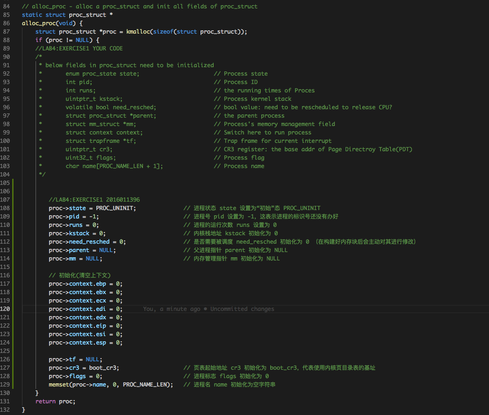
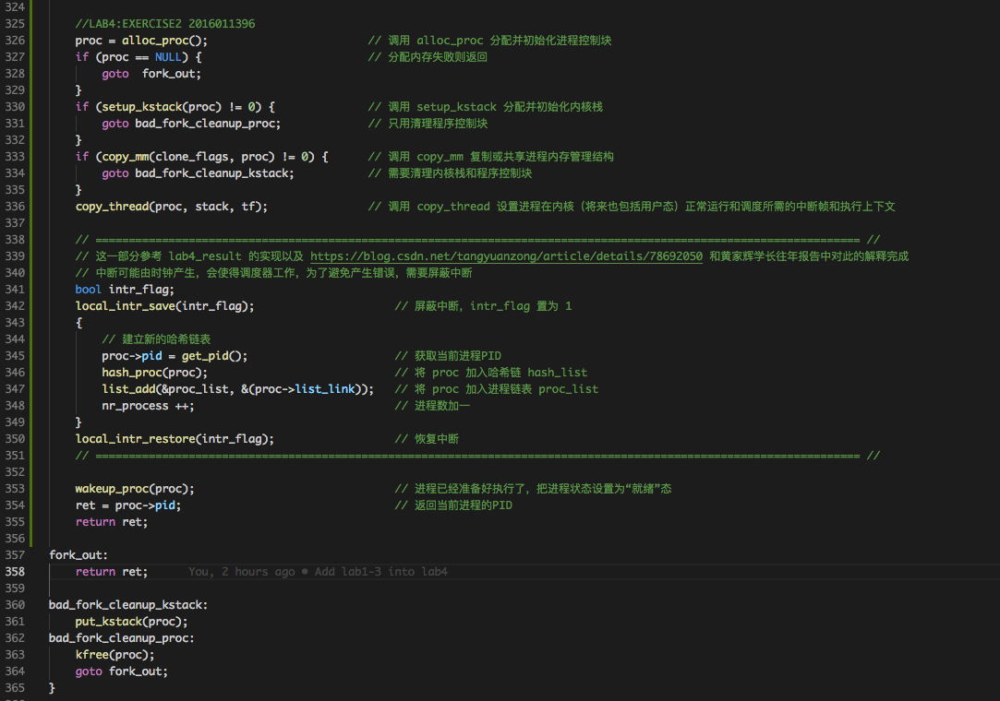
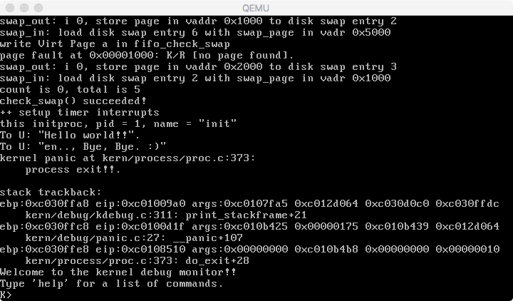

# Lab4实验报告
计61 柳瑞阳 2016011396

## 练习零：填写已有实验

　　借用 Meld 工具，依赖 lab3, 把 lab1-lab3 的代码填入本实验中代码中有 “LAB1” 、“LAB2” 和 “LAB3” 的注释相应部分。总共修改的文件有四个，分别是以下文件：  

* **default_pmm.c**
* **pmm.c**
* **trap.c**
* **kdebugs.c**
* **vmm.c**
* **swap_fifo.c**

---

   

## 练习一：分配并初始化一个进程控制块

### 练习内容：

　　alloc\_proc 函数（位于kern/process/proc.c中）负责分配并返回一个新的 struct proc\_struct 结构，用于存储新建立的内核线程的管理信息。ucore 需要对这个结构进行最基本的初始化，你需要完成这个初始化过程。

### 准备工作：

　　首先分析 ucore 的启动初始化函数 init 的代码。在 /kern/init/init.c 中，可以观察到当完成虚拟内存的初始化工作后，就调用了 proc\_init 函数，这个函数完成了 idleproc 内核线程和 initproc 内核线程的创建或复制工作。proc\_init 函数启动了创建内核线程的步骤。在 proc\_init 中首先调用 alloc\_proc 函数来通过 kmalloc 函数获得 proc\_struct 结构的一块内存块，作为第 0 个进程控制块。并把proc进行初步初始化（即把proc\_struct中的各个成员变量清零）。但有些成员变量设置了特殊的值，比如:   

	 proc->state = PROC_UNINIT;  设置进程为“初始”态
	 proc->pid = -1;             设置进程pid的未初始化值
	 proc->cr3 = boot_cr3;       使用内核页目录表的基址
	 ...

　　进程管理信息用 struct proc\_struct 表示，在 kern/process/proc.h 中定义如下：  

	struct proc_struct {
	    enum proc_state state; // Process state
	    int pid; // Process ID
	    int runs; // the running times of Proces
	    uintptr_t kstack; // Process kernel stack
	    volatile bool need_resched; // need to be rescheduled to release CPU?
	    struct proc_struct *parent; // the parent process
	    struct mm_struct *mm; // Process's memory management field
	    struct context context; // Switch here to run process
	    struct trapframe *tf; // Trap frame for current interrupt
	    uintptr_t cr3; // the base addr of Page Directroy Table(PDT)
	    uint32_t flags; // Process flag
	    char name[PROC_NAME_LEN + 1]; // Process name
	    list_entry_t list_link; // Process link list
	    list_entry_t hash_link; // Process hash list
	};
	
	enum proc_state {              //进程状态
	    PROC_UNINIT = 0,           //未初始状态 
	    PROC_SLEEPING,             //睡眠（阻塞）状态 
	    PROC_RUNNABLE,             //运行与就绪态 
	    PROC_ZOMBIE,               //僵死状态
	};
	
	struct context {
	    uint32_t eip;
	    uint32_t esp;
	    uint32_t ebx;
	    uint32_t ecx;
	    uint32_t edx;
	    uint32_t esi;
	    uint32_t edi;
	    uint32_t ebp;
	};

### 实现流程:

　　在 alloc\_proc 函数中，我们需要对 proc\_struct 的某一个内存块对象进行初始化，即把proc\_struct中的各个成员变量清零，但是某些成员变量需要赋值为相应的值。初始化包括以下几个方面：

* 进程状态 state 设置为“初始”态 PROC_UNINIT
* 进程号 pid 设置为 -1，这表示进程的标识号还没有办好
* 进程的运行次数 runs 设置为 0
* 内核栈地址 kstack 初始化为 0
* 是否需要被调度 need_resched 初始化为 0 （在构建好内存块后会主动对其进行修改）
* 父进程指针 parent 初始化为 NULL
* 内存管理指针 mm 初始化为 NULL
* 进程上下文信息(寄存器)全部初始化为 0
* 页表起始地址 cr3 初始化为 boot_cr3，代表使用内核页目录表的基址
* 进程标志 flags 初始化为 0
* 进程名 name 初始化为空字符串

　　最终代码实现如下：

	  

### 请说明 proc\_struct中 struct context context 和 struct trapframe *tf 成员变量含义和在本实验中的作用是啥？

　　struct context 是线（进）程的上下文，用于进程切换。在 uCore 中，所有的线（进）程在内核中是相对独立的（例如独立的内核堆栈以及上下文等等）。使用 context 保存寄存器的目的就在于线（进）程切换的时候能够在内核态中进行上下文之间的切换。当 idle 进程被 CPU 切换出去时，可以将 idle 线（进）程上下文保存在其 proc\_struct 结构体的 context 成员中，这样当 CPU 再次运行 idle 进程时，就能够根据成员变量 context 恢复现场，然后保证该线（进）程的继续执行。  
　　\*tf 是中断帧的指针，总是指向内核栈的某个位置。当线（进）程从用户空间跳到内核空间时，中断帧记录了线（进）程在被中断前的状态。当内核需要跳回用户空间时，需要调整中断帧以恢复让进程继续执行的各寄存器值。为了保证嵌套中断发生时 \*tf 总是能够指向当前的 trapframe，uCore 在内核栈上维护了 \*tf 的链。  
　　通过观察代码可知：struct trapframe 中包含了部分上下文 struct context 的信息，除此之外，trapframe 还保存有段寄存器、中断号、错误码 err 和状态寄存器 eflags 等信息。context 主要用于进程切换时保存进程上下文，而 trapframe 主要用于发生中断或异常时保存进程状态。当进程进行系统调用或发生中断时，如果此时发生用户态和内核态之间的特权级转换，此时会涉及到堆栈的切换，因此需要保存包括 ss 和 esp 等在内栈信息到trapframe，但此时不需要涉及更新 context。  
　　当创建一个新进程时，我们先分配并初始化一个进程控制块 proc，并初始化其中的 tf 及 context 成员变量。在此之后，当调度器 schedule 调度到该进程时，首先进行上下文切换，这里关键的两个上下文信息是 context.eip 和 context.esp，前者提供新进程的起始入口 forkret，后者保存新进程的 trapframe 地址。当上下文切换完毕后，CPU 会跳转到新进程的起始入口 forkret 开始执行。在新进程的起始入口中，根据 trapframe 信息设置通用寄存器和段寄存器的值，并执行真正的处理函数。可见，*tf 与 context 共同用于进程的状态保存与恢复。其中调用关系如下： forkret() -> forkrets(current->tf) -> \_\_trapret -> kernel\_thread\_entry -> init\_main。

   

## 练习二：为新创建的内核线程分配资源

### 练习内容：

　　创建一个内核线程需要分配和设置好很多资源。kernel\_thread 函数通过调用 do\_fork 函数完成具体内核线程的创建工作。do\_kernel 函数会调用 alloc\_proc 函数来分配并初始化一个进程控制块，但 alloc\_proc 只是找到了一小块内存用以记录进程的必要信息，并没有实际分配这些资源。ucore 一般通过 do\_fork 实际创建新的内核线程。do\_fork 的作用是，创建当前内核线程的一个副本，它们的执行上下文、代码、数据都一样，但是存储位置不同。在这个过程中，需要给新内核线程分配资源，并且复制原进程的状态。你需要完成在 kern/process/proc.c 中的 do\_fork 函数中的处理过程。

### 准备工作：

　　在完成上一个线程的初始化创建之后，uCore 接下来还需创建其他进程来完成各种工作。idleproc 内核子线程不愿意直接完成功能，通过调用 kernel\_thread 函数创建了一个内核线程 init\_main 完成输出一些字符串的工作。

	kernel_thread(int (*fn)(void *), void *arg, uint32_t clone_flags)
	{
	    struct trapframe tf;
	    memset(&tf, 0, sizeof(struct trapframe));
	    tf.tf_cs = KERNEL_CS;
	    tf.tf_ds = tf_struct.tf_es = tf_struct.tf_ss = KERNEL_DS;
	    tf.tf_regs.reg_ebx = (uint32_t)fn;
	    tf.tf_regs.reg_edx = (uint32_t)arg;
	    tf.tf_eip = (uint32_t)kernel_thread_entry;
	    return do_fork(clone_flags | CLONE_VM, 0, &tf);
	}

　　kernel\_thread 函数采用了局部临时变量 tf 来放置保存新的内核线程的临时中断帧，并把中断帧的指针传递给 do\_fork 函数。do\_fork 函数需要调用 copy\_thread 函数来在新创建的进程内核栈上专门给进程的中断帧分配一块空间。给中断帧分配完空间后，就需要构造新进程的中断帧，具体过程是：首先给 tf 进行清零初始化，并设置中断帧的代码段（tf.tf\_cs）和数据段( tf.tf\_ds/tf\_es/tf\_ss)为内核空间的段（KERNEL\_CS/KERNEL\_DS），这实际上也说明了initproc内核线程在内核空间中执行。 tf.tf\_eip 的指出了是 kernel\_thread\_entry。  

	kernel_thread_entry:    # void kernel_thread(void)
		pushl %edx              # push arg
		call *%ebx              # call fn
		pushl %eax              # save the return value of fn(arg)
		call do_exit            # call do_exit to terminate current thread  
   
　　kernel\_thread\_entry 主要为内核线程的主体 fn 函数做了一个准备开始和结束运行的“壳”，并把函数 fn 的参数 arg（保存在 edx 寄存器中）压栈，然后调用 fn 函数，把函数返回值 eax 寄存器内容压栈，调用 do\_exit 函数退出线程执行。  

### 实现流程:

　　do\_fork 是创建线程的主要函数。kernel\_thread 函数通过调用 do\_fork 函数最终完成了内核线程的创建工作。其主要做了以下6件事情：

* 分配并初始化进程控制块（alloc\_proc 函数）
* 分配并初始化内核栈（setup\_kstack 函数）
* 根据 clone\_flag 标志复制或共享进程内存管理结构（copy\_mm 函数）
* 设置进程在内核（将来也包括用户态）正常运行和调度所需的中断帧和执行上下文（copy\_thread函数）
* 把设置好的进程控制块放入 hash\_list 和 proc\_list 两个全局进程链表中。自此，进程已经准备好执行了，把进程状态设置为“就绪”态
* 设置返回码为子进程的 id 号

　　需要注意如果上述前 3 步执行没有成功，则需要做对应的出错处理，把相关已经占有的内存释放掉。如果控制块分配失败，直接返回；如果内核栈初始化失败，则需要释放控制块；如果内存管理结构复制或共享失败，则需要释放内核栈和进程控制块。  
　　copy\_thread 函数设置进程在内核正常运行和调度所需的中断帧和执行上下文。这里设置了 initproc 的执行现场中主要的两个信息：上次停止执行时的下一条指令地址 context.eip 和上次停止执行时的堆栈地址 context.esp。其实 initproc 还没有执行过，所以这其实就是 initproc 实际执行的第一条指令地址和堆栈指针。故 copy\_thread 函数其第二个参数 esp 指中断帧中的栈指针 esp，即 initproc 的堆栈指针。  
　　在设置好的进程控制块放入 hash\_list 和 proc\_list 两个全局进程链表中的部分，我起初的实现并未考虑屏蔽中断的问题，在参考了 lab4_result 的实现以及查询博客 https://blog.csdn.net/tangyuanzong/article/details/78692050 和黄家辉学长往年报告中对此的解释，对此稍微有了一定的了解。  
　　最后将进程状态设置为“就绪”态并返回其 PID 即可实现本函数。最终的代码如下：

	  

### 请说明ucore是否做到给每个新fork的线程一个唯一的id？请说明你的分析和理由。

　　我认为能做到每 fork 一个新的线程，有一个唯一的 pid。因为在实际实现中，在分配 pid 的时候屏蔽了中断，所以此时不会在分配同时产生中断并分配新的一样的 pid ，导致两个线程的 pid 一样。同时 git\_pid 函数保证了单次触发时分配 pid 的独特性。所以能保证每一个新线程一个唯一的 id。

   

## 练习三：阅读代码，理解 proc\_run 函数和它调用的函数如何完成进程切换的。

　　首先观察 proc\_run 函数，其首先判断要切换到的进程是不是当前进程，若是则不需进行任何处理。随后同练习二中实现一样，调用 local\_intr\_save 和 local\_intr\_restore 函数屏蔽中断，避免在进程切换过程中出现中断。让 current 指向 next 内核线程 initproc。设置任务状态段 ts 中特权态 0 下的栈顶指针 esp0 为 next 内核线程 initproc 的内核栈的栈顶，即 next->kstack + KSTACKSIZE 。加载 cr3 寄存器，使页目录表更新为新进程 proc 的页目录表，这实际上是完成进程间的页表切换。调用 switch\_to 函数实现上下文切换，把当前进程 current 的上下文(各寄存器的值)保存在其 proc\_struct 结构体的 context 成员变量中，再把要切换到的进程 proc 的 proc\_struct 结构体的 context 变量加载到各寄存器。当 switch\_to 函数执行完 “ret” 指令后，就切换到 initproc 执行了。

	// proc_run - make process "proc" running on cpu
	// NOTE: before call switch_to, should load  base addr of "proc"'s new PDT
	void
	proc_run(struct proc_struct *proc) {
	    if (proc != current) {
	        bool intr_flag;
	        struct proc_struct *prev = current, *next = proc;
	        local_intr_save(intr_flag);
	        {
	            current = proc;
	            load_esp0(next->kstack + KSTACKSIZE);
	            lcr3(next->cr3);
	            switch_to(&(prev->context), &(next->context));
	        }
	        local_intr_restore(intr_flag);
	    }
	}

　　完成上下文切换后，CPU 会根据 eip 寄存器的值找到下一条指令的地址并执行。此时 eip 寄存器存放的是 forkret 函数的入口地址，因为在 copy\_thread 函数中实现了如下语句：   

	proc->context.eip = (uintptr_t)forkret;

　　而 forkret 函数的函数体如下：

	static void
	forkret(void) {
	    forkrets(current->tf);
	}

　　观察 forkrets 可知，其将参数 current->tf 赋值给 %esp 寄存器，即把 %esp 指向当前进程的中断帧，从 \_\_trapret 开始执行到 iret 前，esp 指向了 current->tf.tf\_eip。而如果此时执行的是 initproc，则 current->tf.tf\_eip = kernel\_thread\_entry，initproc->tf.tf\_cs = KERNEL\_CS，所以当执行完 iret 后，就开始在内核中执行 kernel\_thread\_entry 函数了：

	int
	kernel_thread(int (*fn)(void *), void *arg, uint32_t clone_flags) {
	    struct trapframe tf;
	    memset(&tf, 0, sizeof(struct trapframe));
	    tf.tf_cs = KERNEL_CS;
	    tf.tf_ds = tf.tf_es = tf.tf_ss = KERNEL_DS;
	    tf.tf_regs.reg_ebx = (uint32_t)fn;
	    tf.tf_regs.reg_edx = (uint32_t)arg;
	    tf.tf_eip = (uint32_t)kernel_thread_entry;
	    return do_fork(clone_flags | CLONE_VM, 0, &tf);
	}

	.globl forkrets
	forkrets:
	    # set stack to this new process's trapframe
	    movl 4(%esp), %esp
	    jmp __trapret
	
	.globl __trapret
	__trapret:
	    # restore registers from stack
	    popal
	
	    # restore %ds, %es, %fs and %gs
	    popl %gs
	    popl %fs
	    popl %es
	    popl %ds
	
	    # get rid of the trap number and error code
	    addl $0x8, %esp
	    iret

　　因为 initproc->tf.tf\_regs.reg\_ebx = fn（**init_main**），所以在 kernl\_thread\_entry 中执行 “call %ebx” 后，就开始执行 initproc 的主体了。init\_main 函数实现的就是进行字符串的输出。实现完之后，就返回到 kernel\_thread\_entry 函数，并进一步调用do\_exit 执行退出操作了，并实现线程内存资源的回收释放。

	.text
	.globl kernel_thread_entry
	kernel_thread_entry:        # void kernel_thread(void)
	
	    pushl %edx              # push arg
	    call *%ebx              # call fn
	
	    pushl %eax              # save the return value of fn(arg)
	    call do_exit            # call do_exit to terminate current thread
	    
	static int
	init_main(void *arg) {
	    cprintf("this initproc, pid = %d, name = \"%s\"\n", current->pid, get_proc_name(current));
	    cprintf("To U: \"%s\".\n", (const char *)arg);
	    cprintf("To U: \"en.., Bye, Bye. :)\"\n");
	    return 0;
	}

### 在本实验的执行过程中，创建且运行了几个内核线程？

　　在本次实验中一共创建并且运行了 **2** 个内核线程，分别为 idleproc 和 init\_proc 线程。其中 idleproc 为 init\_proc 的父线程
　　
### 语句local\_intr\_save(intr\_flag);....local\_intr\_restore(intr\_flag);在这里有何作用?请说明理由

　　其作用在于实现屏蔽中断和打开中断，以免在进程切换时其他进程再进行调度。特别是在进程切换之间和 pid 分配时，保证中断的屏蔽为了实现其为一个 **原子操作**，保证了操作不被打扰，也确保了 pid 的线/进程唯一性。

   

## 实验总结

　　通过 lab4，我对于线程的几大状态有了深入的理解，特别是创建和就绪、运行状态。另外了解内核线程创建/执行的管理过程，也学习到了内核线程的切换和基本调度过程的相关知识。

#### 实验效果截图

　　至此，lab4 练习 1-3 完成，最终 make grade 得分为 45/45，qemu 运行结果如下：  

	 
	 

　

#### 实验 lab4 中重要的知识点

* 练习1：线(进)程控制块内容，线程控制块的初始化
* 练习2：内核线程创建过程
* 练习3：内核线程的切换调度流程

#### 在实验中没有对应上的知识点

　　我认为 lab4 没有涉及到的知识点有：线（进）程的等待状态、退出状态，以及相关状态间的切换。进程的挂起状态也没有进行涉及。

#### 与参考答案的实现区别

* 练习1：与参考答案基本思路相同，关于上下文的初始化我的实现比较笨重，答案使用 memset 进行初始化显得简洁。
* 练习2：与参考答案基本思路相同，但是开始时没有添加需要加入的屏蔽中断的相关代码，在参考答案和搜索相关博客后进行了原理学习，也在后续的回答中进行了思考。
* 练习3：无参考解答。

   

### 实验参考资料：  

* 实验指导书
* lab4\_result  
* https://www.cnblogs.com/wuhualong/p/ucore_lab4_report.html  
* https://blog.csdn.net/th_num/article/details/51244876
* 黄家辉学长资料：lab4-tsinghua\_huangjh14.md