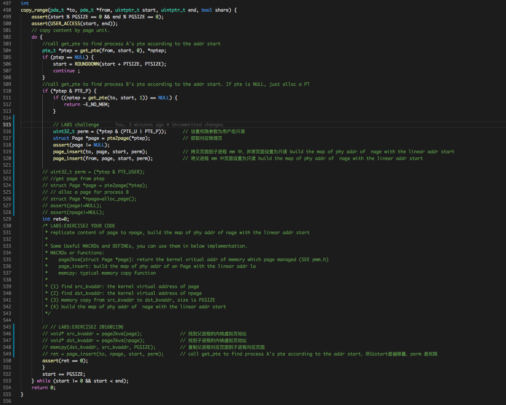
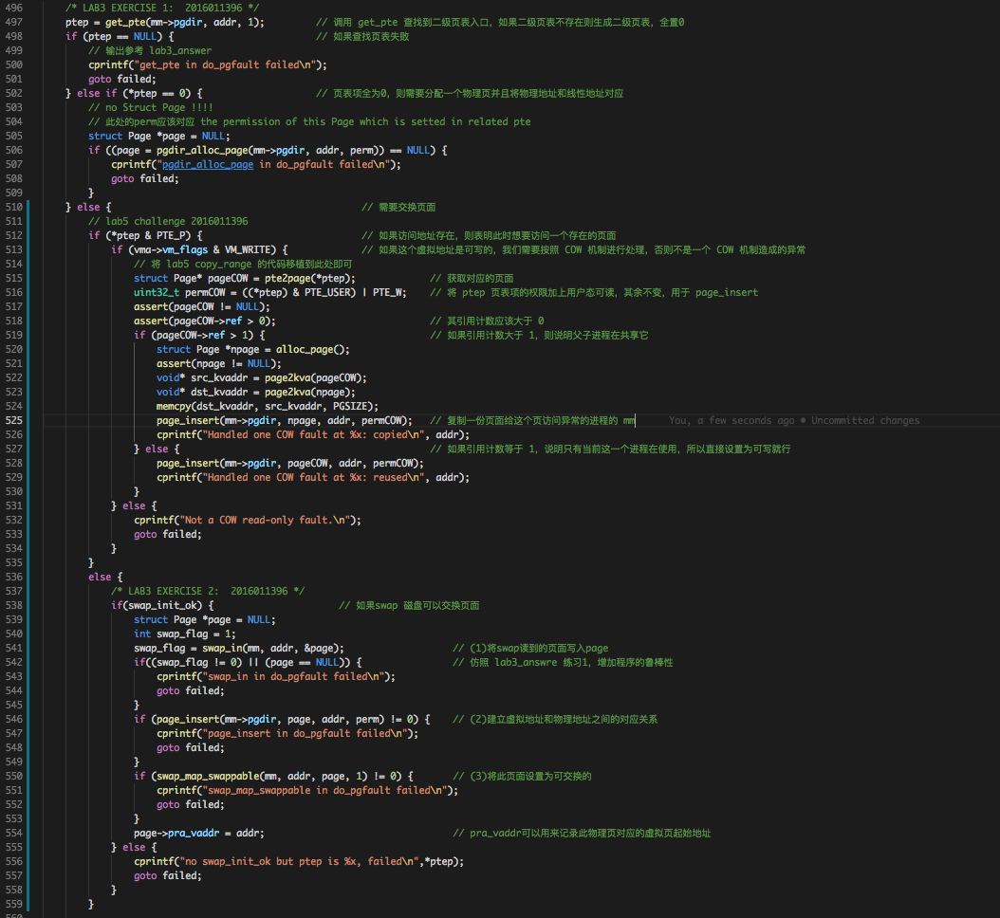
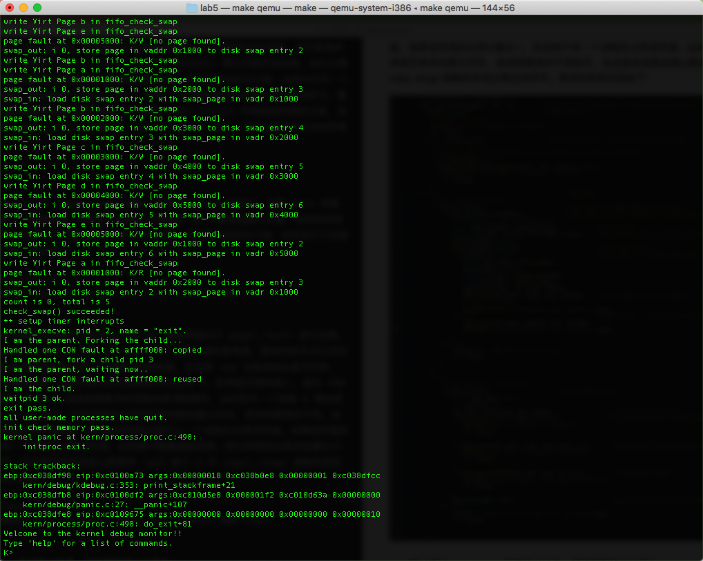
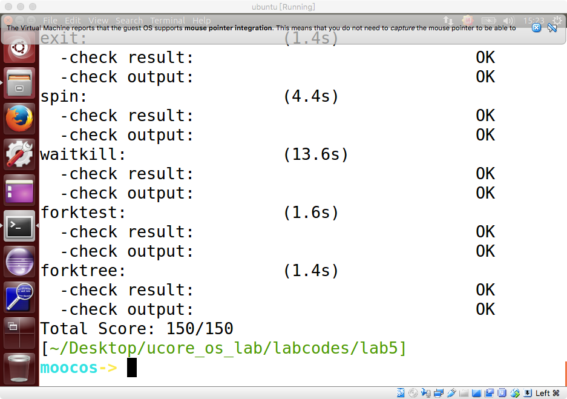

# Lab5 Challenge实验报告
计61 柳瑞阳 2016011396

## 练习：实现 Copy on Write（COW）机制

### 练习内容：

　　这个扩展练习涉及到本实验和上一个实验“虚拟内存管理”。在 ucore 操作系统中，当一个用户父进程创建自己的子进程时，父进程会把其申请的用户空间设置为只读，子进程可共享父进程占用的用户内存空间中的页面（这就是一个共享的资源）。当其中任何一个进程修改此用户内存空间中的某页面时，ucore 会通过 page fault 异常获知该操作，并完成拷贝内存页面，使得两个进程都有各自的内存页面。这样一个进程所做的修改不会被另外一个进程可见了。请在 ucore 中实现这样的 COW 机制。

### 准备工作：

　　为了实现 Copy on Write 机制，需要在每次执行 fork 拷贝 mm\_struct 的时候，即在执行 do\_fork 函数中的 copy\_mm 函数时，子进程的页目录表直接拷贝自父进程的页目录表，而不是调用 setup\_pgdir(mm) 通过 memcpy(pgdir, boot\_pgdir, PGSIZE) 拷贝内核页目录表。我们只需用将新进程的页表和旧进程的页表项同时指向相同的物理内存区域，并将页表项设为只读。当其中任何一个进程想要对页面进行写操作时，就会触发 page\_fault 异常，此时再将相应的页进行拷贝重写即可。需要注意的是，修改只读仅仅是修改页表项的读写权限，并不修改 vma\_struct 中保存的的相关记录，这样可以区分本次需要处理的 page\_fault 究竟是由 Copy on Write 机制，还是由真实的页访问异常产生的。

### 实现流程：

　　首先在 kern/mm/pmm.c 中的 copy\_range 函数，修改原有 lab5 实现为：设置 perm 权限参数为用户态只读，对于同一个物理页面，分别在父进程和子进程的 mm 中将其设置为只读，这样即实现了将新进程的页表和旧进程的页表项同时指向相同的物理内存区域，并将页表项设为只读，没有进行子进程新的物理页的分配和拷贝工作。代码如下：

	 

　　实现了父子进程的内存共享并且设置为内存空间只读之后，需要考虑对于 page\_fault 进行处理。 此时需要按照提示修改 kern/mm/vmm.c 中的 do\_pgfault 函数。我的思考是：首先判定本次也访问异常中该页的页表项纪录的是否是存在的页面，如果是存在的页面，并且其 vma 记录该地址是可写的话，则说明是 COW 机制造成的问题。如果页表项存在但是其存在位为 0，则考虑页面的换入。面对 COW 机制引起的页访问异常，假设 A 和 B 进程或者更多的进程共享该物理页，此时其中一个进程 A 修改其页面，我们只需用对于 A 的 mm 进行一次页面复制并将该页面权限设置为可写，其余权限保持不变。此时其他进程对于该页面应该依然为只读权限，因为此时依然可能不止一个进程在共享该页面。如果该页面的引用计数为 1，则说明只有一个进程在占用该页面，此时就不需要复制页面，而只用将其页表项设置为可写，其余权限保持不变即可。在这里实现其实核心就是将 lab5 练习 2 中 copy\_range 函数的实现迁移过来即可。我在这里没有将引用计数手动减 1，因为发现如果有其会产生错误，在进程消亡时其自动会减去 1，如果手动减去，会造成 bug，但是具体原因我尚不清楚。具体的实现代码如下：

	 

### 实验结果：

　　可以通过 make qemu 进行输出检查，可观察到输出结果为，其中有一次 COW 机制复制页面修改可写权限的处理，也有一次直接修改页表项可写权限的处理。应该是当有多个进程占用该页面时进行了修改，然后其余进程结束，仅有一个进程占用该页面时进行了修改。最终输出如下图：

	 

　　我在虚拟机上进行了 make grade 测试，发现最终的得分为：150/150，截图如下：

	 

### 在cow情况下的各种状态转换：

