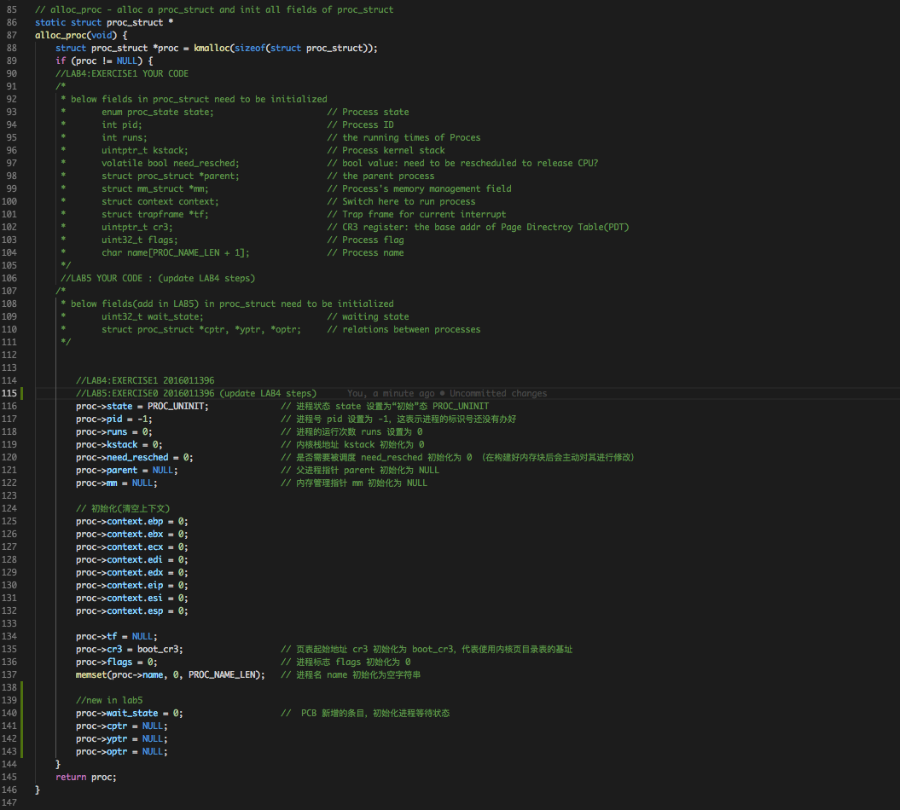
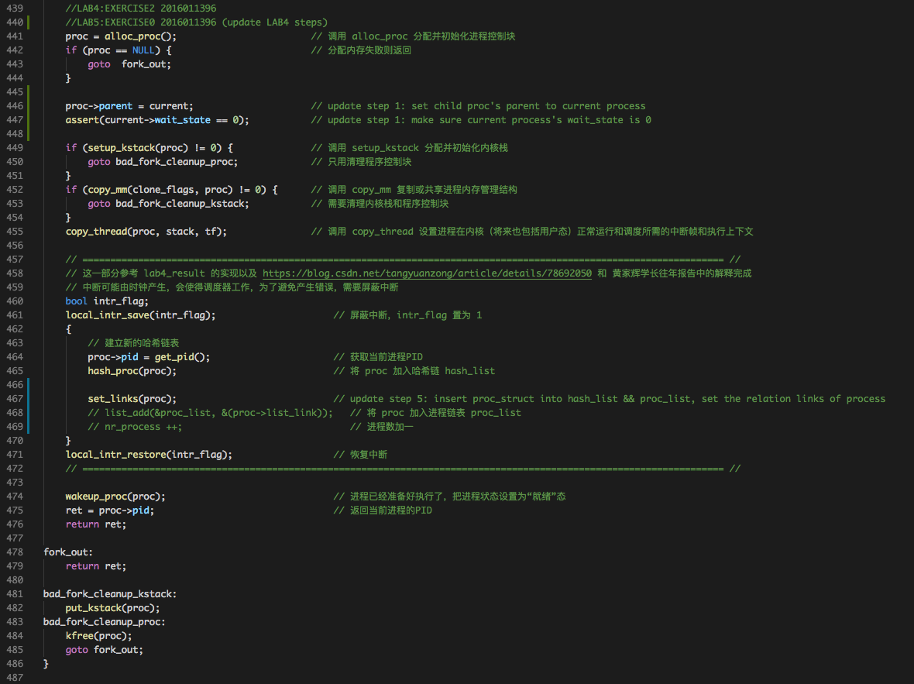
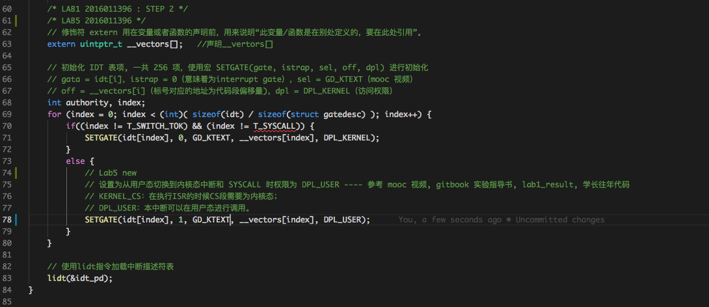
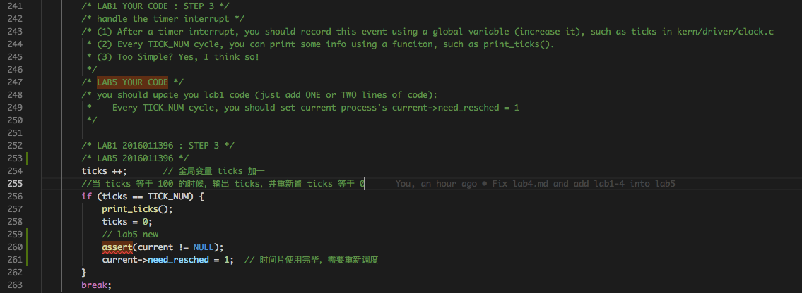
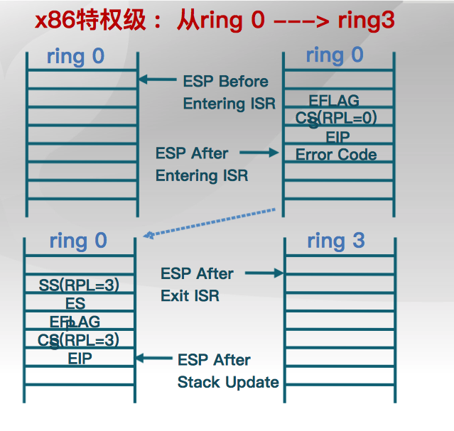
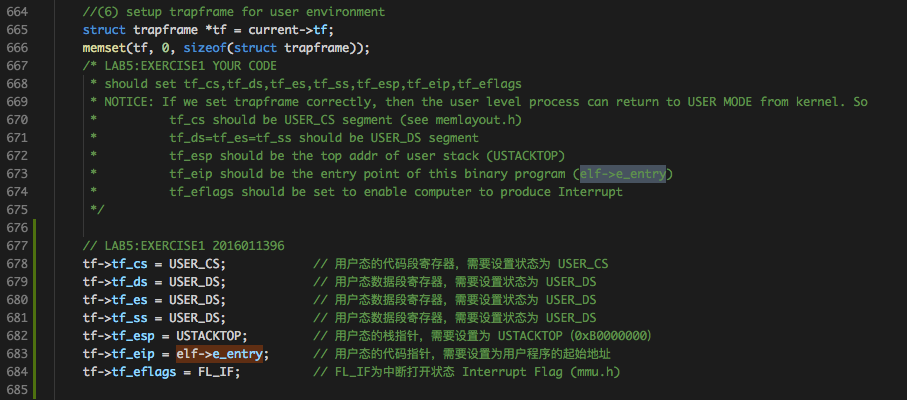
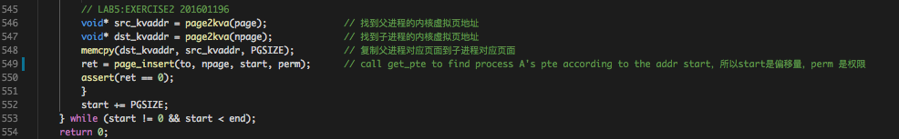
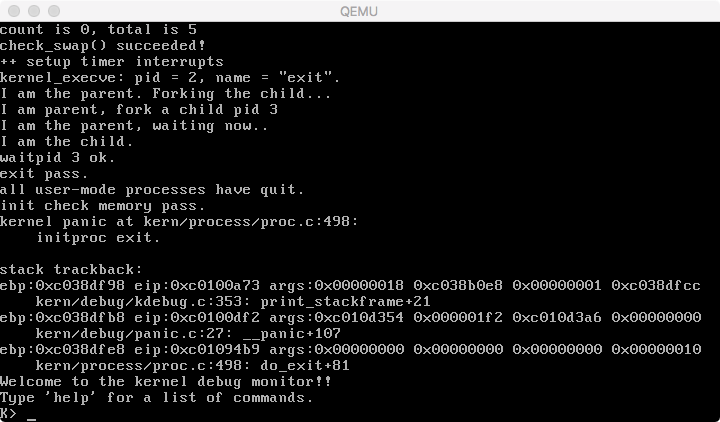
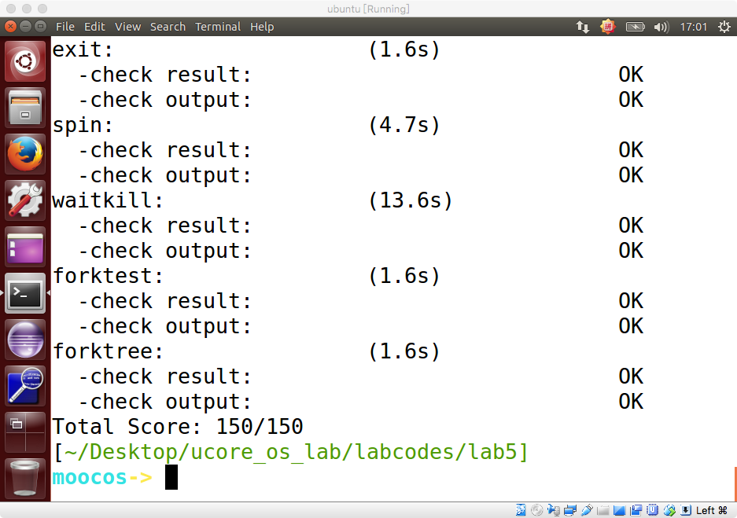

# Lab5实验报告
计61 柳瑞阳 2016011396

## 练习零：填写已有实验

　　借用 Meld 工具，依赖 lab5, 把 lab1-lab4 的代码填入本实验中代码中有 “LAB1” 、“LAB2” 和 “LAB3”、“LAB4” 的注释相应部分。总共修改的文件有七个，分别是以下文件：  

* **default_pmm.c**
* **pmm.c**
* **trap.c**
* **kdebugs.c**
* **vmm.c**
* **swap_fifo.c**
* **proc.c**

　　注意：为了能够正确执行 lab5 的测试应用程序，可能需对已完成的实验1/2/3/4的代码进行进一步改进。在搜索栏中搜关键词 **LAB5 YOUR CODE**，发现一共四处地方需要修改：  
　　首先针对 kern/process/proc.c 中的 alloc\_proc 函数，新增关于成员变量 wait\_state、\*cptr, \*yptr 和 \*optr 的初始化。其中 cptr 是 children 进程控制块的指针；yptr 是 young sibling(胞弟)进程控制块的指针；optr 是 old sibling(胞兄)进程控制块的指针。具体函数如下：

	 

　　其次是针对 kern/process/proc.c 中的 do\_fork 函数，首先设置子进程和父进程之间的链接关系，并且确保父进程在等待状态。然后修改将 proc 加入进程链表为调用函数 set\_links，观察此函数其实以及完成了之前 lab4 中实现的步骤五如 list\_add 以及 nr\_process ++，所以在此直接替换即可。具体函数如下：

	 

　　再者是针对 kern/trap/trap.c 中的 idt\_init 函数，需要将 Syscall 的使用状态设置为用户态，我在 lab1 已经完成了这个设置，但是将 istrap 误设置为0，所以做更改将第二个参数 istrap 设置为 1 即可。

	 

　　最后是针对 kern/trap/trap.c 中的 trap\_dispatch 函数，需要在每一个 TICK_NUM 计数循环中将当前进程的 need\_resched 设置为 1，即当前进行的时间片使用完毕，需要重新调度。当然此时需要确保当前进程存在。

	 

　　至此，练习零完成，代码准备工作实现完毕。

---

   

## 练习一：加载应用程序并执行

### 练习内容：

　　do\_execv 函数调用 load\_icode（位于kern/process/proc.c中）来加载并解析一个处于内存中的 ELF 执行文件格式的应用程序，建立相应的用户内存空间来放置应用程序的代码段、数据段等，且要设置好 proc\_struct 结构中的成员变量 trapframe 中的内容，确保在执行此进程后，能够从应用程序设定的起始执行地址开始执行。需设置正确的 trapframe 内容。

### 准备工作：

　　参考实验指导书，知道 load\_icode 函数的主要工作就是给用户进程建立一个能够让用户进程正常运行的用户环境。此函数有一百多行，完成了如下重要工作：

* 调用 mm\_create 函数来申请进程的内存管理数据结构 mm 所需内存空间，并对 mm 进行初始化
* 调用 setup\_pgdir 来申请一个页目录表所需的一个页大小的内存空间，并把描述 ucore 内核虚空间映射的内核页表（boot\_pgdir 所指）的内容拷贝到此新目录表中，最后让 mm->pgdir 指向此页目录表，这就是进程新的页目录表了，且能够正确映射内核虚空间；
* 根据应用程序执行码的起始位置来解析此 ELF 格式的执行程序，并调用 mm\_map 函数根据 ELF 格式的执行程序说明的各个段（代码段、数据段、BSS 段等）的起始位置和大小建立对应的 vma 结构，并把 vma 插入到 mm 结构中，从而表明了用户进程的合法用户态虚拟地址空间。调用根据执行程序各个段的大小分配物理内存空间，并根据执行程序各个段的起始位置确定虚拟地址，并在页表中建立好物理地址和虚拟地址的映射关系，然后把执行程序各个段的内容拷贝到相应的内核虚拟地址中，至此应用程序执行码和数据已经根据编译时设定地址放置到虚拟内存中了；
* 需要给用户进程设置用户栈，为此调用 mm\_mmap 函数建立用户栈的 vma 结构，明确用户栈的位置在用户虚空间的顶端，大小为 256 个页，即 1MB，并分配一定数量的物理内存且建立好栈的虚地址<-->物理地址映射关系；
* 至此，进程内的内存管理 vma 和 mm 数据结构已经建立完成，于是把 mm->pgdir 赋值到 cr3 寄存器中，即更新了用户进程的虚拟内存空间，此时的 initproc 已经被 hello 的代码和数据覆盖，成为了第一个用户进程，但此时这个用户进程的执行现场还没建立好；
* 先清空进程的中断帧，再重新设置进程的中断帧，使得在执行中断返回指令 “iret” 后，能够让 CPU 转到用户态特权级，并回到用户态内存空间，使用用户态的代码段、数据段和堆栈，且能够跳转到用户进程的第一条指令执行，并确保在用户态能够响应中断；

　　至此，用户进程的用户环境已经搭建完毕。此时 initproc 将按产生系统调用的函数调用路径原路返回，执行中断返回指令 “iret”（位于 trapentry.S 的最后一句）后，将切换到用户进程 hello 的第一条语句位置 \_start 处（位于 user/libs/initcode.S 的第三句）开始执行。

### 实现流程

　　练习一需要实现的部分主要为上述第六步（实验中第六步 **(6) setup trapframe for user environment**），观察 trapframe 的格式如下：

	struct trapframe {
	    struct pushregs tf_regs;
	    uint16_t tf_gs;
	    uint16_t tf_padding0;
	    uint16_t tf_fs;
	    uint16_t tf_padding1;
	    uint16_t tf_es;
	    uint16_t tf_padding2;
	    uint16_t tf_ds;
	    uint16_t tf_padding3;
	    uint32_t tf_trapno;
	    /* below here defined by x86 hardware */
	    uint32_t tf_err;
	    uintptr_t tf_eip;
	    uint16_t tf_cs;
	    uint16_t tf_padding4;
	    uint32_t tf_eflags;
	    /* below here only when crossing rings, such as from user to kernel */
	    uintptr_t tf_esp;
	    uint16_t tf_ss;
	    uint16_t tf_padding5;
	} __attribute__((packed));

　　因为进程为新建进程，根据课堂理论知识以及代码注释讲解，知需要修改的有：

* tf\_cs: 用户态的代码段寄存器，需要设置状态为 USER\_CS
* tf\_ds, tf\_es, tf\_ss: 用户态数据段寄存器，需要设置状态为 USER\_DS
* tf\_esp: 用户态的栈指针，需要设置为 USTACKTOP（0xB0000000）
* tf\_eip: 用户态的代码指针，需要设置为用户程序的起始地址 elf->e\_entry
* tf\_eflags: 一些用户态的设置信息。

	 

　　最终代码实现如下：

	 

### 当创建一个用户态进程并加载了应用程序后，CPU是如何让这个应用程序最终在用户态执行起来的

　　通过代码一步一步分析可知，用户态进程被 ucore 选择占用 CPU 执行（RUNNING 态）到具体执行应用程序第一条指令的整个经过如下：  

1. 在 init\_main 函数中调用 kernel\_thread 创建完成基于 user\_main 用户态进程 userproc 后(只是一个壳)，调用 do\_wait 函数，do\_wait 函数在确认存在状态为 RUNNABLE 的子进程后，调用 schedule 函数对此子进程进行处理。  
2. schedule 函数首先屏蔽中断，此处使用 first-fit 选择状态为 RUNNABLE 的子进程，然后调用 proc\_run 运行进程。  
3. proc\_run 函数在屏蔽中断后，完成了以下工作：   
	* load\_esp0(next->kstack + KSTACKSIZE)，设置 userproc 的栈指针 esp 为userproc->kstack + 2 * 4096，即指向 userproc 申请到的 2 页栈空间的栈顶 
	* lcr3(next->cr3)，因为此时切换成了新进程运行，所以要加载 userproc 的（内核态）页目录表。
	* switch\_to(&(prev->context), &(next->context))，切换进程上下文，然后跳转到 userproc -> context.eip 指向的函数入口，即 forkret。
4. forkret 函数直接调用 forkrets 函数：forkrets(current->tf);
5. 观察 forkrets 可知，其将参数 current->tf 赋值给 %esp 寄存器，即把 %esp 指向当前进程的中断帧，从 \_\_trapret 开始执行到 iret 前，esp 指向了 current->tf.tf\_eip。而如果此时执行的是 initproc，则 current->tf.tf\_eip = kernel\_thread\_entry，initproc->tf.tf\_cs = KERNEL\_CS，所以当执行完 iret 后，就开始在内核中执行 kernel\_thread\_entry 函数了：

		.globl forkrets
		forkrets:
		    # set stack to this new process's trapframe
		    movl 4(%esp), %esp
		    jmp __trapret
		
		.globl __trapret
		__trapret:
		    # restore registers from stack
		    popal
		
		    # restore %ds, %es, %fs and %gs
		    popl %gs
		    popl %fs
		    popl %es
		    popl %ds
		
		    # get rid of the trap number and error code
		    addl $0x8, %esp
		    iret

6. kernel\_thread\_entry 先将 edx 保存的输入参数（NULL）压栈，然后通过 call 指令，跳转到 ebx 指向的函数，因为 initproc->tf.tf\_regs.reg\_ebx = fn（**user\_main**）, 所以转为 user\_main 执行。

		.text
		.globl kernel_thread_entry
		kernel_thread_entry:        # void kernel_thread(void)
		
		    pushl %edx              # push arg
		    call *%ebx              # call fn
		
		    pushl %eax              # save the return value of fn(arg)
		    call do_exit            # call do_exit to terminate current thread
		
7. user\_main 调用 KERNEL\_EXECVE.	
		
		static int
		user_main(void *arg) {
		#ifdef TEST
		    KERNEL_EXECVE2(TEST, TESTSTART, TESTSIZE);
		#else
		    KERNEL_EXECVE(exit);
		#endif
		    panic("user_main execve failed.\n");
		}

8. KERNEL\_EXECVE 中间会调用 \_\_KERNEL\_EXECVE，后者先打印当前进程（userproc 壳）的 pid 和 name 信息，然后调用 kernel\_execve，将用户进程可执行程序作为参数。

		#define __KERNEL_EXECVE(name, binary, size) ({                          \
		            cprintf("kernel_execve: pid = %d, name = \"%s\".\n",        \
		                    current->pid, name);                                \
		            kernel_execve(name, binary, (size_t)(size));                \
		        })
		
		#define KERNEL_EXECVE(x) ({                                             \
		            extern unsigned char _binary_obj___user_##x##_out_start[],  \
		                _binary_obj___user_##x##_out_size[];                    \
		            __KERNEL_EXECVE(#x, _binary_obj___user_##x##_out_start,     \
		                            _binary_obj___user_##x##_out_size);         \
		        })

9. kernel\_execve 执行 exec 系统调用，CPU 检测到系统调用后，会保存 eflags/ss/eip 等现场信息，然后根据中断号查找中断向量表，进入中断处理例程。这里要经过一系列的函数跳转，才真正进入到 exec 的系统处理函数 do\_execve 中：vector128（0x80 T\_SYSCALL） -> \_\_alltraps -> trap -> trap\_dispatch -> syscall -> sys\_exec -> do\_execve。
10. do\_execve 首先检查用户态虚拟内存空间是否合法，如果合法且目前只有当前进程占用，则释放虚拟内存空间，把以前的资源，这里主要是内存空间给去掉，但是还保留留他的pid。其中把它的 cr3 这个⻚表基址指向 ucore 内核中的页表。然后要填入新的内容，由 load\_icode 完成。其中参数为之前的用户进程可执行二进制程序。
11. 调用 load\_icode 函数来加载应用程序，其完成的任务见上述。load\_icode 返回到 do\_exevce，do\_execve 调用 set\_proc\_name 也将返回。这样一直原路返回到\_\_alltraps函数时，接下来进入 \_\_trapret函数。
12. \_\_trapret函数先将栈上保存的 tf 的内容 pop 给相应的寄存器，\_\_trapret 开始执行到 iret 前，esp 指向了 current -> tf.tf\_eip。tf->tf\_eip = elf->e\_entry; initproc->tf.tf\_cs = USER\_CS，所以当执行完 iret 后，就开始在用户态中执行所需函数了。

   

## 练习2: 父进程复制自己的内存空间给子进程

### 练习内容：

　　创建子进程的函数 do\_fork 在执行中将拷贝当前进程（即父进程）的用户内存地址空间中的合法内容到新进程中（子进程），完成内存资源的复制。具体是通过 copy\_range 函数（位于kern/mm/pmm.c中）实现的，请补充 copy\_range 的实现，确保能够正确执行。

### 准备工作：

　　do\_fork 是创建线程的主要函数。kernel\_thread 函数通过调用 do\_fork 函数最终完成了内核线程的创建工作。其主要做了以下6件事情：

- 分配并初始化进程控制块（alloc\_proc 函数）
- 分配并初始化内核栈（setup\_kstack 函数）
- 根据 clone\_flag 标志复制或共享进程内存管理结构（copy\_mm 函数）
- 设置进程在内核（将来也包括用户态）正常运行和调度所需的中断帧和执行上下文（copy\_thread函数）
- 把设置好的进程控制块放入 hash\_list 和 proc\_list 两个全局进程链表中。自此，进程已经准备好执行了，把进程状态设置为“就绪”态
- 设置返回码为子进程的 id 号

　　在 copy\_mm 函数中，需要调用 dup\_mmap 根据父进程到子进程的 mm\_struct 成员变量 mm 进行拷贝。其中子进程的 mm 刚刚构建完毕。在 dup\_mmap 中先基于父进程的 vma 完成子进程 nvma 的构造，并未给子进程分配物理页，然后调用 copy\_range 完成内存资源的复制。

### 实现流程：

　　首先观察 copy\_range 函数，基本思路是遍历对父进程的每一块 vma，逐页拷贝其内容给子进程。由于子进程目前只是设置好了 mm 和 vma 结构，尚未为虚拟页分配物理页。因此在拷贝过程中，需要申请物理页。子进程物理页申请完毕后，需要调用 page2kva 分别获取父进程和子进程的内核虚拟页地址，然后调用 memcpy 函数进程拷贝，拷贝好内容后，调用 page\_insert 建立虚拟地址到物理地址的映射。注意到之前的 start 就是偏移量，并且 perm 是权限，可作为 page\_insert 的参数。最终代码实现如下：

	 

### 简要说明如何设计实现”Copy on Write 机制“，给出概要设计

　　为了实现 “Copy on Write 机制”，可以在现有代码的基础上进行以下修改（这里暂时不考虑页面换入换出保证一致性的问题）：

* 在执行 do\_fork 函数中的 copy\_mm 函数时，子进程的页目录表直接拷贝自父进程的页目录表，而不是调用 setup\_pgdir(mm) 通过 memcpy(pgdir, boot\_pgdir, PGSIZE) 拷贝内核页目录表；
* 在 dup\_mmap 函数中，只需保留拷贝 vma 链表的部分，取消调用 copy\_range 函数来为子进程分配物理内存并拷贝内存资源。
* 将父进程的内存空间对应的所有 Page 结构的引用计数 ref 均加 1，表示子进程也在共用这些内存页面。
* 将内存拷贝操作，并恢复页目录表的写权限操作添加到页面访问异常处理函数中。
* 将父进程和子进程的页目录表的写权限取消，标记为只读。一旦父子进程执行写操作时，就会发生页面访问异常，进入页面访问异常处理函数中，进行内存拷贝操作，并恢复页目录表的写权限。
 
   

## 练习3: 阅读分析源代码，理解进程执行 fork/exec/wait/exit 的实现，以及系统调用的实现

### 练习内容：

　　请在实验报告中简要说明你对 fork/exec/wait/exit 函数的分析。并回答如下问题：

* 请分析 fork/exec/wait/exit 在实现中是如何影响进程的执行状态的？
* 请给出ucore中一个用户态进程的执行状态生命周期图（包执行状态，执行状态之间的变换关系，以及产生变换的事件或函数调用）。（字符方式画即可）

### 与用户进程相关的系统调用

| 系统调用名 | 含义 | 具体完成服务的函数 |
|---|---|---|
| SYS\_exit   | process exit                               | do_exit |
| SYS\_fork   | create child process, dup mm               | do\_fork-->wakeup\_proc |
| SYS\_wait   | wait child process                         | do\_wait |
| SYS\_exec   | after fork, process execute a new program  | load a program and refresh the mm |
| SYS\_yield  | process flag itself need resecheduling     | proc->need\_sched=1, then scheduler will rescheule this process |
| SYS\_kill   | kill process                               | do_kill-->proc->flags |= PF\_EXITING, -->wakeup\_proc-->do\_wait-->do\_exit |
| SYS\_getpid | get the process's pid |  |

### fork 函数分析

　　fork 使用了系统调用 SYS\_fork, 而系统调用 SYS\_fork 则主要是由 do\_fork 和 wakeup\_proc 函数来完成的。实现流程如下：

	fork -> sys_fork(位于user/lib/syscall.c) -> 
	syscall(SYS_fork) -> sys_fork(kern/syscall/syscall.c) -> do_fork

　　do\_fork 是创建线程的主要函数。kernel\_thread 函数通过调用 do\_fork 函数最终完成了内核线程的创建工作。其主要做了以下 6 件事情：

- 分配并初始化进程控制块（alloc\_proc 函数）
- 分配并初始化内核栈（setup\_kstack 函数）
- 根据 clone\_flag 标志复制或共享进程内存管理结构（copy\_mm 函数）
- 设置进程在内核（将来也包括用户态）正常运行和调度所需的中断帧和执行上下文（copy\_thread函数）
- 把设置好的进程控制块放入 hash\_list 和 proc\_list 两个全局进程链表中。自此，进程已经准备好执行了，把进程状态设置为“就绪”态（wakeup\_proc 函数）
- 设置返回码为子进程的 id 号

　　wakeup\_proc 函数主要是将进程的状态设置为等待，即:

	proc->state = PROC_RUNNABLE;
	proc->wait_state = 0;

### exec 函数分析

　　exec 使用了系统调用 SYS\_exec, 而系统调用 SYS\_exec 则主要是由 do\_execve 函数来完成的。实现流程如下：

	exec -> sys_exec(位于user/lib/syscall.c) -> 
	syscall(SYS_exec) -> sys_exec(kern/syscall/syscall.c) -> do_execve

　　do\_execve 的功能是在已经存在的进程的上下文中运行新的可执行文件，替换先前的可执行文件。其主要做了以下 3 件事情：

- do\_execve 首先检查用户态虚拟内存空间是否合法，如果合法且目前只有当前进程占用，则释放虚拟内存空间，包括取消虚拟内存到物理内存的映射，释放 vma，mm 及页目录表占用的物理页等。
- 调用load\_icode函数来加载应用程序。
- 重新设置当前进程的名字，然后返回

　　load\_icode 完成的工作说明见练习一准备工作说明。

### wait 函数分析

　　wait 使用了系统调用 SYS\_wait, 而系统调用 SYS\_wait 则主要是由 do\_wait 函数来完成的。实现流程如下：

	exec -> sys_wait(位于user/lib/syscall.c) -> 
	syscall(SYS_wait) -> sys_wait(kern/syscall/syscall.c) -> do_wait

　　do\_wait 函数的功能是等待一个或任何处于僵尸状态的子进程，并释放该子进程占用的资源，内核堆栈的内存空间。其主要做了以下 3 件事情：

- 遍历进程链表 proc\_list，根据输入参数寻找指定 pid 或任意 pid 的子进程，如果没找到，直接返回错误信息。
- 如果找到子进程，而且其 state 为 PROC\_ZOMBIE，则释放子进程占用的资源，然后返回。
- 如果找到子进程，但状态不为 PROC\_ZOMBIE，则将当前进程的 state 设置为 PROC\_SLEEPING、wait\_state设置为WT\_CHILD，然后调用 schedule 函数，从而进入等待状态。等再次被唤醒后，继续重复上述过程寻找状态为 PROC\_ZOMBIE 的子进程。

### exit 函数分析

　　exit 使用了系统调用 SYS\_exit, 而系统调用 SYS\_exit 则主要是由 do\_exit 函数来完成的。实现流程如下：

	exit -> sys_exit(位于user/lib/syscall.c) -> 
	syscall(SYS_exit) -> sys_exit(kern/syscall/syscall.c) -> do_exit

　　do\_exit 函数的功能是释放进程占用的资源并结束运行进程。其主要做了以下 2 件事情：

- 释放页表项记录的物理内存，以及 mm 结构、vma 结构、页目录表等占用的内存。
- 将自己的 state 设置为 PROC\_ZOMBIE，自己的 exit\_code 设置为收集到的错误信息。然后唤醒父进程，并调用 schedule 函数，等待父进程回收剩下的资源，并最终彻底结束子进程。

### 上述四个函数如何影响进程执行状态？

　　上述四个状态在自己的实现函数中修改进程的状态 state，实现进程执行状态的转变。根据不同的系统调用，实现不同执行状态时期的对应处理。

### 用户态进程的执行状态生命周期图

　　参考 proc.c 函数开篇注释：

	------------------------------------------------------------------------------------------------------------------
	process state       :     meaning               -- reason
	    PROC_UNINIT     :   uninitialized           -- alloc_proc
	    PROC_SLEEPING   :   sleeping                -- try_free_pages, do_wait, do_sleep
	    PROC_RUNNABLE   :   runnable(maybe running) -- proc_init, wakeup_proc, 
	    PROC_ZOMBIE     :   almost dead             -- do_exit
	
	------------------------------------------------------------------------------------------------------------------
	process state changing:
	                                            
	  alloc_proc                                 RUNNING
	      +                                   +--<----<--+
	      +                                   + proc_run +
	      V                                   +-->---->--+ 
	PROC_UNINIT -- proc_init/wakeup_proc --> PROC_RUNNABLE -- try_free_pages/do_wait/do_sleep --> PROC_SLEEPING --
	                                           ^      +                                                           +
	                                           |      +--- do_exit --> PROC_ZOMBIE                                +
	                                           +                                                                  + 
	                                           -----------------------wakeup_proc----------------------------------
	------------------------------------------------------------------------------------------------------------------

  我理解的生命周期图如下（多了一个ready状态）：

	     (alloc_proc)          (wakeup_proc/proc_init)
	    ------------------> NEW ---------------------> READY
	                                                 |
	                                                 |  (proc_run)
	                                                 | 
	                                                 |    (do_wait/do_sleep)
	             (do_wait)            (do_exit)      V    (try_free_pages)
	      EXIT <---------- ZOMBIE <-------------- RUNNING -----------------> SLEEP
	                                                  ^                         |
	                                                  |                         |
	                                                  |     (wakeup_proc)       |
	                                                  +-------------------------+

   

## 实验总结

　　通过 lab5，我对于用户进程的几大状态转变有了深入的理解，对于用户进程从创建到执行进行了细致的分析，了解了具体流程。同时对于四大状态 fork/exec/wait/exit 的函数分析也使我受益颇多。

#### 实验效果截图

　　至此，lab5 练习 1-3 完成，最终 make grade 得分为 150/150，qemu 运行结果如下：  

	 
	 

　

#### 实验 lab5 中重要的知识点

* 练习0：进程的创建初始化
* 练习1：进程的创建和加载
* 练习2：进程的创建和内存分配，copy-on-write
* 练习3：进程的状态及变化，进程的生命周期

#### 在实验中没有对应上的知识点

　　我认为 lab5 没有涉及到的知识点有：进(线)程抢占，进(线)程优先级，用户态线程，轻量级进程，挂起状态。

#### 与参考答案的实现区别

* 练习0：与参考答案基本相同
* 练习1：与参考答案基本思路相同。
* 练习2：与参考答案基本思路相同。
* 练习3：无参考解答。

   

### 实验参考资料：  

* 实验指导书
* lab5\_result  
* https://blog.csdn.net/Ni9htMar3/article/details/72868214  
* https://www.cnblogs.com/wuhualong/p/ucore_lab5_report.html
* 黄家辉学长资料：lab5-tsinghua\_huangjh14.md