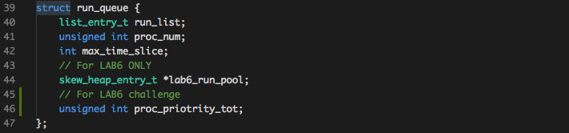
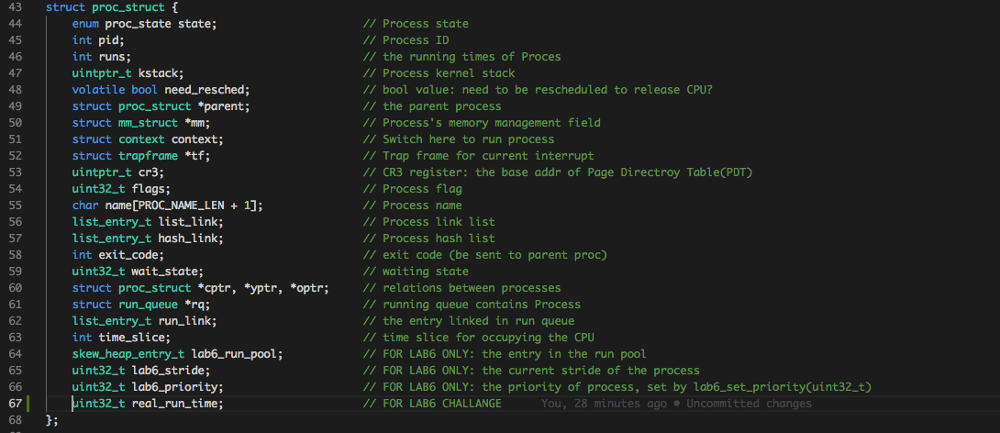
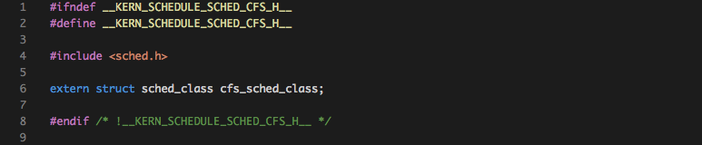
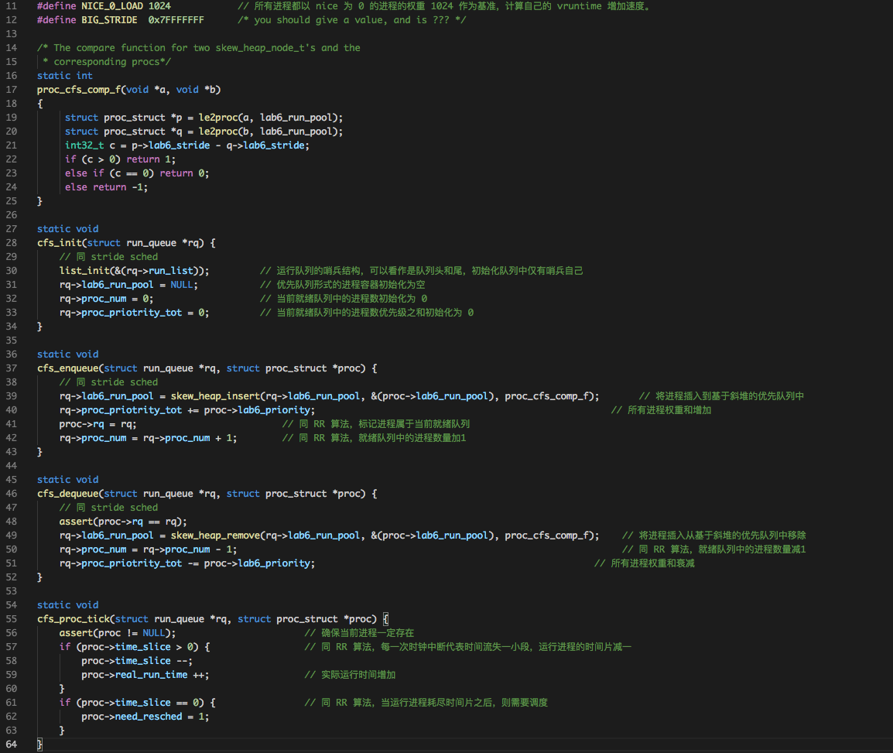
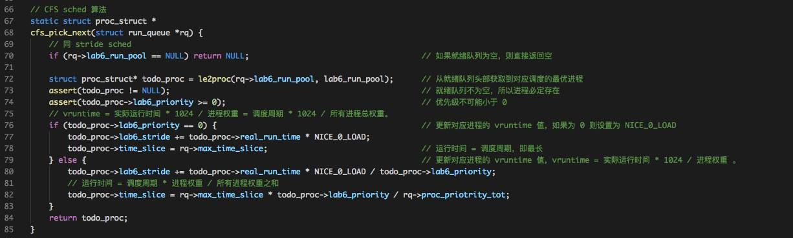
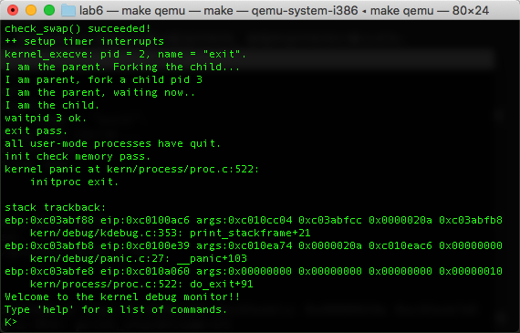

# Lab6 Challenge实验报告
计61 柳瑞阳 2016011396

## 练习1：实现 Linux 的 CFS 调度算法

### 练习内容：

　　在 ucore 的调度器框架下实现下 Linux 的 CFS 调度算法。可阅读相关 Linux 内核书籍或查询网上资料，可了解 CFS 的细节，然后大致实现在 ucore 中。

### 准备工作：

　　CFS 指完全公平调度算法，它给 cfs\_rq（ cfs 的 run queue）中的每一个进程安排一个虚拟时钟，vruntime。如果一个进程得以执行，随着时间的增长（也就是一个个 tick 的到来），其 vruntime 将不断增大。没有得到执行的进程 vruntime 不变。而调度器总是选择 vruntime 跑得最慢的那个进程来执行。这就是所谓的“完全公平”。为了区别不同优先级的进程，优先级高的进程 vruntime 增长得慢，以至于它可能得到更多的运行机会。  
　　CFS 思路很简单，就是根据各个进程的权重分配运行时间。进程的运行时间计算公式为:

	分配给进程的运行时间 = 调度周期 * 进程权重 / 所有进程权重之和   (公式1)
    
　　调度周期很好理解，就是将所有处于 STATE\_RUNNING 态进程都调度一遍的时间。举个例子，比如只有两个进程 A, B，权重分别为 1 和 2，调度周期设为 30ms，那么分配给 A 的 CPU 时间为: 30ms * (1 / (1 + 2)) = 10ms；而 B 的 CPU 时间为：30ms * (2 / ( 1 + 2 )) = 20ms。那么在这 30ms 中A将运行 10ms，B将运行 20ms。  
　　公平怎么体现呢？它们的运行时间并不一样？其实公平是体现在另外一个量上面，叫做 virtual runtime(vruntime)，它记录着进程已经运行的时间，但是并不是直接记录，而是要根据进程的权重将运行时间放大或者缩小一个比例。我们来看下从实际运行时间到 vruntime 的换算公式：

	vruntime = 实际运行时间 * 1024 / 进程权重 。 (公式2)

　　这里的 1024，实际上它等于 nice 为 0 的进程的权重，代码中是 NICE\_0\_LOAD。也就是说，所有进程都以 nice 为 0 的进程的权重 1024 作为基准，计算自己的 vruntime 增加速度。还以上面 A 和 B 两个进程为例，B 的权重是 A 的 2 倍，那么 B 的 vruntime 增加速度只有 A 的一半。现在我们把公式 2 中的实际运行时间用公式 1 来替换，可以得到这么一个结果：

	vruntime = (调度周期 * 进程权重 / 所有进程总权重) * 1024 / 进程权重 = 调度周期 * 1024 / 所有进程总权重 

　　虽然进程的权重不同，但是它们的 vruntime 增长速度应该是一样的，与权重无关。好，既然所有进程的 vruntime 增长速度宏观上看应该是同时推进的，那么就可以用这个 vruntime 来选择运行的进程，谁的 vruntime 值较小就说明它以前占用 cpu 的时间较短，受到了“不公平”对待，因此下一个运行进程就是它。这样既能公平选择进程，又能保证高优先级进程获得较多的运行时间。这就是 CFS 的主要思想了。权重跟进程 nice 值之间有一一对应的关系，nice值越大，权重越低。  
　　基于已有的 ucore 算法框架，只用修改运行进程 stride 的含义为 vruntime，修改 stride 的大小比较为 vruntime，选择 stride 的最小值进程，即是 vruntime 的最小值从就绪队列中获取目标进程进行调度即可。

　　(参考学习《linux内核分析——CFS（完全公平调度算法）》，博客地址： https://www.cnblogs.com/tianguiyu/articles/6091378.html)

### 实现流程：

　　为了满足：**实际运行时间 = 调度周期 * 进程权重 / 所有进程权重之和** 以及 **vruntime = 实际运行时间 * 1024 / 进程权重**，我扩展进程控制块结构和就绪队列结构。对于就绪队列，增加成员变量 proc\_priotrity\_tot，记录就绪队列中总进程的权重之和。对于进程控制块结构，增加成员变量 real\_run\_time，记录当前进程实际运行时间。并在 proc.c 中的 alloc\_proc 函数中对 real\_run\_time 进行初始化为0。

	 
	 

　　随后新增加 cfs\_sched.h 以及 cfs\_sched.c，完成 CFS 算法。cfs\_sched.h 参考 default\_sched.h，其具体实现如下：

	 

　　对于 cfs\_sched.c，首先定义 nice 为 0 的进程的权重，即代码中是 NICE\_0\_LOAD。所有进程都以 nice 为 0 的进程的权重 1024 作为基准，计算自己的 vruntime 增加速度。随后的 init、enqueue 以及 dequeue、proc\_tick 基本同 RR 算法和 stride 调度算法。不同在于初始化时对就绪队列中的总进程的权重之和初始化为0；进程进入就绪队列时不记录将运行的时间片时间，但是需要更新就绪队列进程权重之和；进程移除就绪队列时也需要更新就绪队列进程权重之和；每一次时钟中断进程处理除了时间片减一之外，还需要对实际运行时间加一。具体实现代码如下：

	 

　　对于 CFS 算法的 pick\_next 改动稍微大一点。其主要集中在 stride 定义修改为 vruntime。面对进程优先级为 0 的进程，vruntime = 实际运行时间 * NICE\_0\_LOAD，运行时间 = 调度周期；面对进程优先级大于 0 的进程，vruntime = 实际运行时间 * NICE\_0\_LOAD / 进程权重，运行时间 = 调度周期 * 进程权重 / 所有进程权重之和。具体实现代码如下：

	 

### 实验结果：

　　最终在 sched.c 中引入头文件 <cfs\_sched.h>，并修改 sched\_class = &cfs\_sched\_class; 即可进行测试。运行 make qemu 结果如下：

	 

