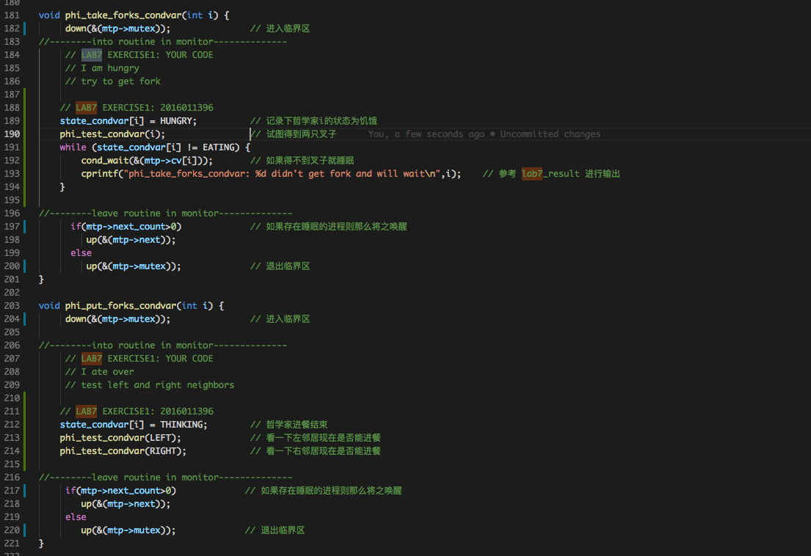

# Lab7 实验报告
计61 柳瑞阳 2016011396

## 练习零：填写已有实验

　　借用 Meld 工具，依赖 lab6, 把 lab1-lab6 的代码填入本实验中代码中有 “LAB1” 、“LAB2” 、 “LAB3”、“LAB4”、“LAB5” 和 “LAB6” 的注释相应部分。总共修改的文件有八个，分别是以下文件：  

* **default\_pmm.c**
* **pmm.c**
* **trap.c**
* **kdebugs.c**
* **vmm.c**
* **swap\_fifo.c**
* **proc.c**
* **default\_sche.c**

　　注意：为了能够正确执行 lab7 的测试应用程序，可能需对已完成的实验 1/2/3/4/5/6 的代码进行进一步改进。在搜索栏中搜关键词 **LAB7 YOUR CODE**，发现一共一处地方需要修改：  
　　针对 kern/trap/trap.c 中的 trap\_dispatch 函数，修改时钟中断调用函数为 run\_timer\_list，具体实现如下:  

	 

　　至此，练习零完成，代码准备工作实现完毕。

---

## 练习1: 理解内核级信号量的实现和基于内核级信号量的哲学家就餐问题

### 问题描述：

　　完成练习 0 后，建议大家比较一下（可用 meld 等文件 diff 比较软件）个人完成的 lab6 和练习 0 完成后的刚修改的 lab7 之间的区别，分析了解 lab7 采用信号量的执行过程。执行 make grade，大部分测试用例应该通过。请在实验报告中给出内核级信号量的设计描述，并说明其大致执行流程。请在实验报告中给出给用户态进程/线程提供信号量机制的设计方案，并比较说明给内核级提供信号量机制的异同。

### 准备工作：理解内核级信号量的设计描述

　　首先理解内核级信号量。信号量是一种同步互斥机制的实现，普遍存在于现在的各种操作系统内核里。信号量的伪代码如下：

	struct semaphore {
		int count;
		queueType queue;
	};
	void semWait(semaphore s)
	{
		s.count--;
		if (s.count < 0) {
			/* place this process in s.queue */;
			/* block this process */;
		}
	}
	void semSignal(semaphore s)
	{
		s.count++;
		if (s.count<= 0) {
			/* remove a process P from s.queue */;
			/* place process P on ready list */;
		}
	}

　　基于上诉信号量实现可以认为，当多个（>1）进程可以进行互斥或同步合作时，一个进程会由于无法满足信号量设置的某条件而在某一位置停止，直到它接收到一个特定的信号（表明条件满足了）。为了发信号，需要使用一个称作信号量的特殊变量。为通过信号量 s 传送信号，信号量的 V 操作采用进程可执行原语 semSignal(s)；为通过信号量 s 接收信号，信号量的 P 操作采用进程可执行原语 semWait(s)；如果相应的信号仍然没有发送，则进程被阻塞或睡眠，直到发送完为止。  
　　ucore 中信号量参照上述原理描述，建立在开关中断机制和 wait\_queue 的基础上进行了具体实现。semaphore\_t是最基本的记录型信号量（record semaphore) 结构，包含了用于计数的整数值 value，和一个进程等待队列 wait\_queue，一个等待的进程会挂在此等待队列上。信号量的数据结构定义如下：

	typedef struct {
	    int value;                   //信号量的当前值
	    wait_queue_t wait_queue;     //信号量对应的等待队列
	} semaphore_t;

　　在 ucore 中最重要的信号量操作是 P 操作函数 down(semaphore\_t \*sem) 和 V 操作函数  up(semaphore\_t \*sem)。但这两个函数的具体实现是 \_\_down(semaphore\_t \*sem, uint32\_t wait\_state) 函数和 \_\_up(semaphore\_t \*sem, uint32\_t wait\_state)函数，二者的具体实现描述如下：  
　　\_\_down(semaphore\_t \*sem, uint32\_t wait\_state, timer\_t *timer)：具体实现信号量的 P 操作，首先关掉中断，然后判断当前信号量的 value 是否大于 0。如果是 >0，则表明可以获得信号量，故让 value 减一，并打开中断返回即可；如果不是 >0，则表明无法获得信号量，故需要将当前的进程加入到等待队列中，并打开中断，然后运行调度器选择另外一个进程执行。如果被 V 操作唤醒，则把自身关联的 wait 从等待队列中删除（此过程需要先关中断，完成后开中断）。具体实现如下所示：

	static __noinline uint32_t __down(semaphore_t *sem, uint32_t wait_state) {
	    bool intr_flag;
	    local_intr_save(intr_flag);
	    if (sem->value > 0) {
	        sem->value --;
	        local_intr_restore(intr_flag);
	        return 0;
	    }
	    wait_t __wait, *wait = &__wait;
	    wait_current_set(&(sem->wait_queue), wait, wait_state);
	    local_intr_restore(intr_flag);
	
	    schedule();
	
	    local_intr_save(intr_flag);
	    wait_current_del(&(sem->wait_queue), wait);
	    local_intr_restore(intr_flag);
	
	    if (wait->wakeup_flags != wait_state) {
	        return wait->wakeup_flags;
	    }
	    return 0;
	}

　　\_\_up(semaphore\_t \*sem, uint32\_t wait\_state)：具体实现信号量的 V 操作，首先关中断，如果信号量对应的 wait queue 中没有进程在等待，直接把信号量的 value 加一，然后开中断返回；如果有进程在等待且进程等待的原因是 semophore 设置的，则调用 wakeup\_wait 函数将 waitqueue 中等待的第一个 wait 删除，且把此 wait 关联的进程唤醒，最后开中断返回。具体实现如下所示：

	static __noinline void __up(semaphore_t *sem, uint32_t wait_state) {
	    bool intr_flag;
	    local_intr_save(intr_flag);
	    {
	        wait_t *wait;
	        if ((wait = wait_queue_first(&(sem->wait_queue))) == NULL) {
	            sem->value ++;
	        }
	        else {
	            wakeup_wait(&(sem->wait_queue), wait, wait_state, 1);
	        }
	    }
	    local_intr_restore(intr_flag);
	}

　　其中，信号量的计数器 sem->value 具有有如下性质：

* value > 0，表示共享资源的空闲数
* value < 0，表示该信号量的等待队列里的进程数
* value = 0，表示等待队列为空

### 哲学家就餐问题理解：

　　相对于 LAB6，LAB7 在 proc.c 中的 init\_main 内核线程内容有一定的修改，在开始执行调度之前多执行了一个 check\_sync 函数。该函数分为了两个部分，第一部分是实现基于信号量的哲学家问题,第二部分是实现基于管程的哲学家问题。函数代码如下：

	void check_sync(void){
	
	    int i;
	
	    //check semaphore
	    sem_init(&mutex, 1);
	    for(i=0;i<N;i++){
	        sem_init(&s[i], 0);
	        int pid = kernel_thread(philosopher_using_semaphore, (void *)i, 0);
	        if (pid <= 0) {
	            panic("create No.%d philosopher_using_semaphore failed.\n");
	        }
	        philosopher_proc_sema[i] = find_proc(pid);
	        set_proc_name(philosopher_proc_sema[i], "philosopher_sema_proc");
	    }
	
	    //check condition variable
	    monitor_init(&mt, N);
	    for(i=0;i<N;i++){
	        state_condvar[i]=THINKING;
	        int pid = kernel_thread(philosopher_using_condvar, (void *)i, 0);
	        if (pid <= 0) {
	            panic("create No.%d philosopher_using_condvar failed.\n");
	        }
	        philosopher_proc_condvar[i] = find_proc(pid);
	        set_proc_name(philosopher_proc_condvar[i], "philosopher_condvar_proc");
	    }
	}

　　为了分析基于信号量的哲学家问题，我们考虑代码实现的前半部分，即 **check semaphore** 部分。首先实现初始化了一个互斥信号量 mutex = 1，表示一次只能一个哲学家拿筷子放筷子。再通过一个 for 循环，创建了对应 5 个哲学家的 5 个信号量，并创建 5 个内核线程分别代表 5 个哲学家各自独立的行为，每个内核线程完成了基于信号量的哲学家吃饭和思考状态的实现。下面关注 kernel\_thread 的参数 **philosopher\_using\_semaphore**	，其对应哲学家线程。代码如下：

	int philosopher_using_semaphore(void * arg) /* i：哲学家号码，从0到N-1 */
	{
	    int i, iter=0;
	    i=(int)arg;
	    cprintf("I am No.%d philosopher_sema\n",i);
	    while(iter++<TIMES)
	    { /* 无限循环 */
	        cprintf("Iter %d, No.%d philosopher_sema is thinking\n",iter,i); /* 哲学家正在思考 */
	        do_sleep(SLEEP_TIME);
	        phi_take_forks_sema(i); 
	        /* 需要两只叉子，或者阻塞 */
	        cprintf("Iter %d, No.%d philosopher_sema is eating\n",iter,i); /* 进餐 */
	        do_sleep(SLEEP_TIME);
	        phi_put_forks_sema(i); 
	        /* 把两把叉子同时放回桌子 */
	    }
	    cprintf("No.%d philosopher_sema quit\n",i);
	    return 0;    
	}

　　通过代码观察可知，ucore 通过定时器设置线程睡眠状态来表示哲学家思考和吃饭的过程。定时器结束即表明哲学家可以切换状态，即思考完毕或吃饭完毕。其中最重要的两个函数是：phi\_take\_forks\_sema(i) 以及 phi\_put\_forks\_sema(i)，即哲学家拿起筷子和放下筷子。

	void phi_take_forks_sema(int i) /* i：哲学家号码从0到N-1 */
	{ 
	        down(&mutex); /* 进入临界区 */
	        state_sema[i]=HUNGRY; /* 记录下哲学家i饥饿的事实 */
	        phi_test_sema(i); /* 试图得到两只叉子 */
	        up(&mutex); /* 离开临界区 */
	        down(&s[i]); /* 如果得不到叉子就阻塞 */
	}
	
	void phi_put_forks_sema(int i) /* i：哲学家号码从0到N-1 */
	{ 
	        down(&mutex); /* 进入临界区 */
	        state_sema[i]=THINKING; /* 哲学家进餐结束 */
	        phi_test_sema(LEFT); /* 看一下左邻居现在是否能进餐 */
	        phi_test_sema(RIGHT); /* 看一下右邻居现在是否能进餐 */
	        up(&mutex); /* 离开临界区 */
	}
	
	void
	up(semaphore_t *sem) {
	    __up(sem, WT_KSEM);
	}
	
	void
	down(semaphore_t *sem) {
	    uint32_t flags = __down(sem, WT_KSEM);
	    assert(flags == 0);
	}

　　在这里观察到了 down 和 up 函数。其实质为 \_\_down 函数和 \_\_up 函数。通过 **准备工作--理解内核级信号量的设计描述** 中的讲述，\_\_down 函数和 \_\_up 函数其实就是对应信号量的 P、V 操作。这样就保证了每个哲学家在拿筷子时能够互斥地进入临界区完成相应的工作。同时在放下筷子时，哲学家会判断左右邻居能不能吃饭，如果状态允许，则将邻居状态转变为可吃饭状态。  
　　至此，基于信号量的哲学家就餐问题分析完毕。

### 用户态进程/线程提供信号量机制的设计方案：

　　我的设计方案是：在用户态的线程控制块 proc\_struct 中新增信号量控制模块 sem 成员变量，再通过一个双向链表 sem\_list，用于组织该进程对应的线程的信号量。实现类似内核级信号量的设计，同时也如 mm 和 vmm 控制合法地址的设计思路。  
　　由于用户态无法屏蔽中断，而信号量的互斥访问和 PV 操作需要建立在屏蔽中断的基础上，所以需要新增 P 和 V 操作的系统调用，由操作系统保证原子性。由于 PV 操作需要进行状态切换，开销较大，这样实现使得效率大大降低。

### 用户级和内核级提供信号量机制的异同：

　　用户级信号量的控制链表在用户态由用户函数库控制，信号量 PV 操作需要进行状态切换。P 操作需要从用户态切换到内核态，当原子操作完成后还需要跳转回用户态继续进行线程的操作。当操作完成后，需要对信号量进行释放，V 操作也需要从用户态切换到内核态。当释放信号量后，需要跳转回用户态。开销极大。  
　　内核级信号量的控制链表在内核态由操作系统控制，信号量 PV 操作不涉及状态切换。开销较小。

---

   

## 练习二：完成内核级条件变量和基于内核级条件变量的哲学家就餐问题

### 问题描述：

　　首先掌握管程机制，然后基于信号量实现完成条件变量实现，然后用管程机制实现哲学家就餐问题的解决方案（基于条件变量）。请在实验报告中给出内核级条件变量的设计描述，并说明其大致执行流程。请在实验报告中给出给用户态进程/线程提供条件变量机制的设计方案，并比较说明给内核级提供条件变量机制的异同。请在实验报告中回答：能否不用基于信号量机制来完成条件变量？如果不能，请给出理由，如果能，请给出设计说明和具体实现。

### 准备工作：理解内核级条件变量的设计描述

　　管程是为了将对共享资源的所有访问及其所需要的同步操作集中并封装起来。在 ucore 中用 C 语言实现采用基于互斥和条件变量机制的管程基本原理。ucore 中的管程机制是基于信号量和条件变量来实现的。ucore 中的管程的数据结构 monitor\_t 定义如下：

	typedef struct monitor{
	    semaphore_t mutex;      // the mutex lock for going into the routines in monitor, should be initialized to 1
	    // the next semaphore is used to 
	    //    (1) procs which call cond_signal funciton should DOWN next sema after UP cv.sema
	    // OR (2) procs which call cond_wait funciton should UP next sema before DOWN cv.sema
	    semaphore_t next;        
	    int next_count;         // the number of of sleeped procs which cond_signal funciton
	    condvar_t *cv;          // the condvars in monitor
	} monitor_t;

　　管程中的成员变量 mutex 是一个二值信号量，是实现每次只允许一个进程进入管程的关键元素，确保了互斥访问性质。管程中的条件变量 cv 通过执行 wait\_cv，会使得等待某个条件 Cond 为真的进程能够离开管程并睡眠，且让其他进程进入管程继续执行；而进入管程的某进程设置条件 Cond 为真并执行 signal\_cv 时，能够让等待某个条件 Cond 为真的睡眠进程被唤醒，从而继续进入管程中执行。  
　　管程中的成员变量信号量 next 和整型变量 next\_count 是配合进程对条件变量cv的操作而设置的，这是由于发出 signal\_cv 的进程 A 会唤醒由于 wait_\cv 而睡眠的进程 B，由于管程中只允许一个进程运行，所以进程B执行会导致唤醒进程 B 的进程 A 睡眠，直到进程B离开管程，进程 A 才能继续执行，这个同步过程是通过信号量 next 完成的；而 next\_count 表示了由于发出 singal\_cv 而睡眠的进程个数。  
　　管程中的条件变量的数据结构 condvar\_t 定义如下：

	typedef struct condvar{
	    semaphore_t sem;     // the sem semaphore is used to down the waiting proc, and the signaling proc should up the waiting proc
	    int count;       　    // the number of waiters on condvar
	    monitor_t * owner;     // the owner(monitor) of this condvar
	} condvar_t;

　　条件变量的定义中也包含了一系列的成员变量，信号量 sem 用于让发出 wait\_cv 操作的等待某个条件 Cond 为真的进程睡眠，而让发出 signal\_cv 操作的进程通过这个 sem 来唤醒睡眠的进程。count 表示等在这个条件变量上的睡眠进程的个数。owner 表示此条件变量的宿主是哪个管程。  
　　ucore 设计实现了条件变量 wait\_cv 操作和 signal\_cv 操作对应的具体函数，即 cond\_wait 函数和 cond\_signal 函数，此外还有 cond\_init 初始化函数。函数 cond\_wait(condvar\_t \*cvp, semaphore\_t \*mp) 和 cond\_signal (condvar\_t  \*cvp) 的实现原理参考了《OS Concept》一书中的 6.7.3 小节“用信号量实现管程”的内容。首先来看 wait\_cv 的原理实现：

	cv.count++;
	if(monitor.next_count > 0)
	   sem_signal(monitor.next);
	else
	   sem_signal(monitor.mutex);
	sem_wait(cv.sem);
	cv.count -- ;

　　对照着可分析出 cond\_wait 函数的具体执行过程。可以看出如果进程 A 执行了 cond\_wait 函数，表示此进程等待某个条件 Cond 不为真，需要睡眠。因此表示等待此条件的睡眠进程个数 cv.count 要加一。接下来会出现两种情况:

* 情况一：如果 monitor.next\_count 如果大于 0，表示有大于等于 1 个进程执行 cond\_signal 函数，并且等待在了 monitor.next 信号量上（假定这些进程挂在 monitor.next 信号量相关的等待队列 Ｓ 上），因此需要唤醒等待队列 Ｓ 中的一个进程 B；然后进程 A 等待在信号量 cv.sem 上。如果进程 A 进程被重新唤醒了，则让 cv.count 减一，表示等待此条件变量的睡眠进程个数少了一个，可继续执行了！
* 情况二：如果 monitor.next\_count 如果小于等于 0，表示目前没有进程执行 cond\_signal 函数且等待了，那需要唤醒的是由于互斥条件限制而无法进入管程的进程，所以要唤醒睡在 monitor.mutex 上的进程。然后进程 A 睡在 cv.sem 上，如果睡醒了，则让 cv.count 减一，表示等待此条件的睡眠进程个数少了一个，可继续执行了！

　　signal\_cv 的原理描述如下：

	if( cv.count > 0) {
	   monitor.next_count ++;
	   sem_signal(cv.sem);
	   sem_wait(monitor.next);
	   monitor.next_count -- ;
	}

　　对照着可分析出 cond\_signal 函数的具体执行过程。首先进程 B 判断 cv.count，如果不大于 0，则表示当前没有执行 cond\_wait 而睡眠的进程，因此就没有被唤醒的对象了，直接函数返回即可；如果大于 0，这表示当前有执行 cond\_wait 而睡眠的进程 A，因此需要唤醒等待在 cv.sem 上睡眠的进程 A。由于只允许一个进程在管程中执行，所以一旦进程 B 唤醒了别人（进程 A），那么自己就需要睡眠。故让 monitor.next_count 加一，且让自己（进程 B）睡在信号量 monitor.next 上。如果睡醒了，则让 monitor.next\_count 减一。

### 实现流程：

　　首先基于实验指导书以及源代码注释，修改 kern/sync/monitor.c 中的 cond\_signal 函数和 cond\_wait 函数。由准备过程分析可知：

* cvp->count 等价于 cv.count，代表等在这个条件变量上的睡眠进程的个数
* cvp->owner->next\_count 等价于 mt.next\_count，代表 cond\_signal 中等待进程的个数
* cvp->sem 等价于 cv.sem，通过 sem 来唤醒在这个条件变量上的睡眠进
* cvp->owner->next 等价于 mt.next，代表管程中的成员变量信号量 next
* cvp->owner->mutex 等价于 mt.mutex，代表管程中的一个二值信号量，实现每次只允许一个进程进入管程的关键元素，确保了互斥访问性质

　　实现代码如下：

	 

　

　　完成了 cond\_signal 函数和 cond\_wait 函数，就可以基于管程机制，完成哲学家问题。参照信号量的实现方式，实现哲学家拿筷子和放下筷子的操作。实现代码如下：

	 

　

### 用户态条件变量机制设计方案：

　　我们可以基于用户态信息量实现用户态条件变量，类似基于信息量的内核态条件变量的实现，通过信息量的 up 和 down 结构，即 PV 操作，实现条件变量的 cond\_signal 和 cond\_wait 操作。但是同练习 1 的讲述，条件变量对应的信息量的 PV 操作需要涉及用户态和内核态状态的切换，同样需要设计对应的系统调用和中断服务例程加以实现。相比于内核态的基于信号量机制的条件变量，用户态的条件变量无疑开销过大，效率较低。

### 基于信号量机制完成条件变量：

　　能用基于信号量机制来完成条件变量。条件变量和信号量在结构上都是一个整数和一个等待队列构成，但是条件变量允许中途打断，信息量则必须运行完毕，中途不能被打断。条件变量中，整数表示正在等待队列中等待该条件变量的进程个数；而信号量中，整数表示资源的剩余数目，不直接反映等待队列中的进程数目，二者表示的含义不同。  
　　然而在 ucore 中，条件变量 condvar 却包含信号量成员变量 semaphore\_t sem，monitor 结构中也包含两个信号量成员变量 semaphore\_t mutex，next。在执行条件变量的 signal 或是 wait 操作的时候，信息量即用于唤醒和阻塞进程，可以直接通过调用其 up 和 down 接口来实现这些功能。所以我们可以实现基于信号量机制来完成条件变量。

---

   

## 实验总结

　　通过 lab7，我对于同步互斥机制有了深刻的理解，同时对于基于信号量和基于条件变量的同步互斥实现方法有了一定的了解。通过信号量和条件变量分析解决了哲学家问题，使我对于数据的同步和互斥使用，进程的切换有了具体的认识。

#### 实验效果截图

　　至此，lab7 练习 1-2 完成，最终 make grade 得分为 170/170，qemu 运行结果如下，同时执行 make run-priority 运行结果如下：  

	 

　

#### 实验 lab7 中重要的知识点

* 练习1：信号量，哲学家问题
* 练习2：管程和条件变量，哲学家问题

#### 在实验中没有对应上的知识点

　　我认为 lab7 没有涉及到的知识点有：使用原子指令--更高级的抽象方法的同步互斥实现，读者-写者问题，生产者-消费者问题。

#### 与参考答案的实现区别

* 练习0：与参考答案基本相同
* 练习1：无参考答案
* 练习2：与参考答案基本思路相同，为了避免 make grade 出错参考了参考答案的输出

   

### 实验参考资料：  

* 实验指导书
* lab7\_result 
* https://blog.csdn.net/qq_19876131/article/details/51707007
* 黄家辉学长资料：lab7-tsinghua\_huangjh14.md