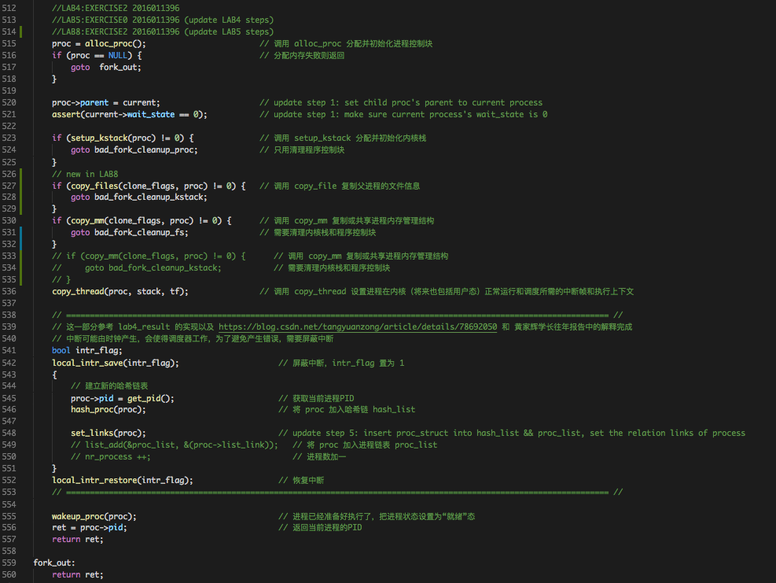
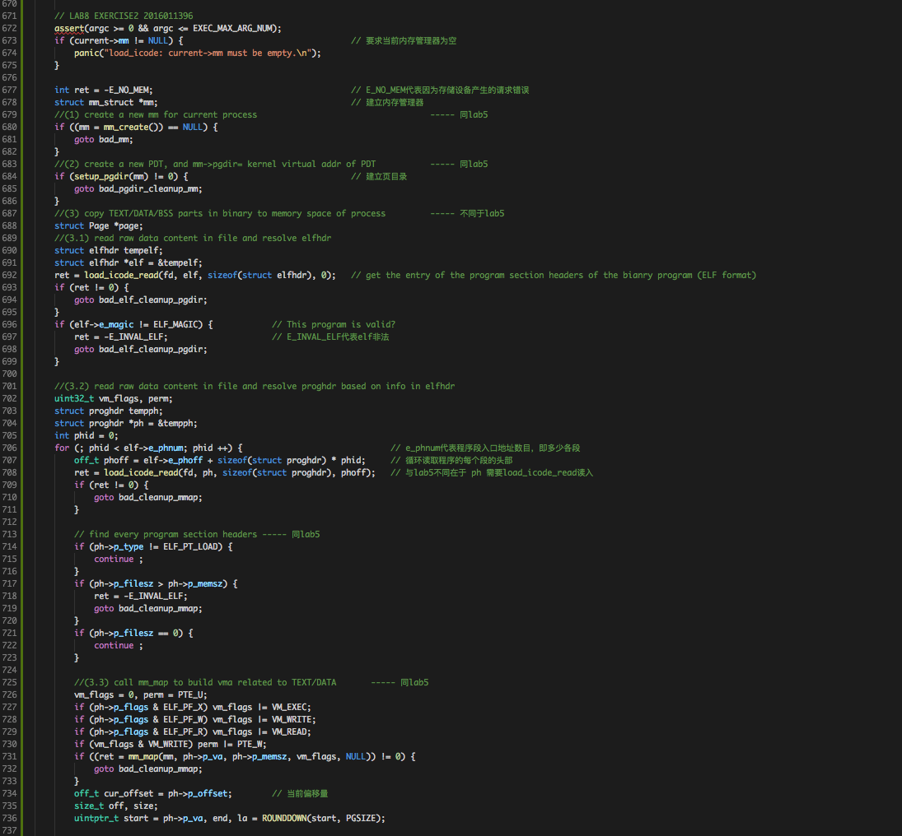
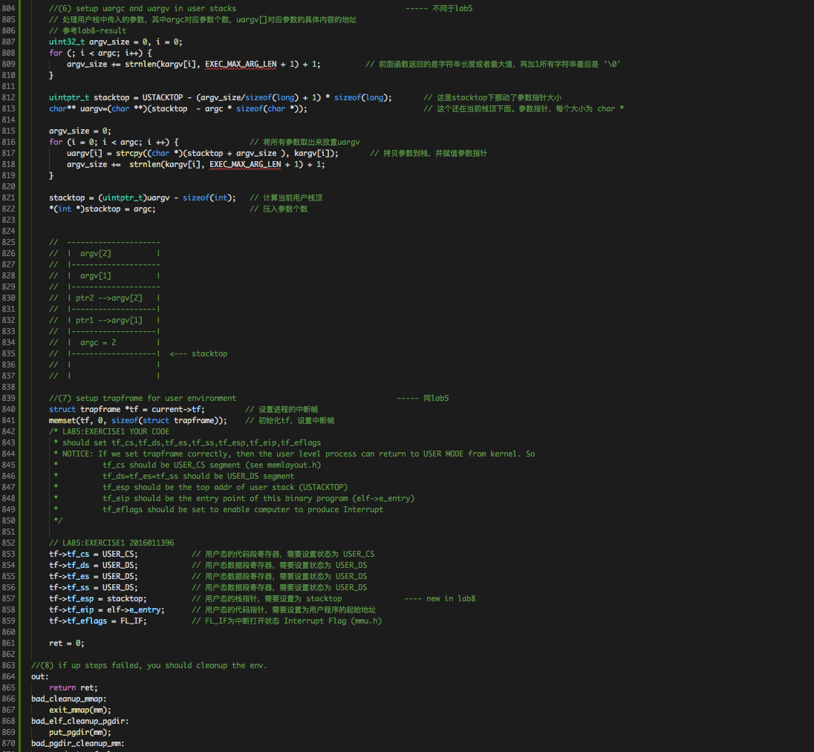
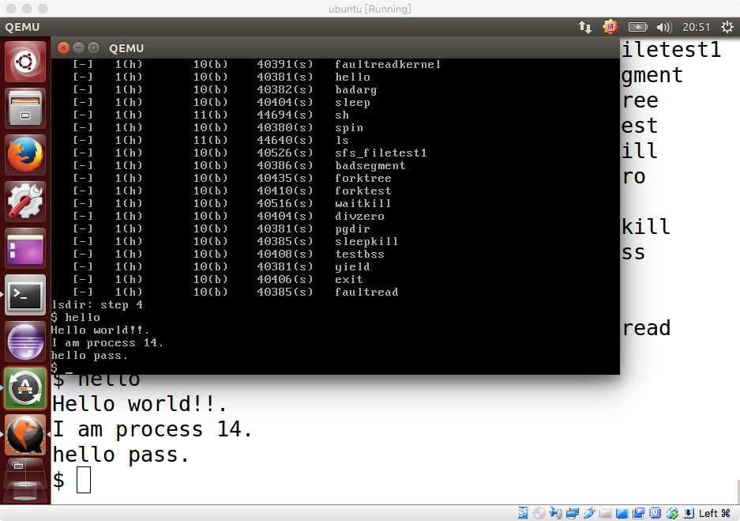

# Lab8 实验报告
计61 柳瑞阳 2016011396

## 练习零：填写已有实验

　　借用 Meld 工具，依赖 lab6, 把 lab1-lab7 的代码填入本实验中代码中有 “LAB1” 、“LAB2” 、 “LAB3”、“LAB4”、“LAB5”、“LAB6” 和 “LAB7” 的注释相应部分。总共修改的文件有十个，分别是以下文件：  

* **default\_pmm.c**
* **pmm.c**
* **trap.c**
* **kdebugs.c**
* **vmm.c**
* **swap\_fifo.c**
* **proc.c**
* **monitor.c**
* **default\_sche.c**
* **check\_sync.c**

　　注意：本次无需对代码进行修改。当代码复制后，至此，练习零完成，代码准备工作实现完毕。

---

## 练习1: 完成读文件操作的实现

### 问题描述：

　　首先了解打开文件的处理流程，然后参考本实验后续的文件读写操作的过程分析，编写在 sfs\_inode.c 中 sfs\_io\_nolock 读文件中数据的实现代码。请在实验报告中给出设计实现”UNIX的PIPE机制“的概要设方案，鼓励给出详细设计方案

### 准备工作：

#### 1. ucore 文件系统架构

　　ucore 模仿了 UNIX 的文件系统设计，ucore 的文件系统架构主要由四部分组成：

* **通用文件系统访问接口层**：该层提供了一个从用户空间到文件系统的标准访问接口。这一层访问接口让应用程序能够通过一个简单的接口获得 ucore 内核的文件系统服务。
* **文件系统抽象层**：向上提供一个一致的接口给内核其他部分（文件系统相关的系统调用实现模块和其他内核功能模块）访问。向下提供一个同样的抽象函数指针列表和数据结构屏蔽不同文件系统的实现细节。
* **Simple FS 文件系统层**：一个基于索引方式的简单文件系统实例。向上通过各种具体函数实现以对应文件系统抽象层提出的抽象函数。向下访问外设接口
* **外设接口层**：向上提供 device 访问接口屏蔽不同硬件细节。向下实现访问各种具体设备驱动的接口，比如 disk 设备接口/串口设备接口/键盘设备接口等。

　　再了解 ucore 打开文件的处理流程。假如应用程序操作文件（打开/创建/删除/读写），首先需要通过文件系统的通用文件系统访问接口层给用户空间提供的访问接口进入文件系统内部，接着由文件系统抽象层把访问请求转发给某一具体文件系统（比如 SFS 文件系统），具体文件系统（Simple FS 文件系统层）把应用程序的访问请求转化为对磁盘上的 block 的处理请求，并通过外设接口层交给磁盘驱动例程来完成具体的磁盘操作。

	 

#### 2. ucore 打开文件的处理流程

　　首先假定用户进程需要打开的文件已经存在在硬盘上。以 user/sfs\_filetest1.c 为例，首先用户进程会调用在 main 函数中的如下语句：

	int fd1 = safe_open("sfs\_filetest1", O_RDONLY);

　　如果 ucore 能够正常查找到这个文件，就会返回一个代表文件的文件描述符 fd1，这样在接下来的读写文件过程中，就直接用这样 fd1 来代表就可以了。

##### 通用文件访问接口层的处理流程

　　首先用户会在进程中调用 safe\_open() 函数，其返回值即为 fd（文件描述符）。safe\_open 依次调用如下函数： open->sys\_open->syscall，从而引起系统调用进入到内核态。到了内核态后，通过中断处理例程，会调用到 sys\_open 内核函数，并进一步调用 sysfile\_open 内核函数。到了这里，需要把位于用户空间的字符串 "sfs\_filetest1" 拷贝到内核空间中的字符串 path 中，并进入到文件系统抽象层的处理流程完成进一步的打开文件操作中。

	static int safe_open(const char *path, int open_flags)
	{
		int fd = open(path, open_flags);
		printf("fd is %d\n",fd);
		assert(fd >= 0);
		return fd;
	}
	
	int
	open(const char *path, uint32_t open_flags) {
	    return sys_open(path, open_flags);
	}
	
	static int
	sys_open(uint32_t arg[]) {　　　　// sys_open 内核函数
	    const char *path = (const char *)arg[0];
	    uint32_t open_flags = (uint32_t)arg[1];
	    return sysfile_open(path, open_flags);
	}

	int
	sysfile_open(const char *__path, uint32_t open_flags) {
	    int ret;
	    char *path;
	    if ((ret = copy_path(&path, __path)) != 0) {
	        return ret;
	    }
	    ret = file_open(path, open_flags);
	    kfree(path);
	    return ret;
	}

##### 文件系统抽象层的处理流程

　　文件系统抽象层需要完成分配一个空闲的 file 数据结构变量 file 。为此首先调用的是 file\_open 函数，它要给这个即将打开的文件分配一个 file 数据结构的变量，这个变量其实是当前进程的打开文件数组 current->fs\_struct->filemap[] 中的一个空闲元素（即还没用于一个打开的文件），而这个元素的索引值就是最终要返回到用户进程并赋值给变量 fd1。到了这一步还仅仅是给当前用户进程分配了一个 file 数据结构的变量，还没有找到对应的文件索引节点，也没有文件对应的 inode。为此需要进一步调用 vfs\_open 函数来找到 path 指出的文件所对应的基于 inode 数据结构的 VFS 索引节点 node。vfs\_open 函数需要完成两件事情：通过 vfs\_lookup 找到 path 对应文件的 inode；调用 vop\_open 函数打开文件。

##### SFS文件系统层的处理流程

　　在 sfs\_inode.c 中的 sfs\_node\_dirops 变量定义了 “.vop\_lookup = sfs\_lookup”，实现找到 SFS 文件系统中的 “/” 目录下的 “sfs\_filetest1” 文件。sfs\_lookup有三个参数：node，path，node\_store。其中 node 是根目录 “/” 所对应的 inode 节点；path 是文件 sfs\_filetest1 的绝对路径 /sfs\_filetest1，而 node\_store 是经过查找获得的 sfs\_filetest1 所对应的 inode 节点。sfs\_lookup 函数以 “/” 为分割符，从左至右逐一分解 path 获得各个子目录和最终文件对应的 inode 节点。在本例中是调用 sfs\_lookup\_once 查找以根目录下的文件 sfs\_filetest1 所对应的 inode 节点。当无法分解 path 后，就意味着找到了sfs\_filetest1 对应的 inode 节点，就可顺利返回了。  
　　其中 sfs\_lookup\_once 将调用 sfs\_dirent\_search\_nolock 函数来查找与路径名匹配的目录项，如果找到目录项，则根据目录项中记录的 inode 所处的数据块索引值找到路径名对应的 SFS 磁盘 inode，并读入 SFS 磁盘 inode 对应的内容，创建 SFS 内存 inode。

	static int
	sfs_lookup(struct inode *node, char *path, struct inode **node_store) {
	    struct sfs_fs *sfs = fsop_info(vop_fs(node), sfs);
	    assert(*path != '\0' && *path != '/');
	    vop_ref_inc(node);
	    struct sfs_inode *sin = vop_info(node, sfs_inode);
	    if (sin->din->type != SFS_TYPE_DIR) {
	        vop_ref_dec(node);
	        return -E_NOTDIR;
	    }
	    struct inode *subnode;
	    int ret = sfs_lookup_once(sfs, sin, path, &subnode, NULL);
	
	    vop_ref_dec(node);
	    if (ret != 0) {
	        return ret;
	    }
	    *node_store = subnode;
	    return 0;
	}

　　至此分析了 ucore 打开文件的处理流程。

#### 3. ucore 文件系统架构依赖的数据结构

　　首先是为了打开文件，需要有一个文件的数据结构 file，记录文件信息，并能够找到对应文件的位置。

	struct file {
		enum {
			FD_NONE, FD_INIT, FD_OPENED, FD_CLOSED,
		} status;             // 访问文件的执行状态
		bool readable;        // 文件是否可读
		bool writable;        // 文件是否可写
		int fd;               // 文件在filemap中的索引值
		off_t pos;            // 访问文件的当前位置
		struct inode *node;   // 该文件对应的内存inode指针
		atomic_t open_count;  // 打开此文件的次数
	};

　　当创建一个进程后，该进程的 files\_struct 将会被初始化或复制父进程的 files\_struct。当用户进程打开一个文件时，将从 fd\_array 数组中取得一个空闲 file 项，然后会把此 file 的成员变量 node 指针指向一个代表此文件的 inode 的起始地址。

	struct files_struct {
	    struct inode *pwd;                //进程当前执行目录的内存inode指针
	    struct file *fd_array;            //进程打开文件的数组
	    atomic_t files_count;             //访问此文件的线程个数
	    semaphore_t files_sem;            //确保对进程控制块中fs_struct的互斥访问
	};

　　其次是 inode 数据结构，它是位于内存的索引节点，是 VFS 结构中的重要数据结构，因为它实际负责把不同文件系统的特定索引节点信息（甚至不能算是一个索引节点）统一封装起来，避免了进程直接访问具体文件系统。

	struct inode {
	    union {                                   //包含不同文件系统特定inode信息的union成员变量
	        struct device __device_info;          //设备文件系统内存inode信息
	        struct sfs_inode __sfs_inode_info;    //SFS文件系统内存inode信息
	    } in_info;   
	    enum {
	        inode_type_device_info = 0x1234,
	        inode_type_sfs_inode_info,
	    } in_type;                          //此inode所属文件系统类型
	    atomic_t ref_count;                 //此inode的引用计数
	    atomic_t open_count;                //打开此inode对应文件的个数
	    struct fs *in_fs;                   //抽象的文件系统，包含访问文件系统的函数指针
	    const struct inode_ops *in_ops;     //抽象的inode操作，包含访问inode的函数指针     
	};

### 实现流程：

　　完成了上述的准备工作，下面开始实现练习一的代码。sfs\_io\_nolock 函数的主要功能是给定一个文件的 inode 以及需要读写的偏移量和大小，转换成数据块级别的读写操作。在 sfs\_io\_nolock 函数中，先计算一些辅助变量，并处理一些特殊情况（比如越界），然后有 sfs\_buf\_op = sfs\_rbuf, sfs\_block\_op = sfs\_rblock，设置读取的函数操作。接着进行实际操作，先处理起始的没有对齐到块的部分，再以块为单位循环处理中间的部分，最后处理末尾剩余的部分。每部分中都调用 sfs\_bmap\_load\_nolock 函数得到 block 对应的 inode 编号，并调用 sfs\_rbuf 或 sfs\_rblock 函数读取数据（中间部分调用 sfs\_rblock，起始和末尾部分调用 sfs\_rbuf），调整相关变量。完成后如果 offset + alen > din->fileinfo.size（写文件时会出现这种情况，读文件时不会出现这种情况，alen为实际读写的长度），则调整文件大小为 offset + alen 并设置 dirty 变量。  
　　sfs\_bmap\_load\_nolock 函数将对应 sfs\_inode 的第 index 个索引指向的 block 的索引值取出存到相应的指针指向的单元（ino\_store）。它调用 sfs\_bmap\_get\_nolock 来完成相应的操作。sfs\_rbuf 和 sfs\_rblock 函数最终都调用 sfs\_rwblock\_nolock 函数完成操作，而 sfs\_rwblock\_nolock 函数调用 dop\_io->disk0\_io->disk0\_read\_blks\_nolock->ide\_read\_secs 完成对磁盘的操作。  
　　这里读取的数据，除去未对齐部分，中间数据跨度需要分三种情况。我们需要首先读取第一部分未对齐数据，再按照整块读取第二部分，最后读取第三部分未对齐数据。具体情况如下：  

* 情况一：跨越多块

		|    ----|----------|----------|-----     |
		 第一部分 |        第二部分       |  第三部分
* 情况二：不足一块

		| -------   |
		   第一部分
* 情况三：不足一块

		|   ----|---       |
		 第一部分|   第三部分 

　　具体解释和实现代码如下：

	 

### 实现“ UNIX 的 PIPE 机制 ”的概要设方案

#### 管道机制

　　管道可以看作是由内核管理的一个缓冲区，一端连接进程 A 的输出，另一端连接进程 B 的输入。进程 A 会向管道中放入信息，进程 B 也会取出被放入管道的信息。当管道中没有信息，进程 B 则会等待，直到进程 A 放入信息。当管道被放满信息的时候，进程 A 会等待，直到进程 B 取出信息。当两个进程都结束的时候，管道也自动消失。  
　　管道可以基于 fork 机制建立，从而让两个进程可以连接到同一个管道上。某个进程创建管道时，管道两端都连接在同一个进程 A 上，当 fork 复制进程 A 得到进程 B 的时候，会将这两个连接也复制到新的进程 B 上。随后，每个进程关闭自己不需要的一个连接。例如进程 A 关闭从管道输入的链接，进程 B 关闭向管道输出的连接。这时候就实现了管道链接 A 的输出，B从管道输入。从而二者即可通过该管道进行通信。  
（参考 https://www.jianshu.com/p/0b15c4cdead9）

#### 设计方案

　　为了创建管道，需要实现对应的系统调用，然后需要支持使用统一的接口，如 read 和 write 从管道读或者写数据。基于现有的 ucore，可以认为管道也是一个文件，某个进程对其可写，另外一个进程可读。并且二者共享这个文件。首先需要在数据结构 sfs\_inode 中对此共享量增加两个信号量，进行同步互斥的控制。并需要标记这个文件是不是管道。当 A 向管道输出数据时，即向这个文件写入数据；当 B 从管道读取数据时，即从这个文件中读取数据，并清除读出的数据(数据从管道中流出，不占用管道)。

---

   

## 练习2: 完成基于文件系统的执行程序机制的实现

### 问题描述：

　　改写 proc.c 中的 load\_icode 函数和其他相关函数，实现基于文件系统的执行程序机制。执行：make qemu。如果能看看到 sh 用户程序的执行界面，则基本成功了。如果在 sh 用户界面上可以执行 ”ls”, ”hello” 等其他放置在 sfs 文件系统中的其他执行程序，则可以认为本实验基本成功。请在实验报告中给出设计实现基于” UNIX 的硬链接和软链接机制“的概要设方案，鼓励给出详细设计方案
　　
### 准备工作：

　　在 lab5 中，我曾分析了 load\_icode 需要完成的工作：

* 调用 mm\_create 函数来申请进程的内存管理数据结构 mm 所需内存空间，并对 mm 进行初始化
* 调用 setup\_pgdir 来申请一个页目录表所需的一个页大小的内存空间，并把描述 ucore 内核虚空间映射的内核页表（boot\_pgdir 所指）的内容拷贝到此新目录表中，最后让 mm->pgdir 指向此页目录表，这就是进程新的页目录表了，且能够正确映射内核虚空间；
* 根据应用程序执行码的起始位置来解析此 ELF 格式的执行程序，并调用 mm\_map 函数根据 ELF 格式的执行程序说明的各个段（代码段、数据段、BSS 段等）的起始位置和大小建立对应的 vma 结构，并把 vma 插入到 mm 结构中，从而表明了用户进程的合法用户态虚拟地址空间。调用根据执行程序各个段的大小分配物理内存空间，并根据执行程序各个段的起始位置确定虚拟地址，并在页表中建立好物理地址和虚拟地址的映射关系，然后把执行程序各个段的内容拷贝到相应的内核虚拟地址中，至此应用程序执行码和数据已经根据编译时设定地址放置到虚拟内存中了；
* 需要给用户进程设置用户栈，为此调用 mm\_mmap 函数建立用户栈的 vma 结构，明确用户栈的位置在用户虚空间的顶端，大小为 256 个页，即 1MB，并分配一定数量的物理内存且建立好栈的虚地址<-->物理地址映射关系；
* 至此，进程内的内存管理 vma 和 mm 数据结构已经建立完成，于是把 mm->pgdir 赋值到 cr3 寄存器中，即更新了用户进程的虚拟内存空间，此时的 initproc 已经被 hello 的代码和数据覆盖，成为了第一个用户进程，但此时这个用户进程的执行现场还没建立好；
* 先清空进程的中断帧，再重新设置进程的中断帧，使得在执行中断返回指令 “iret” 后，能够让 CPU 转到用户态特权级，并回到用户态内存空间，使用用户态的代码段、数据段和堆栈，且能够跳转到用户进程的第一条指令执行，并确保在用户态能够响应中断；

　　查看 lab8 中 load\_icode 函数的注释：

	/* (1) create a new mm for current process
     * (2) create a new PDT, and mm->pgdir= kernel virtual addr of PDT
     * (3) copy TEXT/DATA/BSS parts in binary to memory space of process
     *    (3.1) read raw data content in file and resolve elfhdr
     *    (3.2) read raw data content in file and resolve proghdr based on info in elfhdr
     *    (3.3) call mm_map to build vma related to TEXT/DATA
     *    (3.4) callpgdir_alloc_page to allocate page for TEXT/DATA, read contents in file
     *          and copy them into the new allocated pages
     *    (3.5) callpgdir_alloc_page to allocate pages for BSS, memset zero in these pages
     * (4) call mm_map to setup user stack, and put parameters into user stack
     * (5) setup current process's mm, cr3, reset pgidr (using lcr3 MARCO)
     * (6) setup uargc and uargv in user stacks
     * (7) setup trapframe for user environment
     * (8) if up steps failed, you should cleanup the env.
     */

　　注释说明了其一共需要完成以下几部分的工作：

* 建立内存管理器
* 建立页目录
* 将文件逐个段加载到内存中，这里要注意设置虚拟地址与物理地址之间的映射
* 建立相应的虚拟内存映射表
* 建立并初始化用户堆栈
* 处理用户栈中传入的参数
* 最后很关键的一步是设置用户进程的中断帧
* 发生错误还需要进行错误处理。

　　其中第三步和第六步实现有所不同。lab5 中没有从文件加载程序到内存(第三步)，也没处理用户堆栈传入的参数(第六步)。其余实现则与 lab5 基本相近。在整体分析之后，可以开始练习二的实现。

### 实现流程：

　　首先观察到在进程控制块数据结构 struct proc\_struct 中新增了成员变量 *filesp，需要在 alloc\_proc 函数中对其进行初始化。实现代码如下：

    struct files_struct *filesp;                // the file related info(pwd, files_count, files_array, fs_semaphore) of process

	 

　　其次在父进程创建子进程的过程中，也需要在 do\_fork 函数中增加对于父进程文件信息的复制，在这里需要调用新增的 copy\_file 函数。实现代码如下：

	 

　　最后进行 load\_icode 函数的实现。在本函数的实现上，我曾参考 lab8-result 以及向潘庆霖同学请教细节理解，如用户栈处理。下面分段进行实现描述。

* **建立内存管理器**：和 lab5 实现一致。
* **建立页目录**：和 lab5 实现一致。
* **从文件加载程序到内存**：实现和 lab5 略有不同。我们需要使用 load\_icode\_read 实现对于文件中程序 **ELF 格式头** 以及 **program header**，和 **数据/代码段** 的读入。其中需要注意的地方是偏移量的计算，以及每次按页大小读入的 size，和对地址不对齐问题的处理。这些部分 lab5 中已经基本实现，需要理解如何完成。
* **建立用户堆栈**：和 lab5 实现一致。
* **建立当前进程的页目录表**：和 lab5 实现一致
* **处理用户栈中传入的参数**：不同于 lab5，这里需要将真实文件中存储的程序的 main 函数的参数个数以及参数压栈，并计算栈顶位置。这部分难度最大。我曾参考 lab8\_result 以及向潘庆霖同学请教。最后完成的栈需要入下所示：从栈顶向上依次是 参数个数，参数 1 指针，参数 2 指针，...，参数 1，参数 2，...。实现中首先需要计算参数所占栈空间，将栈顶从 temp0 移动到 temp1，并且计算出 temp2 的位置，然后从 temp1 开始拷贝参数，并将指针赋值在 temp2 开始的对应位置。temp1 和 temp2 同时向上增长，直到参数拷贝完毕。当完成参数拷贝之后，移动栈顶到最后所示位置，复制上参数个数。此时用户栈构造完成。

	     ---------------------  <--- temp0
	     |  argv[2]          |
	     |--------------------
	     |  argv[1]          |
	     |--------------------  <--- temp1
	     | ptr2 -->argv[2]   |
	     |-------------------|
	     | ptr1 -->argv[1]   |
	     |-------------------|  <--- temp2
	     |  argc = 2         |
	     |-------------------|  <--- stacktop
	     |                   |
	     |                   |

* **建立中断帧**：基本同 lab5 实现一致。唯一的不同在于此时需要将 tf->tf_esp = stacktop; 不能再是以前的 USTACKTOP，而是我们针对程序参数新构造好了的栈顶位置。

　　至此完成了 load\_icode 函数的实现。具体代码如下：

	 
	 
	 

### UNIX 的硬链接和软链接机制设计：

#### 硬链接机制的设计实现：

　　硬链接的特点是：当创建一个文件或是目录的硬链接时就是在目录里面创建一个新的目录项，目录项的名字和原来被连接的对象名字不同，但是 inode 结点的值是一样的。  
　　在 vfs 中有硬链接的实现接口 int vfs_link(char \*old\_path, char \*new\_path);。实现硬链接机制，创建硬链接 link 时，为 new\_path 创建对应的 file，并把其 inode 指向 old\_path 所对应的 inode，inode 的引用计数加 1。在 unlink 时将引用计数减去 1 即可。

#### 软链接机制的设计实现：

　　软链接的特点是：链接原文件和新文件有不同的索引节点号。  
　　在 vfs 中有软链接的实现接口 int vfs\_symlink(char \*old\_path, char \*new\_path); 。实现软链接机制，创建软连接 link 时，为 new\_path 创建对应的 file, 其 inode 和 old\_path 所对应的 inode 不同，并把 old\_path 的内容存放到文件的内容中去，给该文件保存在磁盘上时 disk\_inode 类型为 SFS\_TYPE\_LINK。unlink 时类似于删除一个普通的文件。

---

   

## 实验总结

　　通过 lab8，我对于文件系统有了深刻的认识。结合 mooc 以及老师上课所讲，针对操作系统中文件系统一层一层的包含实现，抽象的分析，对于应用程序如何实现对于硬盘文件的操作和访问有了直观的了解。

#### 实验效果截图

　　至此，lab8 练习 1-2 完成，最终 make grade 得分为 190/190，qemu 运行结果如下（使用了 ls 和 hello 指令）：

	 
	 

  

#### 实验 lab8 中重要的知识点

* 练习1：文件系统架构，VFS，SFS，UNIX 的 PIPE 机制，文件查找与读入
* 练习2：文件系统执行机制，进程对于文件的控制

#### 在实验中没有对应上的知识点

　　我认为 lab8 没有涉及到的知识点有：I/O设备接口，空闲空间管理，文件分配，冗余磁盘阵列RAID。

#### 与参考答案的实现区别

* 练习1：基本思路相同
* 练习2：部分参考参考答案实现，基本思路相同

   

### 实验参考资料：  

* 实验指导书
* lab8\_result 
* https://blog.csdn.net/tangyuanzong/article/details/78955720
* https://www.jianshu.com/p/0b15c4cdead9
* 黄家辉学长资料：lab8-tsinghua\_huangjh14.md